# Sprint 3: Configuració de Dominis amb LDAP

## Introducció als Dominis

Per començar, posem en xarxa NAT les dues màquines virtuals, tant al client com al servidor. D'aquesta manera podrem treballar més còmodament. Aquesta xarxa NAT ha de ser la mateixa a ambdues màquines.


### Què és un domini?

Crear un domini en un servidor serveix per a tenir un entorn controlat on tenim:
- **Equips**: Ordinadors i dispositius de la xarxa
- **Recursos**: Carpetes compartides, impressores, etc.
- **Usuaris**: Comptes d'usuari centralitzats
- **Grups**: Agrupacions d'usuaris per facilitar la gestió

Els usuaris s'agrupen en grups. També tenim les **unitats organitzatives (OU)**, dintre de les quals podem tenir grups, usuaris solts i també equips.

### Estructura jeràrquica

Quan creem un domini, tindrem un **bosc** (forest). Dintre d'aquest bosc tenim les **branques**, que són els subdominis. 

Anem a fer un domini on hi hagi grups, usuaris i equips.

---

## Instal·lació del Servidor LDAP

### 1. Configuració del nom del servidor (hostname)

Primer, configurem el nom de la màquina del servidor editant el fitxer `/etc/hostname`:

```bash
nano /etc/hostname
```

Establim el nom del servidor. En aquest cas: `serverjoan`


### 2. Configuració del fitxer hosts

Editem el fitxer `/etc/hosts` per afegir la resolució local del nom del servidor:

```bash
nano /etc/hosts
```

Afegim les línies necessàries amb les IPs i noms del servidor:

```
127.0.0.1       localhost
127.0.1.1       serverjoan
10.0.2.3        serverjoan.joan.cat serverjoan
```


### 3. Instal·lació dels paquets LDAP

Instal·lem els paquets necessaris per al servidor LDAP:

```bash
apt update
apt install slapd ldap-utils
```

Durant la instal·lació, el sistema demanarà una **contrasenya d'administrador** per al directori LDAP. Aquesta contrasenya serà la del compte `admin` del domini.


**Important**: Guarda aquesta contrasenya de forma segura.

### 4. Verificació inicial de la instal·lació

Podem verificar la configuració inicial del servidor LDAP amb la comanda:

```bash
slapcat
```

Aquesta comanda mostra el contingut de la base de dades LDAP. Inicialment veurem el domini `dc=nodomain`:


### 5. Reconfiguració del servidor LDAP

Per configurar correctament el nostre domini, executem:

```bash
dpkg-reconfigure slapd
```

Aquest assistent ens guiarà a través de diverses preguntes.

#### 5.1. Nom del domini DNS

Introduïm el nom del nostre domini. En aquest cas: `joan.cat`

Aquest serà el domini base del nostre directori LDAP (dc=joan,dc=cat).


#### 5.2. Nom de l'organització

Introduïm el nom de la nostra organització. En aquest cas: `joan`


#### 5.3. Contrasenya d'administrador

Introduïm i confirmem la contrasenya per al compte d'administrador del directori LDAP.


#### 5.4. Eliminar la base de dades quan es purgui slapd?

Seleccionem **Yes** per eliminar la base de dades si desinstal·lem el paquet.


### 6. Verificació de la configuració final

Després de la reconfiguració, executem de nou `slapcat` per verificar que el domini s'ha configurat correctament:

```bash
slapcat
```

Ara podem veure:
- El domini `dc=nodomain` (antic)
- El nou domini `dc=joan,dc=cat` amb el compte admin


---

## Creació d'Unitats Organitzatives (OU)

### 1. Crear fitxer LDIF per a la unitat organitzativa "users"

Creem un fitxer LDIF (LDAP Data Interchange Format) per definir la unitat organitzativa:

```bash
nano uo.ldif
```

Contingut del fitxer:

```ldif
dn: ou=users,dc=joan,dc=cat
objectClass: organizationalUnit
objectClass: top
ou: users
```


### 2. Afegir la unitat organitzativa al directori LDAP

Utilitzem la comanda `ldapadd` per afegir l'entrada al directori:

```bash
ldapadd -c -x -D "cn=admin,dc=joan,dc=cat" -W -f uo.ldif
```

Opcions:
- **-c**: Continuar en cas d'errors
- **-x**: Autenticació simple
- **-D**: Distinguished Name de l'usuari admin
- **-W**: Demanar contrasenya
- **-f**: Fitxer LDIF a processar


---

## Creació d'Usuaris

### 1. Crear fitxer LDIF per a un usuari

Creem un fitxer per definir un usuari anomenat "alu1":

```bash
nano usu.ldif
```

Contingut del fitxer:

```ldif
dn: uid=alu1,ou=users,dc=joan,dc=cat
objectClass: inetOrgPerson
objectClass: organizationalPerson
objectClass: person
objectClass: posixAccount
objectClass: shadowAccount
objectClass: top
userPassword:: VWx4MQ==
cn: Primer
gidNumber: 1001
homeDirectory: /home/alu1
loginShell: /bin/bash
sn: Alumne1
uidNumber: 1001
shadowExpire: -1
shadowLastChange: 16431
shadowMax: 99999
shadowMin: 0
shadowWarning: 7
```

### 2. Afegir l'usuari al directori LDAP

```bash
ldapadd -c -x -D "cn=admin,dc=joan,dc=cat" -W -f usu.ldif
```


### 3. Verificar la creació de l'usuari

Podem utilitzar `ldapsearch` per verificar que l'usuari s'ha creat correctament:

```bash
ldapsearch -x -b "uid=alu1,ou=users,dc=joan,dc=cat"
```


---

## Creació de Grups

### 1. Crear fitxer LDIF per a un grup

Creem un fitxer per definir un grup anomenat "alumnes":

```bash
nano grup.ldif
```

Contingut del fitxer:

```ldif
dn: cn=alumnes,ou=users,dc=joan,dc=cat
objectClass: posixGroup
objectClass: top
cn: alumnes
gidNumber: 1001
memberUid: alu1
```

### 2. Afegir el grup al directori LDAP

```bash
ldapadd -c -x -D "cn=admin,dc=joan,dc=cat" -W -f grup.ldif
```


### 3. Verificar la creació del grup

```bash
ldapsearch -x -b "cn=alumnes,ou=users,dc=joan,dc=cat"
```


---

## Verificació Final de l'Estructura LDAP

Podem veure tota l'estructura del nostre directori LDAP amb `slapcat`:

```bash
slapcat
```

Ara veurem:
- El domini base: `dc=joan,dc=cat`
- La unitat organitzativa: `ou=users,dc=joan,dc=cat`
- L'usuari: `uid=alu1,ou=users,dc=joan,dc=cat`
- El grup: `cn=alumnes,ou=users,dc=joan,dc=cat`


---

## Resum de Comandes

| Comanda | Funció |
|---------|--------|
| `nano /etc/hostname` | Editar el nom del servidor |
| `nano /etc/hosts` | Configurar resolució de noms |
| `apt install slapd ldap-utils` | Instal·lar servidor LDAP |
| `slapcat` | Mostrar contingut de la BD LDAP |
| `dpkg-reconfigure slapd` | Reconfigurar el servidor LDAP |
| `ldapadd -c -x -D "..." -W -f fitxer.ldif` | Afegir entrades al directori |
| `ldapsearch -x -b "DN"` | Cercar entrades al directori |

---


## Configuració del Client LDAP

### 1. Instal·lació del paquet d'autenticació LDAP

Instal·lem el paquet necessari per configurar l'autenticació LDAP al client:

```bash
apt update
apt install ldap-auth-config
```

Durant la instal·lació, l'assistent `ldap-auth-config` ens farà diverses preguntes per configurar la connexió amb el servidor LDAP.

### 2. Configuració de ldap-auth-config

#### 2.1. URI del servidor LDAP

Introduïm la URI del servidor LDAP. Utilitzem la IP del servidor:

```
ldap://10.0.2.3
```

**Nota**: És recomanable utilitzar una adreça IP per reduir riscos de fallada en cas de problemes amb el servei de noms.


#### 2.2. Distinguished Name (DN) de la base de cerca

Introduïm el DN base del nostre domini:

```
dc=joan,dc=cat
```


#### 2.3. Versió del protocol LDAP

Seleccionem la versió **3** del protocol LDAP (la més recent i recomanada).


#### 2.4. Base de dades root local

Aquesta opció permet que les utilitats de contrasenyes que utilitzen PAM es comportin com si estiguessis canviant contrasenyes locals.

Seleccionem **Yes**.


#### 2.5. Requereix login per accedir a la base de dades?

Aquesta opció pregunta si la base de dades LDAP requereix autenticació per recuperar entrades.

En una configuració normal, això no és necessari. Seleccionem **Yes**.


#### 2.6. Compte LDAP per a root

Aquest compte s'utilitzarà quan root canviï una contrasenya. Ha de ser un compte privilegiat.

Introduïm el DN del compte admin:

```
cn=admin,dc=joan,dc=cat
```


#### 2.7. Usuari no privilegiat per a la base de dades

Introduïm el nom del compte que s'utilitzarà per iniciar sessió a la base de dades LDAP.

**Advertència**: NO utilitzis comptes privilegiats per iniciar sessió, el fitxer de configuració ha de ser llegible per a tothom.

```
cn=admin,dc=joan,dc=cat
```


#### 2.8. Criptografia local per canviar contrasenyes

Seleccionem el tipus de criptografia a utilitzar quan es canviïn contrasenyes.

Opcions disponibles:
- clear
- crypt
- nds
- ad
- exop
- **md5** (seleccionada)


---

### 3. Configuració de NSSwitch

Editem el fitxer `/etc/nsswitch.conf` per indicar que el sistema ha de consultar també LDAP per a la informació d'usuaris, grups i contrasenyes:

```bash
nano /etc/nsswitch.conf
```

Modifiquem les línies següents per afegir `ldap` com a font de dades:

```
passwd:         ldap compat files systemd
group:          ldap compat files systemd
shadow:         ldap compat files
```


---

### 4. Configuració de PAM - Common Password

Editem el fitxer `/etc/pam.d/common-password`:

```bash
nano /etc/pam.d/common-password
```

**Important**: Hem d'**eliminar** el paràmetre `use_authtok` de la línia de `pam_ldap.so`.

La línia ha de quedar així:

```
password    [success=1 user_unknown=ignore default=die]    pam_ldap.so try_first_pass
```

> **Nota**: El paràmetre `use_authtok` forçaria a utilitzar la contrasenya ja introduïda, però això pot causar problemes en alguns casos. Per això l'eliminem.


---

### 5. Configuració de PAM - Common Session

Editem el fitxer `/etc/pam.d/common-session`:

```bash
nano /etc/pam.d/common-session
```

Afegim al final del fitxer la línia següent per crear automàticament el directori home dels usuaris LDAP quan iniciïn sessió:

```
session required    pam_mkhomedir.so skel=/etc/skel umask=0022
```


---

### 6. Configuració de LightDM

Editem el fitxer de configuració de LightDM per permetre l'entrada manual de noms d'usuari:

```bash
nano /usr/share/lightdm/lightdm.conf.d/50-ubuntu.conf
```

Afegim o modifiquem les línies següents:

```
[Seat:*]
user-session=ubuntu
greeter-show-manual-login=true
```

Això permetrà introduir manualment el nom d'usuari a la pantalla de login.


---

### 7. Verificació de la configuració

Podem verificar que els usuaris LDAP són visibles al sistema amb la comanda:

```bash
getent passwd
```

Aquesta comanda mostrarà tots els usuaris del sistema, incloent els usuaris LDAP com `alu1`:

```
alu1:x:1001:1001:Primer:/home/alu1:/bin/bash
```


Ara ja podem **reiniciar el client** i iniciar sessió amb els usuaris del directori LDAP!


Com podem observar ja estem amb l'usuari alu1


---

## Instal·lació d'Entorn Gràfic: LDAP Account Manager (LAM)

LDAP Account Manager (LAM) és una interfície web que permet administrar el servidor LDAP de forma gràfica. És més modern que phpLDAPadmin i compatible amb PHP 8.

### 1. Instal·lació de LAM

Al **servidor LDAP**, instal·lem LAM i les seves dependències:

```bash
sudo apt update
sudo apt install ldap-account-manager
```


### 2. Accedir a LAM

Obre un navegador web i accedeix a:

```
http://localhost/lam
```

O des d'un altre ordinador:

```
http://10.0.2.3/lam
```


### 3. Configuració inicial de LAM

A la pàgina principal, fes clic a **"LAM configuration"** (a dalt a la dreta).


### 4. Editar perfil del servidor

Fes clic a **"Edit server profiles"**.

La contrasenya per defecte és: **lam**


### 5. Configurar les opcions generals

A la pestanya **"General settings"**:

- **Server address**: `ldap://localhost:389`
- **Tree suffix**: `dc=joan,dc=cat`
- **Default language**: Català o Castellà


### 6. Configurar els tipus de comptes

A la pestanya **"Account types"**:

- **Users**: `ou=users,dc=joan,dc=cat`
- **Groups**: `ou=users,dc=joan,dc=cat`


### 7. Guardar la configuració

Fes clic a **"Save"** per guardar els canvis.

### 8. Iniciar sessió a LAM

Torna a la pàgina principal (`http://localhost/lam`) i inicia sessió:

- **User name**: `cn=admin,dc=joan,dc=cat`
- **Password**: La teva contrasenya d'admin LDAP


---

## Crear una Unitat Organitzativa (OU) amb LAM

### 1. Accedir a l'editor d'arbres

A la barra superior, fes clic a **"Tree view"** o **"Tools" → "Tree view"**.


### 2. Crear nova OU

1. Fes clic dret sobre **dc=joan,dc=cat**
2. Selecciona **"Create a child entry"** o **"New entry"**
3. Selecciona **"organizationalUnit"**


---

## Crear un Usuari amb LAM

### 1. Accedir a la gestió d'usuaris

A la barra superior, fes clic a **"Users"**.


### 2. Crear nou usuari

Fes clic a **"New user"** o el botó **"+"**.


### 3. Omplir les dades de l'usuari

A la pestanya **"Personal"**:
- **Last name**: `alumne`
- **First name**: `ajoan`

A la pestanya **"Unix"**:
- **User name**: `ajoan`
- **UID number**: `2001`
- **Primary group**: Selecciona un grup o deixa per defecte
- **Home directory**: `/home/ajoan`
- **Login shell**: `/bin/bash`

A la pestanya **"Password"**:
- Introdueix la contrasenya per l'usuari


### 4. Guardar l'usuari

Fes clic a **"Save"**.


---

## Verificació: Accedir al Client amb el Nou Usuari

### 1. Verificar que l'usuari és visible al client

Al **client**, executa:

```bash
getent passwd ajoan
```

Hauries de veure:

```
ajoan:x:2001:2001:ajoan:/home/ajoan:/bin/bash
```


### 2. Iniciar sessió amb el nou usuari

Reinicia el client i inicia sessió amb:
- **Usuari**: `ajoan`
- **Contrasenya**: La que has configurat


---

## Activitats Pràctiques: Gestió d'Entrades LDAP

En aquesta secció realitzarem activitats pràctiques amb les comandes principals de gestió LDAP: `ldapsearch`, `ldapadd`, `ldapmodify` i `ldapdelete`.

### LDIF Base per a les Activitats

Primer, crearem un fitxer LDIF complet que inclou una estructura organitzativa amb diversos elements. Aquest serà el punt de partida per a les nostres activitats.

```bash
nano estructura_completa.ldif
```

Contingut del fitxer `exemple.ldif`:

```ldif
# Unitat Organitzativa: Departaments
dn: ou=Departaments,dc=joan,dc=cat
objectClass: organizationalUnit
ou: Departaments
description: Departaments de l'empresa

# Unitat Organitzativa: Informàtica
dn: ou=Informatica,ou=Departaments,dc=joan,dc=cat
objectClass: organizationalUnit
ou: Informatica
description: Departament d'Informàtica

# Unitat Organitzativa: Vendes
dn: ou=Vendes,ou=Departaments,dc=joan,dc=cat
objectClass: organizationalUnit
ou: Vendes
description: Departament de Vendes

# Grup: Administradors
dn: cn=Administradors,ou=Informatica,ou=Departaments,dc=joan,dc=cat
objectClass: posixGroup
cn: Administradors
gidNumber: 5001
description: Grup d'administradors del sistema

# Grup: Desenvolupadors
dn: cn=Desenvolupadors,ou=Informatica,ou=Departaments,dc=joan,dc=cat
objectClass: posixGroup
cn: Desenvolupadors
gidNumber: 5002
description: Grup de desenvolupadors

# Grup: Comercials
dn: cn=Comercials,ou=Vendes,ou=Departaments,dc=joan,dc=cat
objectClass: posixGroup
cn: Comercials
gidNumber: 5003
description: Grup de comercials

# Usuari: Maria Garcia (Administradora)
dn: uid=mgarcia,ou=Informatica,ou=Departaments,dc=joan,dc=cat
objectClass: inetOrgPerson
objectClass: posixAccount
objectClass: shadowAccount
uid: mgarcia
cn: Maria Garcia
sn: Garcia
givenName: Maria
mail: mgarcia@joan.cat
uidNumber: 3001
gidNumber: 5001
homeDirectory: /home/mgarcia
loginShell: /bin/bash
userPassword: {SSHA}XYZ123

# Usuari: Pere Martí (Desenvolupador)
dn: uid=pmarti,ou=Informatica,ou=Departaments,dc=joan,dc=cat
objectClass: inetOrgPerson
objectClass: posixAccount
objectClass: shadowAccount
uid: pmarti
cn: Pere Marti
sn: Marti
givenName: Pere
mail: pmarti@joan.cat
telephoneNumber: +34 123 456 789
uidNumber: 3002
gidNumber: 5002
homeDirectory: /home/pmarti
loginShell: /bin/bash
userPassword: {SSHA}ABC456

# Usuari: Laura Sánchez (Comercial)
dn: uid=lsanchez,ou=Vendes,ou=Departaments,dc=joan,dc=cat
objectClass: inetOrgPerson
objectClass: posixAccount
objectClass: shadowAccount
uid: lsanchez
cn: Laura Sanchez
sn: Sanchez
givenName: Laura
mail: lsanchez@joan.cat
telephoneNumber: +34 987 654 321
uidNumber: 3003
gidNumber: 5003
homeDirectory: /home/lsanchez
loginShell: /bin/bash
userPassword: {SSHA}DEF789
```

Afegir l'estructura completa al directori LDAP:


```bash
ldapadd -c -x -D "cn=admin,dc=joan,dc=cat" -W -f exemple.ldif
```


---


### Activitat 1: Cerques amb `ldapsearch`

La comanda `ldapsearch` permet cercar i consultar entrades al directori LDAP.

#### 1.1. Llistar totes les entrades del directori

```bash
ldapsearch -x -LLL -b "dc=joan,dc=cat"
```

**Explicació**:
- `-x`: Autenticació simple
- `-LLL`: Format de sortida LDIF simplificat
- `-b`: Base DN per a la cerca


#### 1.2. Cercar tots els usuaris

```bash
ldapsearch -x -LLL -b "dc=joan,dc=cat" "(objectClass=posixAccount)"
```


#### 1.3. Cercar un usuari específic

```bash
ldapsearch -x -LLL -b "dc=joan,dc=cat" "(uid=mgarcia)"
```


#### 1.4. Cercar tots els grups

```bash
ldapsearch -x -LLL -b "dc=joan,dc=cat" "(objectClass=posixGroup)"
```


#### 1.5. Cercar usuaris del departament d'Informàtica

```bash
ldapsearch -x -LLL -b "ou=Informatica,ou=Departaments,dc=joan,dc=cat" "(objectClass=posixAccount)"
```


#### 1.6. Cercar usuaris amb un atribut específic (correu electrònic)

```bash
ldapsearch -x -LLL -b "dc=joan,dc=cat" "(mail=*@joan.cat)" mail cn
```


### Activitat 2: Afegir entrades amb `ldapadd`

La comanda `ldapadd` permet afegir noves entrades al directori LDAP.

#### 2.1. Afegir un nou departament

Crear el fitxer `noudept.ldif`:

```bash
nano noudept.ldif
```

Contingut:

```ldif
dn: ou=RRHH,ou=Departaments,dc=joan,dc=cat
objectClass: organizationalUnit
ou: RRHH
description: Departament de Recursos Humans
```


Afegir al directori:

```bash
ldapadd -x -D "cn=admin,dc=joan,dc=cat" -W -f noudept.ldif
```


Verificar:

```bash
ldapsearch -x -LLL -b "dc=joan,dc=cat" "(ou=RRHH)"
```


### Activitat 3: Modificar entrades amb `ldapmodify`

La comanda `ldapmodify` permet modificar atributs d'entrades existents. Utilitzarem el mateix fitxer `exemple.ldif` per afegir-hi les modificacions.

#### 3.1. Modificar el telèfon d'un usuari

Editar el fitxer `exemple.ldif` i afegir al final:

```bash
nano exemple.ldif
```

Afegir al final del fitxer:

```ldif
dn: uid=pmarti,ou=Informatica,ou=Departaments,dc=joan,dc=cat
changetype: modify
replace: telephoneNumber
telephoneNumber: +34 555 666 777
```


Aplicar la modificació:

```bash
ldapmodify -x -D "cn=admin,dc=joan,dc=cat" -W -f exemple.ldif
```

Verificar: `ldapsearch -x -LLL -b "dc=joan,dc=cat" "(uid=pmarti)" telephoneNumber`


#### 3.2. Afegir un atribut a un usuari

Editar el mateix fitxer i afegir:

```ldif
dn: uid=lsanchez,ou=Vendes,ou=Departaments,dc=joan,dc=cat
changetype: modify
add: description
description: Responsable de vendes a Catalunya
```

Aplicar: `ldapmodify -x -D "cn=admin,dc=joan,dc=cat" -W -f exemple.ldif`

Verificar: `ldapsearch -x -LLL -b "dc=joan,dc=cat" "(uid=lsanchez)" description`


#### 3.3. Eliminar un atribut d'un usuari

Afegir al mateix fitxer:

```ldif
dn: uid=pmarti,ou=Informatica,ou=Departaments,dc=joan,dc=cat
changetype: modify
delete: telephoneNumber
```

Aplicar: `ldapmodify -x -D "cn=admin,dc=joan,dc=cat" -W -f exemple.ldif`

Verificar: `ldapsearch -x -LLL -b "dc=joan,dc=cat" "(uid=pmarti)" telephoneNumber`


### Activitat 4: Eliminar entrades amb `ldapdelete`

La comanda `ldapdelete` permet eliminar entrades del directori LDAP.

> [!CAUTION]
> Les operacions d'eliminació són irreversibles. Assegura't sempre abans d'eliminar.

#### 4.1. Eliminar un usuari

Verificar que existeix: `ldapsearch -x -LLL -b "dc=joan,dc=cat" "(uid=pmarti)"`

Eliminar:

```bash
ldapdelete -x -D "cn=admin,dc=joan,dc=cat" -W "uid=pmarti,ou=Informatica,ou=Departaments,dc=joan,dc=cat"
```


#### 4.2. Eliminar un grup

Verificar que existeix: `ldapsearch -x -LLL -b "dc=joan,dc=cat" "(cn=Desenvolupadors)"`

Eliminar:

```bash
ldapdelete -x -D "cn=admin,dc=joan,dc=cat" -W "cn=Desenvolupadors,ou=Informatica,ou=Departaments,dc=joan,dc=cat"
```


## Resum de Comandes

| Comanda | Funció | Exemple |
|---------|--------|---------|
| `ldapsearch` | Cercar entrades | `ldapsearch -x -LLL -b "dc=joan,dc=cat" "(uid=usuari)"` |
| `ldapadd` | Afegir entrades | `ldapadd -x -D "cn=admin,dc=joan,dc=cat" -W -f fitxer.ldif` |
| `ldapmodify` | Modificar entrades | `ldapmodify -x -D "cn=admin,dc=joan,dc=cat" -W -f modif.ldif` |
| `ldapdelete` | Eliminar entrades | `ldapdelete -x -D "cn=admin,dc=joan,dc=cat" -W "dn_a_eliminar"` |

### Opcions comunes

- `-x`: Autenticació simple
- `-D`: DN de l'usuari que executa l'operació (normalment admin)
- `-W`: Demanar contrasenya de forma interactiva
- `-w`: Especificar contrasenya a la línia de comandes (menys segur)
- `-f`: Fitxer LDIF a processar
- `-b`: Base DN per a cerques
- `-LLL`: Format de sortida LDIF simplificat (només ldapsearch)
- `-c`: Continuar malgrat errors (ldapadd)


---

# Servidor Samba

## Introducció a Samba

**Samba** és un conjunt de programes que permet compartir recursos (fitxers, impressores, etc.) entre sistemes Linux/Unix i Windows utilitzant el protocol SMB/CIFS (Server Message Block / Common Internet File System).

### Característiques principals

- **Compatibilitat multiplataforma**: Permet compartir recursos entre Linux i Windows de forma transparent
- **Autenticació a nivell d'usuari**: Cada usuari ha de autenticar-se amb credencials específiques (a diferència de NFS que treballa a nivell de host)
- **Control d'accés granular**: Es poden definir permisos específics per a cada usuari o grup
- **Integració amb Active Directory i LDAP**: Pot utilitzar serveis de directori per a la gestió d'usuaris

### Diferències entre Samba i NFS

| Característica | Samba | NFS |
|----------------|-------|-----|
| Autenticació | **A nivell d'usuari** | A nivell de host |
| Compatibilitat | Linux i Windows | Principalment Linux/Unix |
| Protocol | SMB/CIFS | NFS |
| Seguretat | Més granular | Més simple |

---

## Configuració del Servidor Samba

### 1. Instal·lació de Samba

Al **servidor**, instal·lem el paquet Samba:

```bash
apt install samba
```

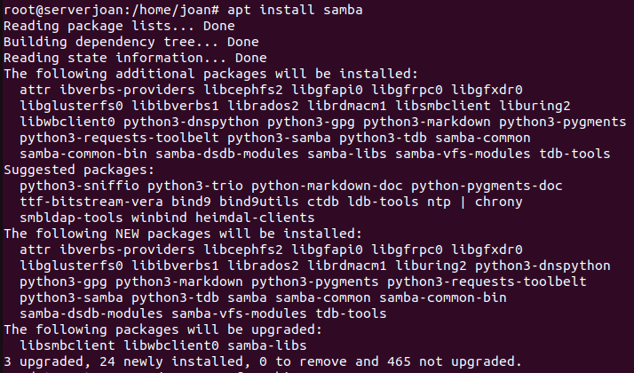

Durant la instal·lació es crearan automàticament:
- El servei `smbd` (Server Message Block daemon)
- El servei `nmbd` (NetBIOS Name Server)
- El fitxer de configuració `/etc/samba/smb.conf`

---

### 2. Creació de la Carpeta Compartida

Crearem una carpeta anomenada `/asixa` que serà compartida a través de Samba.

```bash
cd /
mkdir asixa
chmod 777 asixa
chown nobody:nogroup asixa/
```

**Explicació dels permisos**:
- `chmod 777`: Atorga permisos complets (lectura, escriptura, execució) a tothom
- `chown nobody:nogroup`: Canvia el propietari i grup a `nobody`/`nogroup` (usuari genèric del sistema)

Verifiquem que s'ha creat correctament:

```bash
ls -l | grep asixa
```

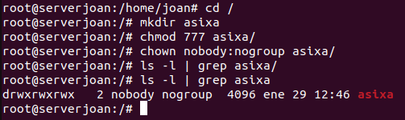

---

### 3. Creació d'Usuaris i Grups

Crearem tres usuaris per realitzar proves amb diferents permisos:

```bash
useradd -M -s /sbin/nologin edgar
useradd -M -s /sbin/nologin naim
useradd -M -s /sbin/nologin eros
```

**Opcions utilitzades**:
- `-M`: No crear directori home (no necessari per a usuaris només de Samba)
- `-s /sbin/nologin`: No permetre login al sistema (només accés Samba)

Creem un grup anomenat `madrid` i hi afegim els usuaris `eros` i `edgar`:

```bash
addgroup madrid
adduser edgar madrid
adduser eros madrid
```

Verifiquem que els usuaris s'han creat correctament:

```bash
tail -3 /etc/passwd
```

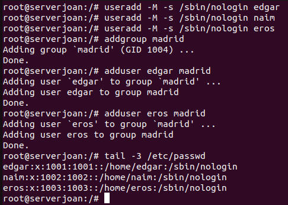

---

### 4. Configuració del Recurs Compartit

Editem el fitxer de configuració principal de Samba:

```bash
nano /etc/samba/smb.conf
```

Al final del fitxer, afegim la configuració del nostre recurs compartit:

```ini
[asixa]
path=/asixa
guest ok = yes
directory mask = 0755
create mask = 0644
browseable = yes
read only = no
writable = yes
read list = @madrid, naim, guest
write list = naim, guest
invalid users = edgar
```

**Explicació dels paràmetres**:

| Paràmetre | Valor | Significat |
|-----------|-------|------------|
| `path` | `/asixa` | Ruta al directori compartit |
| `guest ok` | `yes` | Permet accés anònim (sense contrasenya) |
| `directory mask` | `0755` | Permisos per als directoris creats (rwxr-xr-x) |
| `create mask` | `0644` | Permisos per als fitxers creats (rw-r--r--) |
| `browseable` | `yes` | El recurs apareix a la llista de recursos compartits |
| `read only` | `no` | No és només lectura |
| `writable` | `yes` | Es permet escriptura |
| `read list` | `@madrid, naim, guest` | Usuaris/grups amb permís de lectura |
| `write list` | `naim, guest` | Usuaris/grups amb permís d'escriptura |
| `invalid users` | `edgar` | Usuaris explícitament bloquejats |

> [!NOTE]
> El símbol `@` davant de `madrid` indica que és un **grup**, no un usuari individual.

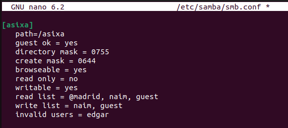

---

### 5. Assignació de Contrasenyes Samba

Samba utilitza una base de dades de contrasenyes pròpia, independent de les contrasenyes del sistema. Per tant, hem de crear contrasenyes específiques per a cada usuari:

```bash
smbpasswd -a edgar
smbpasswd -a eros
smbpasswd -a naim
```

**Opció `-a`**: Afegeix un nou usuari a la base de dades de Samba.

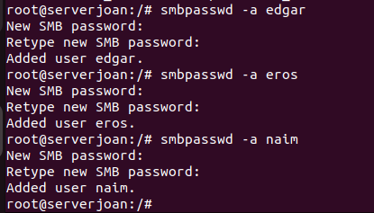

---

### 6. Reinici i Verificació del Servei

Reiniciem els serveis de Samba per aplicar els canvis:

```bash
systemctl restart smbd nmbd
```

Comprovem l'estat dels serveis:

```bash
systemctl status smbd nmbd
```

Hauríem de veure **"active (running)"** en verd.

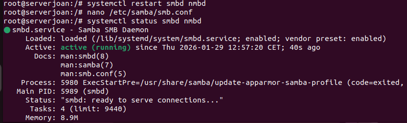

---

## Configuració del Client

### 1. Instal·lació del Client Samba

Al **client**, instal·lem les eines necessàries per connectar-nos a recursos compartits Samba:

```bash
apt install smbclient
```

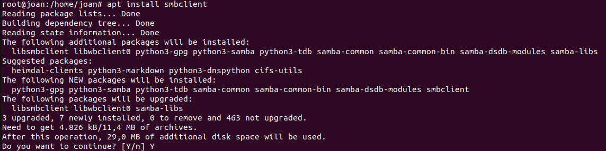

---

### 2. Exploració de Recursos Compartits

Podem llistar els recursos compartits disponibles al servidor:

```bash
smbclient -L //10.0.2.5 -N
```

**Opcions**:
- `-L`: Llistar recursos compartits
- `-N`: No demanar contrasenya (accés anònim)

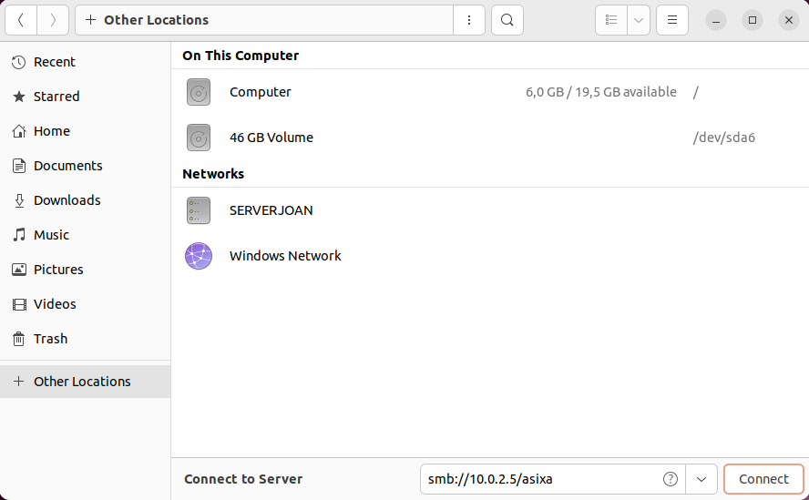

---

## Proves de Permisos

Ara realitzarem diverses proves per verificar que els permisos configurats funcionin correctament segons la configuració establerta:

- **Usuari anònim (guest)**: Pot llegir i escriure
- **Usuari naim**: Pot llegir i escriure
- **Usuari eros** (grup madrid): Només pot llegir
- **Usuari edgar**: No té cap accés (invalid user)

---

### Prova 1: Accés Anònim (Guest)

Connectem com a usuari anònim i intentem crear un directori:

```bash
smbclient //10.0.2.5/asixa -N
```

Dins de la consola de Samba, executem:

```
smb: \> mkdir anonim
```

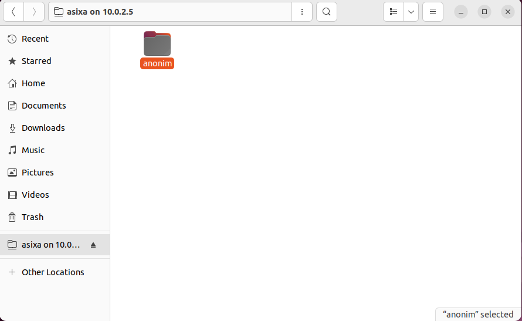

✅ **Resultat**: L'usuari anònim **pot crear carpetes** (té permisos d'escriptura segons `write list = guest`).

---

### Prova 2: Accés amb l'Usuari Edgar (Bloquejat)

Intentem connectar amb l'usuari `edgar` des de la interfície gràfica:

1. Obrim el gestor de fitxers
2. Anem a **Other Locations**
3. Introduïm: `smb://10.0.2.5/asixa`
4. Seleccionem **Registered User** i introduïm `edgar`

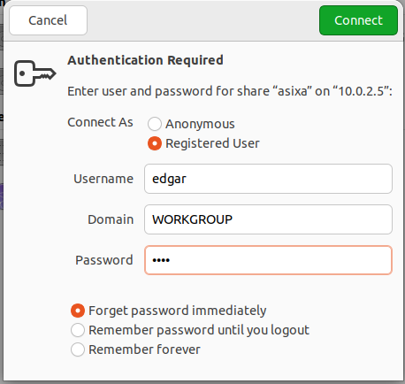

❌ **Resultat**: La connexió és **denegada** perquè `edgar` està a la llista `invalid users`.

---

### Prova 3: Accés amb l'Usuari Naim (Lectura i Escriptura)

Connectem amb l'usuari `naim` utilitzant l'interfície gràfica de fitxers:

1. Obrim el gestor de fitxers
2. Anem a **Other Locations**
3. A la barra inferior, introduïm: `smb://10.0.2.5/asixa`
4. Seleccionem **Registered User** i introduïm les credencials de `naim`

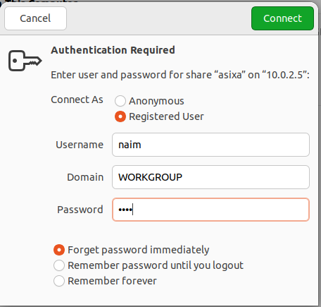

Un cop connectats, provem de crear una carpeta:

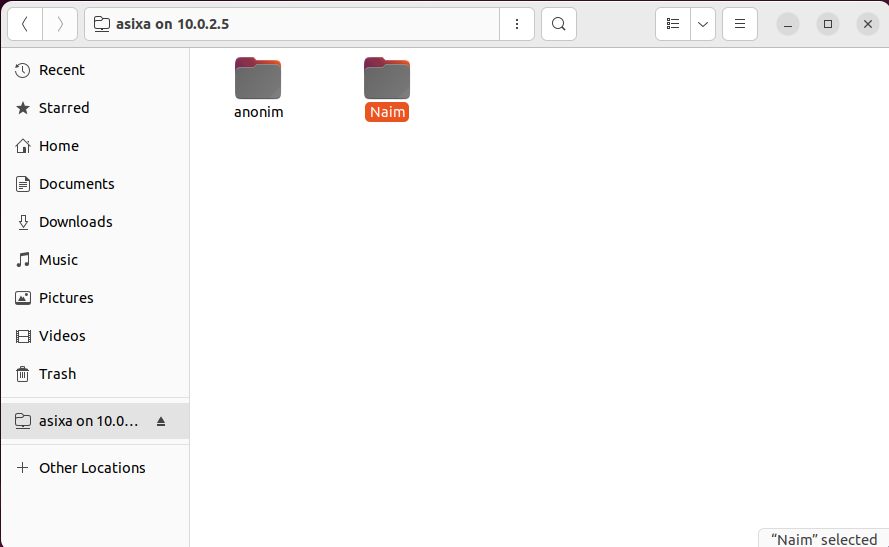

✅ **Resultat**: L'usuari `naim` **pot crear carpetes** (està a la `write list`).

---

### Prova 4: Accés amb l'Usuari Eros (Només Lectura)

Connectem amb l'usuari `eros` (membre del grup `madrid`):

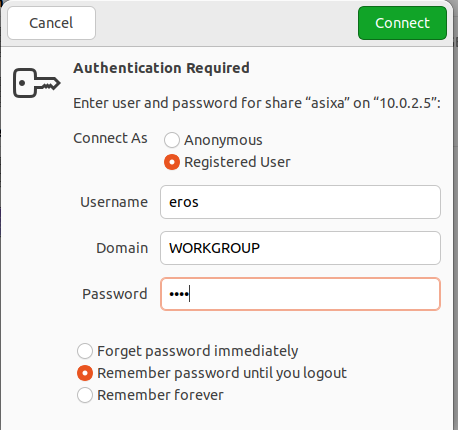

Intentem crear una carpeta:

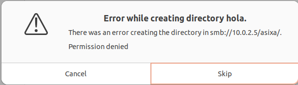

❌ **Resultat**: L'usuari `eros` **NO pot crear carpetes**. Tot i estar al grup `madrid` que té permisos de lectura (`read list = @madrid`), NO està a la `write list`, per tant només pot **llegir**.

---

### Resum de Proves

| Usuari | Accés | Lectura | Escriptura | Motiu |
|--------|-------|---------|------------|-------|
| **anonim (guest)** | ✅ Sí | ✅ Sí | ✅ Sí | A `read list` i `write list` |
| **edgar** | ❌ No | ❌ No | ❌ No | A `invalid users` |
| **naim** | ✅ Sí | ✅ Sí | ✅ Sí | A `read list` i `write list` |
| **eros** | ✅ Sí | ✅ Sí | ❌ No | A `read list` (via @madrid) però NO a `write list` |

---

## Integració de Samba amb LDAP

En aquesta secció integrarem el servidor Samba amb el directori LDAP que hem configurat prèviament. Això permet que els usuaris LDAP puguin accedir als recursos compartits Samba utilitzant les seves credencials del directori.

### Avantatges de la Integració

- **Gestió centralitzada**: Els usuaris es gestionen des d'un únic punt (LDAP)
- **Sincronització automàtica**: No cal crear usuaris locals a cada servidor Samba
- **Escalabilitat**: Facilita la gestió en entorns amb molts usuaris
- **Seguretat**: Autenticació centralitzada i consistent

---

### 1. Instal·lació de Paquets Necessaris

Al **servidor Samba**, primer corregim possibles errors als repositoris i després instal·lem els paquets per a la integració LDAP:

> [!WARNING]
> A **Ubuntu 22.04 (Jammy)**, el paquet `samba-ldap` no existeix. Utilitzarem els paquets estàndard LDAP que ja proporcionen la funcionalitat necessària.

```bash
# Si tens errors de repositoris, arregla'ls primer
sed -i '/focall/d' /etc/apt/sources.list

# Actualitza i instal·la els paquets correctes
apt update
apt install ldap-utils libnss-ldapd libpam-ldapd
```

Durant la instal·lació de `libnss-ldapd`, se't demanarà:

#### 1.1. URI del servidor LDAP

Introdueix la URI del servidor LDAP. Utilitza la IP del servidor per evitar problemes de resolució DNS:

```
ldap://10.0.2.3
```

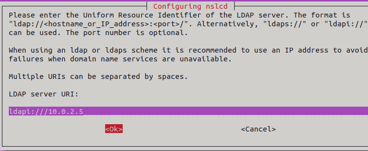

#### 1.2. Base DN

Introdueix el Distinguished Name base del teu domini:

```
dc=joan,dc=cat
```

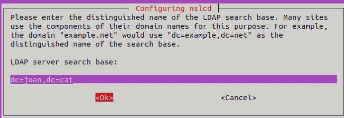

#### 1.3. Serveis amb LDAP Lookups

Se't demanarà quins serveis han de tenir habilitades les cerques LDAP. Selecciona **tots** els serveis necessaris utilitzant la barra espaiadora:

- `[X] passwd` - Per poder cercar usuaris
- `[X] group` - Per poder cercar grups
- `[X] shadow` - Per poder gestionar contrasenyes
- `[ ] hosts` - No necessari (opcional)
- `[ ] networks` - No necessari (opcional)
- `[ ] ethers` - No necessari (opcional)

**Important**: Assegura't de marcar almenys **passwd**, **group** i **shadow**.

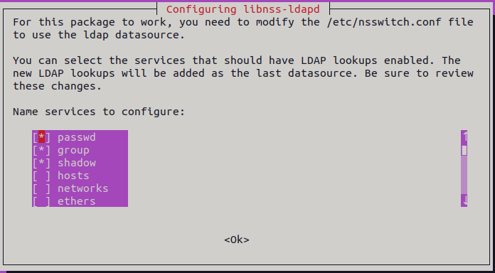


---

### 2. Configuració de Samba amb LDAPSAM (Integració Automàtica)

Per aconseguir que els usuaris LDAP puguin accedir a Samba **automàticament** sense haver de crear-los manualment amb `smbpasswd -a`, utilitzarem **ldapsam** com a backend de Samba.


#### 2.1. Afegir Esquemes Samba a LDAP

Samba necessita que els usuaris LDAP tinguin atributs específics (objectClass `sambaSamAccount`). Primer afegim l'esquema:

```bash
# Verificar si l'esquema Samba ja existeix
ldapsearch -Y EXTERNAL -H ldapi:/// -b "cn=schema,cn=config" "(cn=*samba*)"
```

Si **no existeix**, l'hem d'afegir. L'esquema ve amb Samba:

```bash
# Localitzar l'esquema Samba
ls /usr/share/doc/samba/examples/LDAP/
```


# Afegir l'esquema a LDAP
ldapadd -Y EXTERNAL -H ldapi:/// -f /tmp/samba.ldif

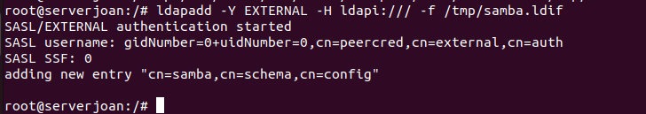

#### 2.2. Configurar smb.conf amb LDAPSAM

Editem el fitxer de configuració de Samba:

```bash
nano /etc/samba/smb.conf
```

A la secció `[global]`, configurem LDAPSAM:

```ini
[global]
   workgroup = WORKGROUP
   security = user
   
   # Backend LDAPSAM - accés automàtic
   passdb backend = ldapsam:ldap://localhost
   ldap suffix = dc=joan,dc=cat
   ldap user suffix = ou=users
   ldap group suffix = ou=users
   ldap admin dn = cn=admin,dc=joan,dc=cat
   ldap ssl = off
   ldap passwd sync = yes
   ldap delete dn = no
```
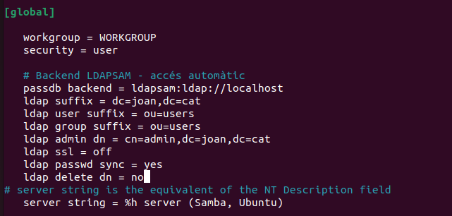

**Paràmetres clau:**
- `passdb backend = ldapsam:ldap://localhost`: Usa LDAP per gestionar usuaris
- `ldap suffix`: Base DN del directori
- `ldap user suffix`: OU on es troben els usuaris
- `ldap admin dn`: Compte admin que Samba usarà per accedir a LDAP
- `ldap passwd sync = yes`: Sincronitza contrasenyes entre Samba i LDAP

---

### 3. Establir la Contrasenya de l'Administrador LDAP

> [!IMPORTANT]
> **Aquest pas ÉS NECESSARI** amb ldapsam. Samba necessita les credencials de l'administrador LDAP per poder crear i modificar usuaris automàticament.

Establim la contrasenya que Samba usarà per connectar-se a LDAP:

```bash
smbpasswd -w 1234
```
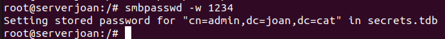

Substitueix `1234` per la contrasenya real del compte `cn=admin,dc=joan,dc=cat`.

**Sortida esperada:**
```
Setting stored password for "cn=admin,dc=joan,dc=cat" in secrets.tdb
```

---

### 4. Inicialitzar el Domini Samba a LDAP

Ara hem d'inicialitzar l'estructura Samba dins de LDAP. Primer obtenim el SID del domini:

```bash
net getlocalsid
```

Aixo mostrarà algo com:
```
SID for domain SERVERJOAN is: S-1-5-21-1234567890-1234567890-1234567890
```

> [!NOTE]
> El SID (Security Identifier) és un identificador únic del domini Samba.

Crea les Organizational Units necessàries per a Samba:

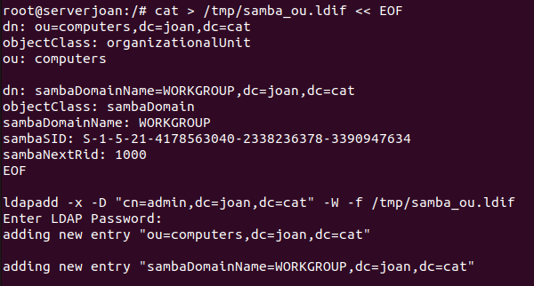

Introdueix la contrasenya de l'admin LDAP quan se't demani.

---

### 5. Migrar Usuaris LDAP a Format Samba

Els usuaris LDAP existents necessiten afegir-se'ls l'objectClass `sambaSamAccount` per poder autenticar-se amb Samba automàticament.

#### 5.1. Comprovar usuaris LDAP existents

Primer vejam quins usuaris tenim:

```bash
ldapsearch -x -b "dc=joan,dc=cat" "(objectClass=posixAccount)" uid cn uidNumber
```


#### 5.2. Afegir atributs Samba a un usuari

Per a cada usuari, hem d'afegir els atributs Samba. Exemple amb l'usuari `javier`:

```bash
# Primer obtenim el SID base del domini
SID=$(net getlocalsid | grep -oP 'S-1-5-21-\d+-\d+-\d+')

# Creem un fitxer LDIF per afegir atributs Samba
cat > /tmp/javier_samba.ldif << EOF
dn: cn=Francisco Javier,ou=users,dc=joan,dc=cat
changetype: modify
add: objectClass
objectClass: sambaSamAccount
-
add: sambaSID
sambaSID: ${SID}-3002
-
add: sambaNTPassword
sambaNTPassword: <hash_NT>
EOF

ldapmodify -x -D "cn=admin,dc=joan,dc=cat" -W -f /tmp/javier_samba.ldif
```

> [!WARNING]
> **Alternativa Més Simple**: En lloc de modificar manualment cada usuari amb LDIF, podem usar `smbpasswd` que ho fa automàticament:

```bash
# Amb ldapsam configurat, smbpasswd afegeix automàticament sambaSamAccount
smbpasswd -a javier
```

Aixo:
1. Detecta que l'usuari existeix a LDAP (via NSS)
2. Afegeix automàticament objectClass `sambaSamAccount`
3. Estableix la contrasenya Samba

Repeteix per a la resta d'usuaris:

```bash
smbpasswd -a joaquin
smbpasswd -a jessica  
smbpasswd -a joel
smbpasswd -a mgarcia
smbpasswd -a lsanchez
```

> [!CAUTION]
> **⚠️ CAPTURA QUE FALTA**: Cal afegir una captura de pantalla mostrant l'execució de `smbpasswd -a` per almenys un usuari LDAP (per exemple `javier`), on es vegi:
> - La comanda `smbpasswd -a javier`
> - El missatge "New SMB password:" i "Retype new SMB password:"
> - El missatge "Added user javier."

---

### 6. Verificació de NSSwitch per LDAP

El fitxer `/etc/nsswitch.conf` ja hauria d'estar configurat automàticament per `libnss-ldapd` durant la instal·lació.

Comprovem que estigui configurat correctament:

```bash
cat /etc/nsswitch.conf | grep -E "passwd|group|shadow"
```

Hauria de mostrar algo com:
```
passwd:         files ldap systemd
group:          files ldap systemd
shadow:         files ldap
```

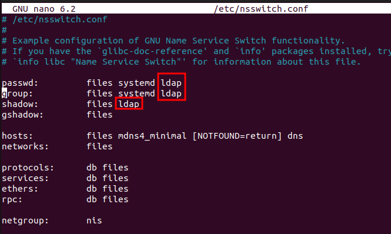

---

### 7. Reiniciar els Serveis

Reiniciem Samba per aplicar la configuració:

```bash
systemctl restart smbd nmbd
systemctl status smbd nmbd
```

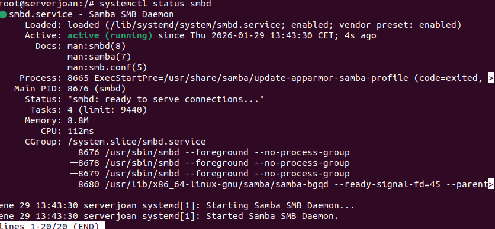

### 6. Verificació de la Integració

#### 6.1. Comprovar usuaris LDAP existents

Primer, llistem els usuaris que existeixen al directori LDAP:

```bash
ldapsearch -x -b "dc=joan,dc=cat" "(objectClass=posixAccount)" uid cn
```


En aquest exemple, tenim els següents usuaris LDAP:
- `javier` (Francisco Javier)
- `joaquin` (Joaquin)
- `jessica` (Jessica)
- `joel` (Joel Javier) 
- `mgarcia` (Maria Garcia)
- `lsanchez` (Laura Sanchez)

#### 6.2. Verificar que NSS veu els usuaris LDAP

Comprovem que el sistema Linux reconeix els usuaris LDAP mitjançant NSS:

```bash
getent passwd javier
```

Hauria de mostrar:
```
javier:x:2001:2001:Francisco Javier:/home/javier:/bin/bash
```


#### 6.3. Afegir usuari LDAP a Samba

Ara ve el pas clau: per permetre que un usuari LDAP accedeixi a recursos Samba, cal crear-li una **contrasenya Samba**:

```bash
smbpasswd -a javier
```

Introdueix una contrasenya quan se't demani:
```
New SMB password: ****
Retype new SMB password: ****
Added user javier.
```

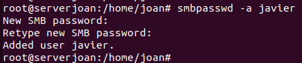


#### 6.4. Llistar usuaris de Samba

Comprovem que els usuaris s'han afegit correctament a la base de dades de Samba:

```bash
pdbedit -L
```

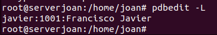


#### 6.5. Crear un recurs compartit per a usuaris LDAP

Ara crearem un recurs compartit específic per als usuaris LDAP que hem afegit a Samba.

Editem `/etc/samba/smb.conf` i afegim al final del fitxer:

```ini
[ldap_share]
path=/srv/samba/ldap_share
comment = Recurs compartit per usuaris LDAP
browseable = yes
read only = no
valid users = javier joaquin jessica joel mgarcia lsanchez
create mask = 0660
directory mask = 0770
```

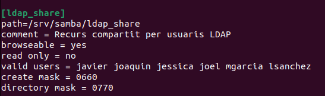

Creem el directori:

```bash
mkdir -p /srv/samba/ldap_share
chmod 770 /srv/samba/ldap_share
chown nobody:nogroup /srv/samba/ldap_share
```

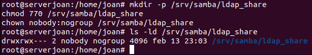


Reiniciem Samba:

```bash
systemctl restart smbd nmbd
```

---

### 7. Proves de Connexió amb Usuaris LDAP

Connectem des d'un client utilitzant un usuari LDAP:

```bash
smbclient //10.0.2.5/ldap_share -U javier
```

Un cop connectat, pots provar:
```
smb: \> ls
smb: \> mkdir prova_javier
smb: \> exit
```

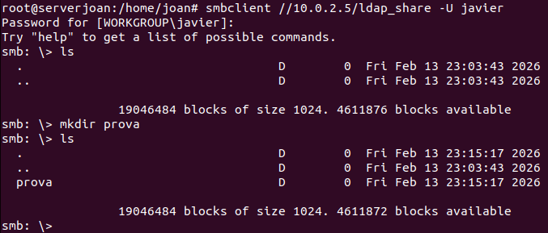


---

## Servidor NFS

Teoria nfs: Permet transfeir carpetes i arxius a través d'una xarxa local. L'autenticacio es fa a nivell de host, no d'usuari. a diferència de samba. Poden accedir tant clients windows com linux. 


## Exercici 1 (Sense LDAP)

### AL SERVIDOR
 

#### 1. Instal·lació del servidor NFS

Instal·lem el paquet `nfs-kernel-server` que conté el servidor NFS per Linux:

```bash
sudo apt install nfs-kernel-server
```

Aquest paquet instal·la:
- `nfs-kernel-server`: El servidor NFS principal
- `nfs-common`: Utilitats comunes per NFS
- `rpcbind`: Servei necessari per la comunicació RPC

**La captura mostra**: La instal·lació exitosa amb 6 paquets nous.


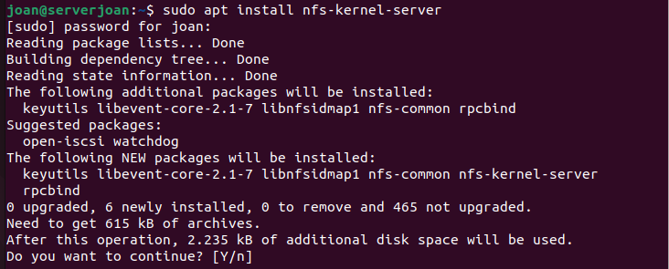

#### 2. Creació del directori compartit

Creem el directori que compartirem via NFS i configurem els permisos:

```bash
cd /
mkdir 1exercici
sudo su
chmod 777 1exercici/
chown nobody:nogroup 1exercici/
ls -l | grep 1exercici
```

**Explicació**:
- `chmod 777`: Dona permisos totals (lectura, escriptura, execució) per a tothom
- `chown nobody:nogroup`: Assigna el propietari a `nobody` (usuari genèric per NFS)

**La captura mostra**: La creació del directori i els permisos finals `drwxrwxrwx 2 nobody nogroup 4096 feb 10 12:51 1exercici`


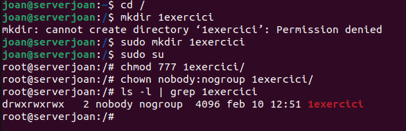


#### 3. Configuració del fitxer /etc/exports

El fitxer `/etc/exports` defineix quins directoris s'exporten via NFS i amb quines opcions.

Editem el fitxer:

```bash
nano /etc/exports
```

Afegim la línia:

```
/1exercici *(rw,sync,no_subtree_check)
```

**Significat dels paràmetres**:
- `/1exercici`: El directori que compartim
- `*`: Permet l'accés des de qualsevol IP (pots especificar IPs concretes com `10.0.2.0/24`)
- `rw`: Permisos de lectura i escriptura (read-write)
- `sync`: Escriu els canvis immediatament al disc (més segur)
- `no_subtree_check`: Millora el rendiment desactivant la verificació de subdirectoris

**La captura mostra**: El fitxer `/etc/exports` obert amb nano amb la línia `/1exercici *(rw,sync,no_subtree_check)` afegida.


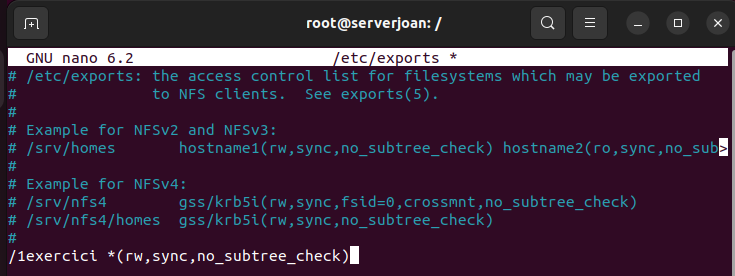

> [!CAUTION]
> **⚠️ CAPTURA QUE FALTA**: Cal afegir una captura de pantalla executant `exportfs -ra` per aplicar els canvis de `/etc/exports` i després `exportfs -v` per verificar les exportacions actives.


Creem un fitxer de prova dins del directori exportat i apliquem les exportacions:

```bash
cd 1exercici/
touch hola
```

Apliquem els canvis de les exportacions:

```bash
exportfs -ra
```

> **Nota**: `exportfs -ra` força la reexportació de tots els directoris sense reiniciar el servei.

**La captura mostra**: La creació del fitxer `hola` dins de `/1exercici`.

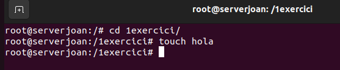

---


---

### AL CLIENT


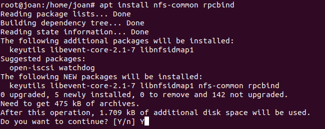

#### 2. Muntatge del recurs NFS

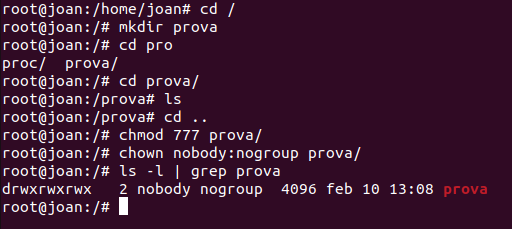

#### 1. Instal·lació del client NFS

Al client, instal·lem els paquets necessaris per muntar recursos NFS:

```bash
apt install nfs-common rpcbind
```

Aquests paquets proporcionen:
- `nfs-common`: Utilitats per muntar recursos NFS
- `rpcbind`: Servei de mapatge de ports RPC

**La captura mostra**: La instal·lació exitosa amb 5 paquets nous (keyutils, libevent-core, libnfsidmap1, nfs-common, rpcbind).


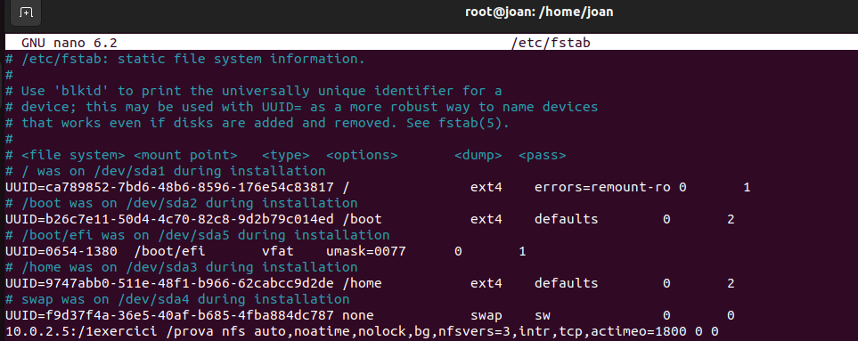


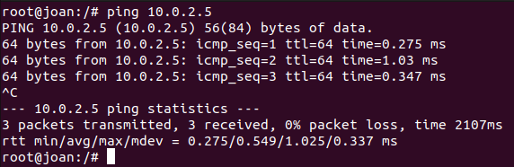

---


---

### PROVES DE FUNCIONAMENT


#### 2. Creació del punt de muntatge

Creem un directori on muntarem el recurs NFS:

```bash
cd /
mkdir prova
cd prova/
ls
cd ..
chmod 777 prova/
chown nobody:nogroup prova/
ls -l | grep prova
```

El resultat mostra: `drwxrwxrwx 2 nobody nogroup 4096 feb 10 13:08 prova`

**La captura mostra**: La creació del directori `/prova` amb permisos 777 i propietari nobody:nogroup.

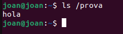

> [!CAUTION]
> **⚠️ CAPTURES QUE FALTEN**: Cal afegir captures mostrant:
> 1. **Crear un fitxer/directori** des del client dins del recurs muntat

#### 3. Verificar connectivitat

Abans de muntar el recurs, verifiquem que tenim connectivitat amb el servidor:

```bash
ping 10.0.2.5
```

El ping ha de ser exitós (0% packet loss).

**La captura mostra**: Test de ping al servidor 10.0.2.5 amb 3 paquets transmesos i rebuts correctament (0% packet loss).

> 2. **Verificar des del servidor** que el fitxer/directori s'ha creat
> 3. **Comprovar propietaris i permisos** amb `ls -l` tant al client com al servidor

---

---

### Client Windows amb NFS

#### 4. Configurar muntatge permanent amb /etc/fstab

Editarem `/etc/fstab` per fer que el recurs es munti automàticament a l'inici:

```bash
nano /etc/fstab
```

Afegim la línia:

```
10.0.2.5:/1exercici /prova nfs auto,nofail,noatime,nolock,bg,nfsvers=3,actimeo=0 0 0
```

**Paràmetres importants**:
- `auto`: Munta automàticament a l'inici
- `nofail`: No dona error si el servidor no està disponible
- `nolock,bg`: Opcions per millorar la compatibilitat
- `nfsvers=3`: Usa NFSv3

**La captura mostra**: El fitxer `/etc/fstab` obert amb nano amb la línia del muntatge NFS afegida.


A continuació documentarem com connectar un client **Windows 10/11** al servidor NFS Linux.

#### Prerequisits

- Windows 10 Pro/Enterprise o Windows 11 Pro/Enterprise  
- Connexió de xarxa amb el servidor NFS Linux
- Permisos d'administrador a Windows

---

#### 1. Habilitar "Services for NFS" a Windows

Windows inclou un client NFS natiu, però ve desactivat per defecte.

1. Obre el **Panell de Control** → **Programes** → **Activar o desactivar les característiques de Windows**
2. Marca la casella **"Services for NFS"** o **"Client for NFS"**

Un cop muntat el recurs (ja sigui amb `mount -a` o després de reiniciar), verifiquem que funciona:

```bash
ls /prova
```

Hauríem de veure el fitxer `hola` que vam crear al servidor!

**La captura mostra**: Executem `ls /prova` i veiem el fitxer `hola`, confirmant que el muntatge NFS funciona correctament.

3. Fes clic a **Acceptar** i **reinicia** el sistema

**Alternativa PowerShell** (executar com a administrador):
```powershell
Enable-WindowsOptionalFeature -Online -FeatureName ServicesForNFS-ClientOnly -All
```

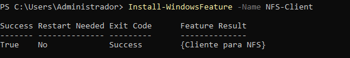

---

#### 2. Verificar el Servei NFS

Després del reinici, verifica que el servei està actiu:

**Opció GUI**: Prem `Win + R` → escriu `services.msc` → busca **"Client for NFS"** → comprova que està "En execució"

**Opció PowerShell**:
```powershell
Get-Service -Name NfsClnt
```

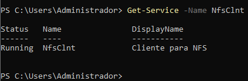

---

#### 3. Muntar el Recurs NFS

**IP del servidor**: `10.0.2.X` (substitueix per la teva IP)  
**Path exportat**: `/1exercici`

##### Opció A: PowerShell (Recomanat)

```powershell
# Muntar el recurs
mount -o anon \\10.0.2.X\1exercici Z:

# Verificar
net use
```
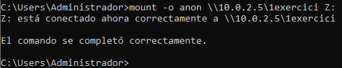


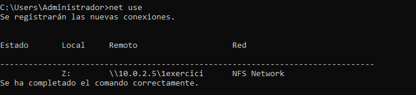

##### Opció B: Explorador de Fitxers

1. Obre l'Explorador → Clic dret a "Aquest equip"
2. Selecciona "Connectar a una unitat de xarxa"
3. **Unitat**: `Z:`
4. **Carpeta**: `\\10.0.2.X\1exercici`
5. Fes clic a "Finalitzar"


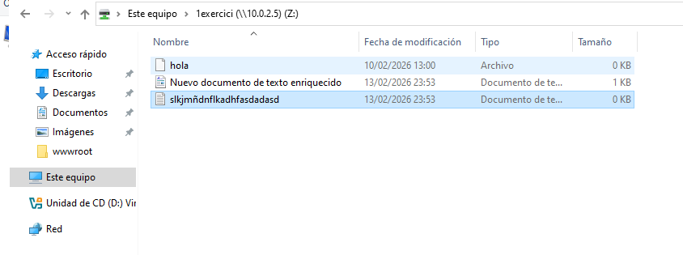


---


## Exercici 2: Muntatge de Homes via NFS per a usuaris LDAP

En aquest exercici configurarem el servidor NFS per allotjar els directoris personals (homes) dels usuaris LDAP, de manera que tinguin els seus fitxers accessibles des de qualsevol client.

### 1. Preparació del Servidor

Primer creem el directori principal on s'allotjaran tots els homes dels usuaris i ajustem els permisos i el propietari.

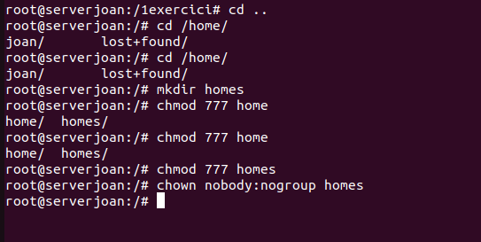

A continuació, creem manualment la carpeta per a l'usuari `marcel` dins del directori de homes i li donem permisos totals (777) provisionalment per a realitzar les proves.

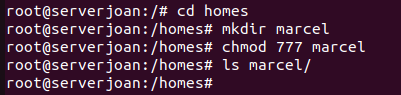

Editem el fitxer `/etc/exports` per compartir el directori `/homes` amb permís d'escriptura i lectura (`rw`) per a tota la xarxa.

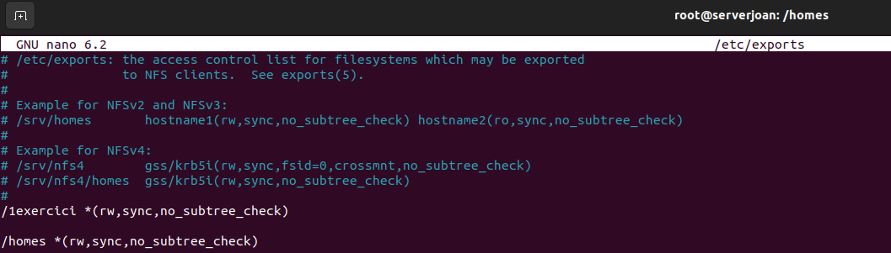

Verifiquem que el directori `homes` existeix i té els permisos correctes.


---

### 2. Configuració del Client

Al client, editem el fitxer `/etc/fstab` per muntar automàticament el directori remot `10.0.2.5:/homes` al directori local `/homes` utilitzant el protocol NFS.

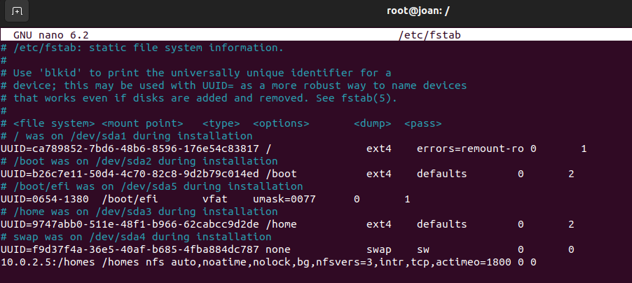

> **Nota**: Recorda crear el punt de muntatge local (`mkdir /homes`) si no existeix abans de reiniciar o executar `mount -a`.

### 3. Creació de l'Usuari LDAP

Creem un fitxer LDIF (`usu.ldif`) per definir l'usuari `marcel`, assignant-li com a directori personal (`homeDirectory`) la ruta `/homes/marcel`, que correspon al recurs NFS compartit.


Finalment, afegim l'usuari al directori LDAP amb la comanda `ldapadd`.

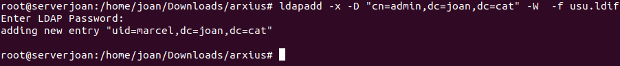