# Sprint 3: Configuració de Dominis amb LDAP

## Introducció als Dominis

Per començar, posem en xarxa NAT les dues màquines virtuals, tant al client com al servidor. D'aquesta manera podrem treballar més còmodament. Aquesta xarxa NAT ha de ser la mateixa a ambdues màquines.

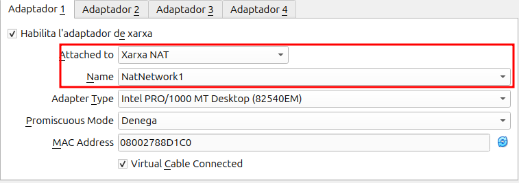

### Què és un domini?

Crear un domini en un servidor serveix per a tenir un entorn controlat on tenim:
- **Equips**: Ordinadors i dispositius de la xarxa
- **Recursos**: Carpetes compartides, impressores, etc.
- **Usuaris**: Comptes d'usuari centralitzats
- **Grups**: Agrupacions d'usuaris per facilitar la gestió

Els usuaris s'agrupen en grups. També tenim les **unitats organitzatives (OU)**, dintre de les quals podem tenir grups, usuaris solts i també equips.

### Estructura jeràrquica

Quan creem un domini, tindrem un **bosc** (forest). Dintre d'aquest bosc tenim les **branques**, que són els subdominis. 

Anem a fer un domini on hi hagi grups, usuaris i equips.

---

## Instal·lació del Servidor LDAP

### 1. Configuració del nom del servidor (hostname)

Primer, configurem el nom de la màquina del servidor editant el fitxer `/etc/hostname`:

```bash
nano /etc/hostname
```

Establim el nom del servidor. En aquest cas: `serverjoan`

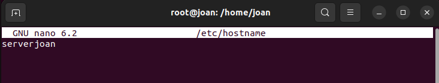

### 2. Configuració del fitxer hosts

Editem el fitxer `/etc/hosts` per afegir la resolució local del nom del servidor:

```bash
nano /etc/hosts
```

Afegim les línies necessàries amb les IPs i noms del servidor:

```
127.0.0.1       localhost
127.0.1.1       serverjoan
10.0.2.3        serverjoan.joan.cat serverjoan
```

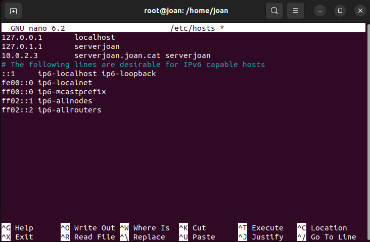

### 3. Instal·lació dels paquets LDAP

Instal·lem els paquets necessaris per al servidor LDAP:

```bash
apt update
apt install slapd ldap-utils
```

Durant la instal·lació, el sistema demanarà una **contrasenya d'administrador** per al directori LDAP. Aquesta contrasenya serà la del compte `admin` del domini.

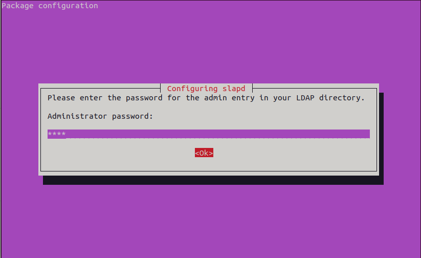

**Important**: Guarda aquesta contrasenya de forma segura.

### 4. Verificació inicial de la instal·lació

Podem verificar la configuració inicial del servidor LDAP amb la comanda:

```bash
slapcat
```

Aquesta comanda mostra el contingut de la base de dades LDAP. Inicialment veurem el domini `dc=nodomain`:

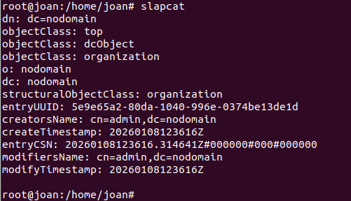

### 5. Reconfiguració del servidor LDAP

Per configurar correctament el nostre domini, executem:

```bash
dpkg-reconfigure slapd
```

Aquest assistent ens guiarà a través de diverses preguntes.

#### 5.1. Nom del domini DNS

Introduïm el nom del nostre domini. En aquest cas: `joan.cat`

Aquest serà el domini base del nostre directori LDAP (dc=joan,dc=cat).

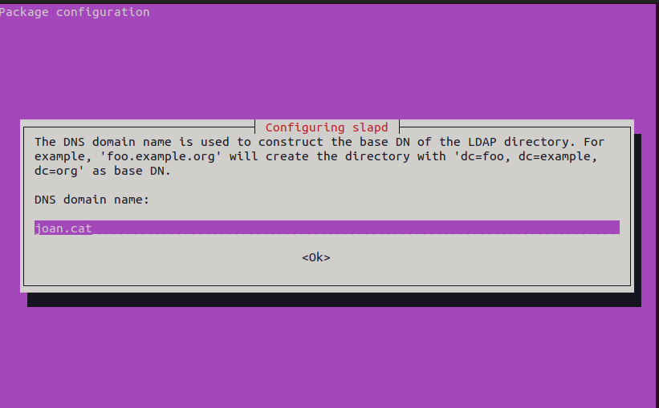

#### 5.2. Nom de l'organització

Introduïm el nom de la nostra organització. En aquest cas: `joan`

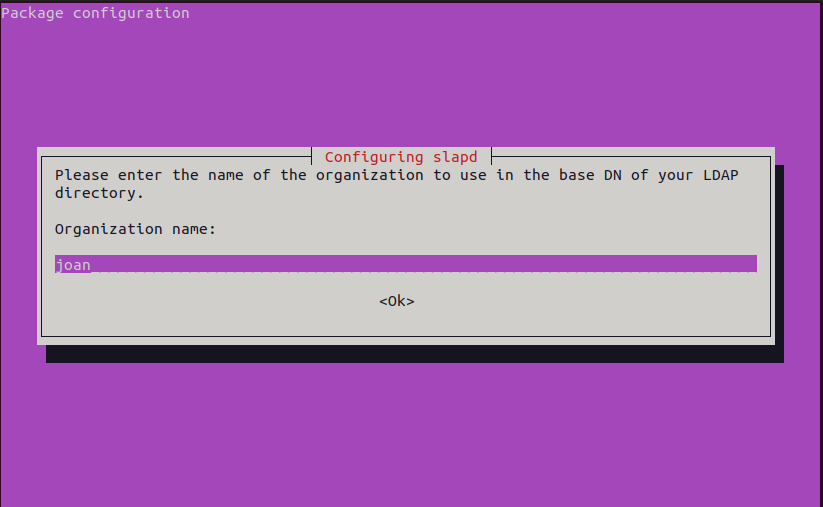

#### 5.3. Contrasenya d'administrador

Introduïm i confirmem la contrasenya per al compte d'administrador del directori LDAP.

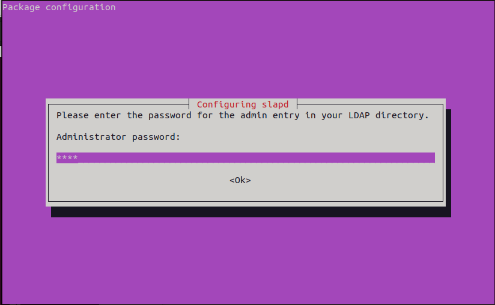

#### 5.4. Eliminar la base de dades quan es purgui slapd?

Seleccionem **Yes** per eliminar la base de dades si desinstal·lem el paquet.

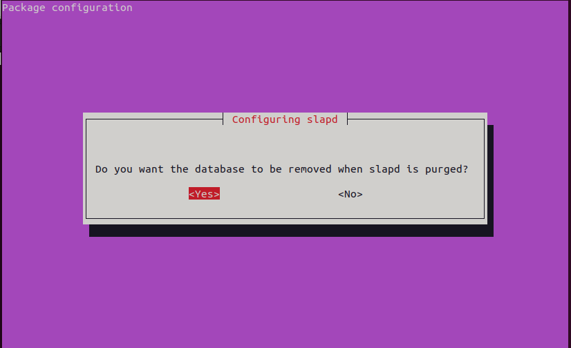

### 6. Verificació de la configuració final

Després de la reconfiguració, executem de nou `slapcat` per verificar que el domini s'ha configurat correctament:

```bash
slapcat
```

Ara podem veure:
- El domini `dc=nodomain` (antic)
- El nou domini `dc=joan,dc=cat` amb el compte admin

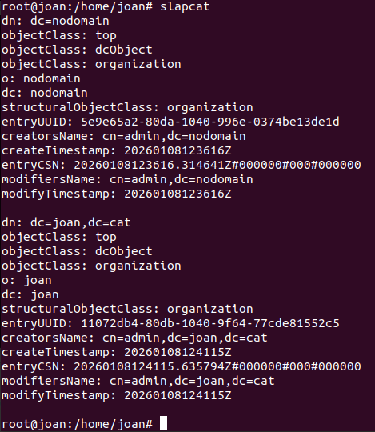

---

## Creació d'Unitats Organitzatives (OU)

### 1. Crear fitxer LDIF per a la unitat organitzativa "users"

Creem un fitxer LDIF (LDAP Data Interchange Format) per definir la unitat organitzativa:

```bash
nano uo.ldif
```

Contingut del fitxer:

```ldif
dn: ou=users,dc=joan,dc=cat
objectClass: organizationalUnit
objectClass: top
ou: users
```

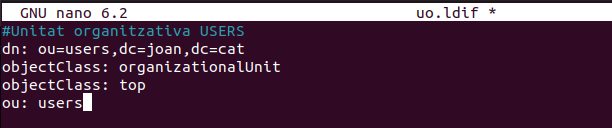

### 2. Afegir la unitat organitzativa al directori LDAP

Utilitzem la comanda `ldapadd` per afegir l'entrada al directori:

```bash
ldapadd -c -x -D "cn=admin,dc=joan,dc=cat" -W -f uo.ldif
```

Opcions:
- **-c**: Continuar en cas d'errors
- **-x**: Autenticació simple
- **-D**: Distinguished Name de l'usuari admin
- **-W**: Demanar contrasenya
- **-f**: Fitxer LDIF a processar

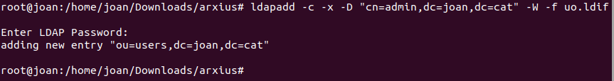

---

## Creació d'Usuaris

### 1. Crear fitxer LDIF per a un usuari

Creem un fitxer per definir un usuari anomenat "alu1":

```bash
nano usu.ldif
```

Contingut del fitxer:

```ldif
dn: uid=alu1,ou=users,dc=joan,dc=cat
objectClass: inetOrgPerson
objectClass: organizationalPerson
objectClass: person
objectClass: posixAccount
objectClass: shadowAccount
objectClass: top
userPassword:: VWx4MQ==
cn: Primer
gidNumber: 1001
homeDirectory: /home/alu1
loginShell: /bin/bash
sn: Alumne1
uidNumber: 1001
shadowExpire: -1
shadowLastChange: 16431
shadowMax: 99999
shadowMin: 0
shadowWarning: 7
```

### 2. Afegir l'usuari al directori LDAP

```bash
ldapadd -c -x -D "cn=admin,dc=joan,dc=cat" -W -f usu.ldif
```

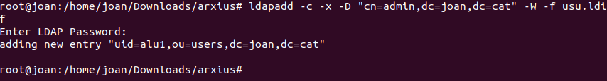

### 3. Verificar la creació de l'usuari

Podem utilitzar `ldapsearch` per verificar que l'usuari s'ha creat correctament:

```bash
ldapsearch -x -b "uid=alu1,ou=users,dc=joan,dc=cat"
```


---

## Creació de Grups

### 1. Crear fitxer LDIF per a un grup

Creem un fitxer per definir un grup anomenat "alumnes":

```bash
nano grup.ldif
```

Contingut del fitxer:

```ldif
dn: cn=alumnes,ou=users,dc=joan,dc=cat
objectClass: posixGroup
objectClass: top
cn: alumnes
gidNumber: 1001
memberUid: alu1
```

### 2. Afegir el grup al directori LDAP

```bash
ldapadd -c -x -D "cn=admin,dc=joan,dc=cat" -W -f grup.ldif
```

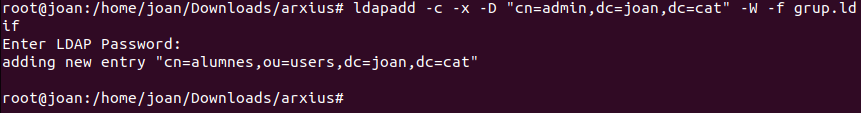

### 3. Verificar la creació del grup

```bash
ldapsearch -x -b "cn=alumnes,ou=users,dc=joan,dc=cat"
```

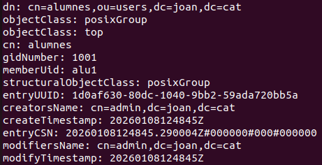

---

## Verificació Final de l'Estructura LDAP

Podem veure tota l'estructura del nostre directori LDAP amb `slapcat`:

```bash
slapcat
```

Ara veurem:
- El domini base: `dc=joan,dc=cat`
- La unitat organitzativa: `ou=users,dc=joan,dc=cat`
- L'usuari: `uid=alu1,ou=users,dc=joan,dc=cat`
- El grup: `cn=alumnes,ou=users,dc=joan,dc=cat`

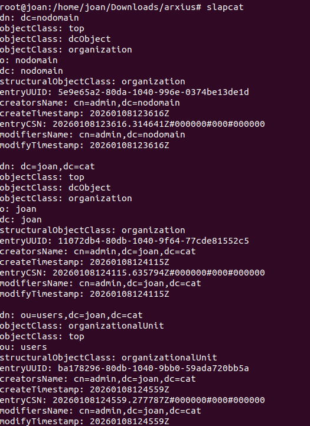

---

## Resum de Comandes

| Comanda | Funció |
|---------|--------|
| `nano /etc/hostname` | Editar el nom del servidor |
| `nano /etc/hosts` | Configurar resolució de noms |
| `apt install slapd ldap-utils` | Instal·lar servidor LDAP |
| `slapcat` | Mostrar contingut de la BD LDAP |
| `dpkg-reconfigure slapd` | Reconfigurar el servidor LDAP |
| `ldapadd -c -x -D "..." -W -f fitxer.ldif` | Afegir entrades al directori |
| `ldapsearch -x -b "DN"` | Cercar entrades al directori |

---


## Configuració del Client LDAP

### 1. Instal·lació del paquet d'autenticació LDAP

Instal·lem el paquet necessari per configurar l'autenticació LDAP al client:

```bash
apt update
apt install ldap-auth-config
```

Durant la instal·lació, l'assistent `ldap-auth-config` ens farà diverses preguntes per configurar la connexió amb el servidor LDAP.

### 2. Configuració de ldap-auth-config

#### 2.1. URI del servidor LDAP

Introduïm la URI del servidor LDAP. Utilitzem la IP del servidor:

```
ldap://10.0.2.3
```

**Nota**: És recomanable utilitzar una adreça IP per reduir riscos de fallada en cas de problemes amb el servei de noms.

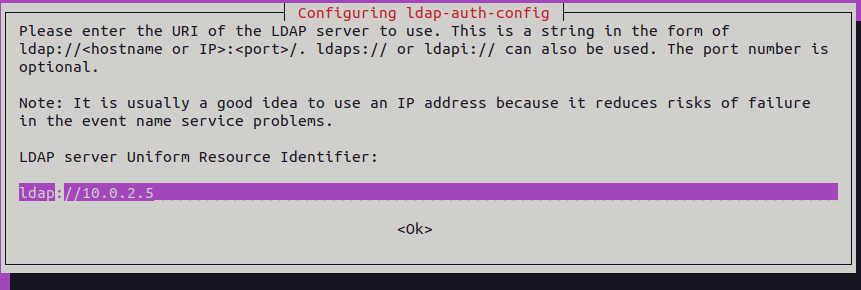

#### 2.2. Distinguished Name (DN) de la base de cerca

Introduïm el DN base del nostre domini:

```
dc=joan,dc=cat
```

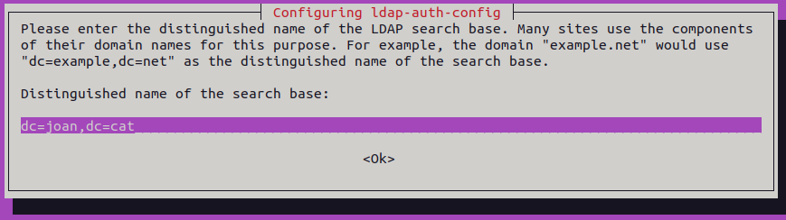

#### 2.3. Versió del protocol LDAP

Seleccionem la versió **3** del protocol LDAP (la més recent i recomanada).

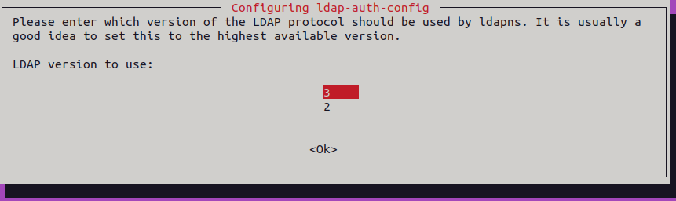

#### 2.4. Base de dades root local

Aquesta opció permet que les utilitats de contrasenyes que utilitzen PAM es comportin com si estiguessis canviant contrasenyes locals.

Seleccionem **Yes**.

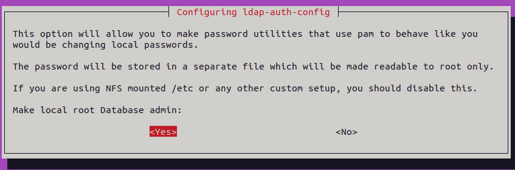

#### 2.5. Requereix login per accedir a la base de dades?

Aquesta opció pregunta si la base de dades LDAP requereix autenticació per recuperar entrades.

En una configuració normal, això no és necessari. Seleccionem **Yes**.

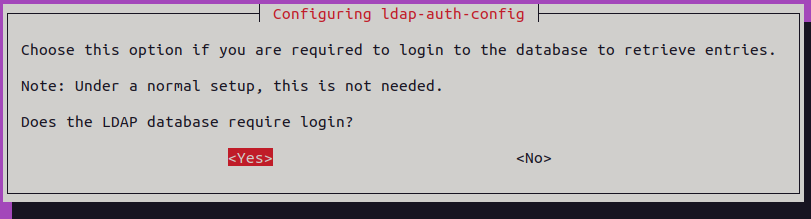

#### 2.6. Compte LDAP per a root

Aquest compte s'utilitzarà quan root canviï una contrasenya. Ha de ser un compte privilegiat.

Introduïm el DN del compte admin:

```
cn=admin,dc=joan,dc=cat
```

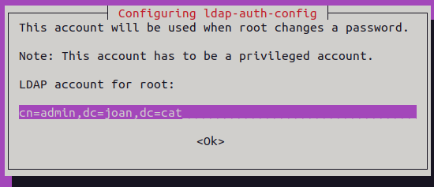

#### 2.7. Usuari no privilegiat per a la base de dades

Introduïm el nom del compte que s'utilitzarà per iniciar sessió a la base de dades LDAP.

**Advertència**: NO utilitzis comptes privilegiats per iniciar sessió, el fitxer de configuració ha de ser llegible per a tothom.

```
cn=admin,dc=joan,dc=cat
```

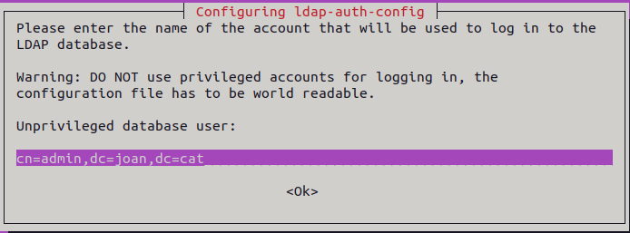

#### 2.8. Criptografia local per canviar contrasenyes

Seleccionem el tipus de criptografia a utilitzar quan es canviïn contrasenyes.

Opcions disponibles:
- clear
- crypt
- nds
- ad
- exop
- **md5** (seleccionada)

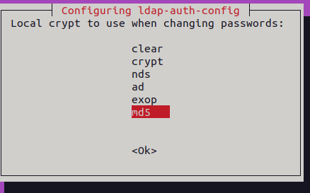

---

### 3. Configuració de NSSwitch

Editem el fitxer `/etc/nsswitch.conf` per indicar que el sistema ha de consultar també LDAP per a la informació d'usuaris, grups i contrasenyes:

```bash
nano /etc/nsswitch.conf
```

Modifiquem les línies següents per afegir `ldap` com a font de dades:

```
passwd:         ldap compat files systemd
group:          ldap compat files systemd
shadow:         ldap compat files
```

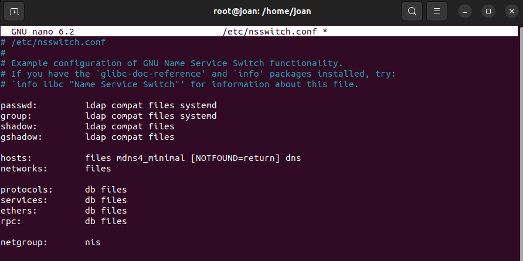

---

### 4. Configuració de PAM - Common Password

Editem el fitxer `/etc/pam.d/common-password`:

```bash
nano /etc/pam.d/common-password
```

**Important**: Hem d'**eliminar** el paràmetre `use_authtok` de la línia de `pam_ldap.so`.

La línia ha de quedar així:

```
password    [success=1 user_unknown=ignore default=die]    pam_ldap.so try_first_pass
```

> **Nota**: El paràmetre `use_authtok` forçaria a utilitzar la contrasenya ja introduïda, però això pot causar problemes en alguns casos. Per això l'eliminem.

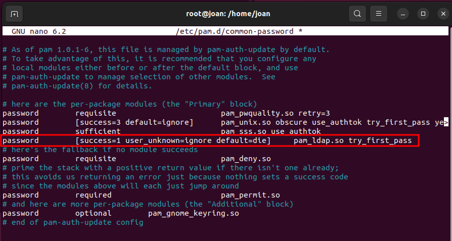

---

### 5. Configuració de PAM - Common Session

Editem el fitxer `/etc/pam.d/common-session`:

```bash
nano /etc/pam.d/common-session
```

Afegim al final del fitxer la línia següent per crear automàticament el directori home dels usuaris LDAP quan iniciïn sessió:

```
session required    pam_mkhomedir.so skel=/etc/skel umask=0022
```

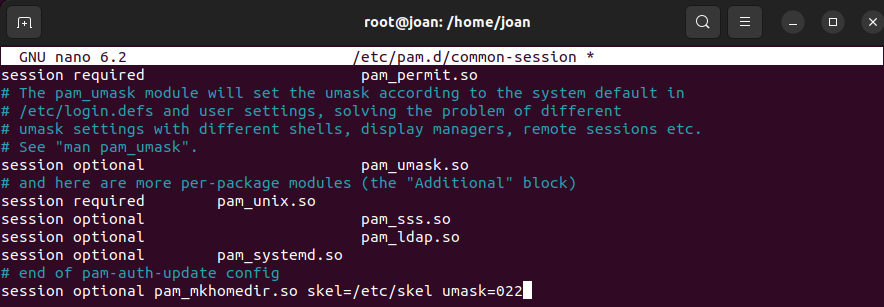

---

### 6. Configuració de LightDM

Editem el fitxer de configuració de LightDM per permetre l'entrada manual de noms d'usuari:

```bash
nano /usr/share/lightdm/lightdm.conf.d/50-ubuntu.conf
```

Afegim o modifiquem les línies següents:

```
[Seat:*]
user-session=ubuntu
greeter-show-manual-login=true
```

Això permetrà introduir manualment el nom d'usuari a la pantalla de login.

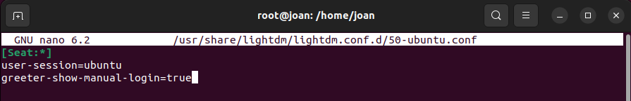

---

### 7. Verificació de la configuració

Podem verificar que els usuaris LDAP són visibles al sistema amb la comanda:

```bash
getent passwd
```

Aquesta comanda mostrarà tots els usuaris del sistema, incloent els usuaris LDAP com `alu1`:

```
alu1:x:1001:1001:Primer:/home/alu1:/bin/bash
```

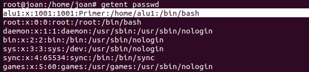

Ara ja podem **reiniciar el client** i iniciar sessió amb els usuaris del directori LDAP!


Com podem observar ja estem amb l'usuari alu1

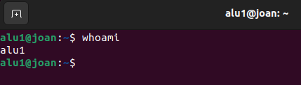

---

## Instal·lació d'Entorn Gràfic: LDAP Account Manager (LAM)

LDAP Account Manager (LAM) és una interfície web que permet administrar el servidor LDAP de forma gràfica. És més modern que phpLDAPadmin i compatible amb PHP 8.

### 1. Instal·lació de LAM

Al **servidor LDAP**, instal·lem LAM i les seves dependències:

```bash
sudo apt update
sudo apt install ldap-account-manager
```

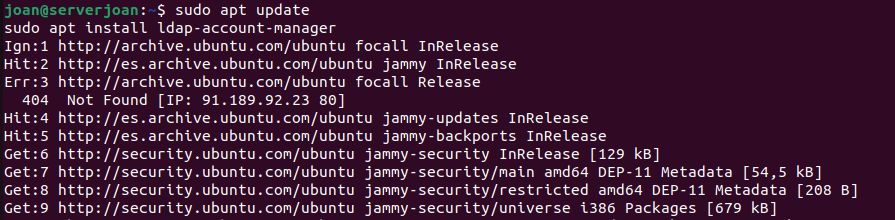

### 2. Accedir a LAM

Obre un navegador web i accedeix a:

```
http://localhost/lam
```

O des d'un altre ordinador:

```
http://10.0.2.3/lam
```

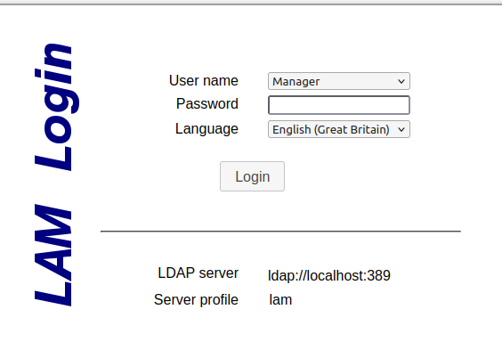

### 3. Configuració inicial de LAM

A la pàgina principal, fes clic a **"LAM configuration"** (a dalt a la dreta).

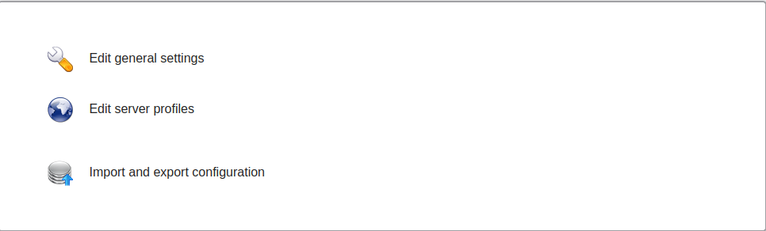

### 4. Editar perfil del servidor

Fes clic a **"Edit server profiles"**.

La contrasenya per defecte és: **lam**

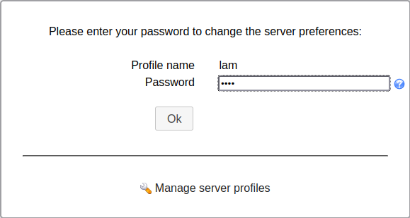

### 5. Configurar les opcions generals

A la pestanya **"General settings"**:

- **Server address**: `ldap://localhost:389`
- **Tree suffix**: `dc=joan,dc=cat`
- **Default language**: Català o Castellà


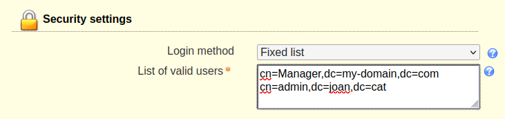

### 6. Configurar els tipus de comptes

A la pestanya **"Account types"**:

- **Users**: `ou=users,dc=joan,dc=cat`
- **Groups**: `ou=users,dc=joan,dc=cat`

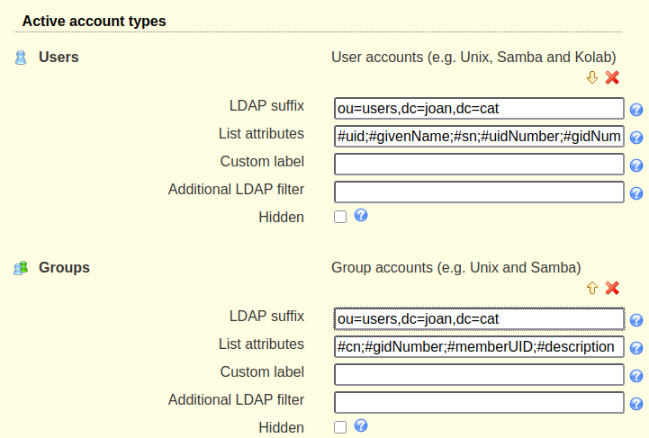

### 7. Guardar la configuració

Fes clic a **"Save"** per guardar els canvis.

### 8. Iniciar sessió a LAM

Torna a la pàgina principal (`http://localhost/lam`) i inicia sessió:

- **User name**: `cn=admin,dc=joan,dc=cat`
- **Password**: La teva contrasenya d'admin LDAP


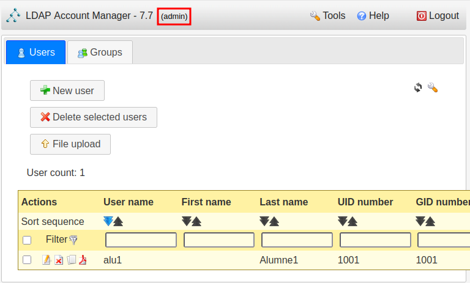

---

## Crear una Unitat Organitzativa (OU) amb LAM

### 1. Accedir a l'editor d'arbres

A la barra superior, fes clic a **"Tree view"** o **"Tools" → "Tree view"**.

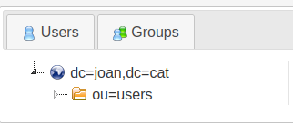

### 2. Crear nova OU

1. Fes clic dret sobre **dc=joan,dc=cat**
2. Selecciona **"Create a child entry"** o **"New entry"**
3. Selecciona **"organizationalUnit"**

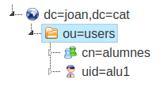

---

## Crear un Usuari amb LAM

### 1. Accedir a la gestió d'usuaris

A la barra superior, fes clic a **"Users"**.


### 2. Crear nou usuari

Fes clic a **"New user"** o el botó **"+"**.

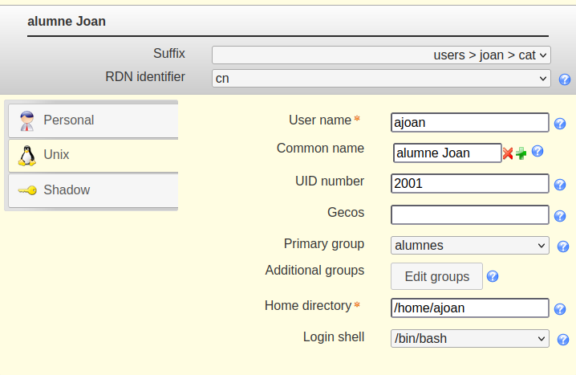

### 3. Omplir les dades de l'usuari

A la pestanya **"Personal"**:
- **Last name**: `alumne`
- **First name**: `ajoan`

A la pestanya **"Unix"**:
- **User name**: `ajoan`
- **UID number**: `2001`
- **Primary group**: Selecciona un grup o deixa per defecte
- **Home directory**: `/home/ajoan`
- **Login shell**: `/bin/bash`

A la pestanya **"Password"**:
- Introdueix la contrasenya per l'usuari

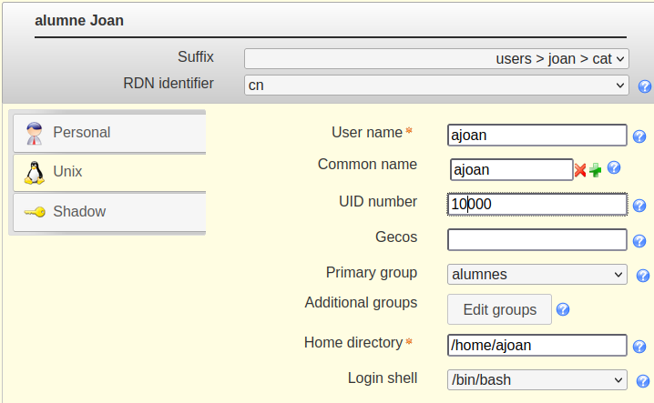

### 4. Guardar l'usuari

Fes clic a **"Save"**.

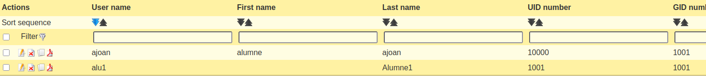
---

## Verificació: Accedir al Client amb el Nou Usuari

### 1. Verificar que l'usuari és visible al client

Al **client**, executa:

```bash
getent passwd ajoan
```

Hauries de veure:

```
ajoan:x:2001:2001:ajoan:/home/ajoan:/bin/bash
```

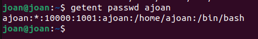

### 2. Iniciar sessió amb el nou usuari

Reinicia el client i inicia sessió amb:
- **Usuari**: `ajoan`
- **Contrasenya**: La que has configurat

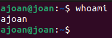

---

## Activitats Pràctiques: Gestió d'Entrades LDAP

En aquesta secció realitzarem activitats pràctiques amb les comandes principals de gestió LDAP: `ldapsearch`, `ldapadd`, `ldapmodify` i `ldapdelete`.

### LDIF Base per a les Activitats

Primer, crearem un fitxer LDIF complet que inclou una estructura organitzativa amb diversos elements. Aquest serà el punt de partida per a les nostres activitats.

```bash
nano estructura_completa.ldif
```

Contingut del fitxer `exemple.ldif`:

```ldif
# Unitat Organitzativa: Departaments
dn: ou=Departaments,dc=joan,dc=cat
objectClass: organizationalUnit
ou: Departaments
description: Departaments de l'empresa

# Unitat Organitzativa: Informàtica
dn: ou=Informatica,ou=Departaments,dc=joan,dc=cat
objectClass: organizationalUnit
ou: Informatica
description: Departament d'Informàtica

# Unitat Organitzativa: Vendes
dn: ou=Vendes,ou=Departaments,dc=joan,dc=cat
objectClass: organizationalUnit
ou: Vendes
description: Departament de Vendes

# Grup: Administradors
dn: cn=Administradors,ou=Informatica,ou=Departaments,dc=joan,dc=cat
objectClass: posixGroup
cn: Administradors
gidNumber: 5001
description: Grup d'administradors del sistema

# Grup: Desenvolupadors
dn: cn=Desenvolupadors,ou=Informatica,ou=Departaments,dc=joan,dc=cat
objectClass: posixGroup
cn: Desenvolupadors
gidNumber: 5002
description: Grup de desenvolupadors

# Grup: Comercials
dn: cn=Comercials,ou=Vendes,ou=Departaments,dc=joan,dc=cat
objectClass: posixGroup
cn: Comercials
gidNumber: 5003
description: Grup de comercials

# Usuari: Maria Garcia (Administradora)
dn: uid=mgarcia,ou=Informatica,ou=Departaments,dc=joan,dc=cat
objectClass: inetOrgPerson
objectClass: posixAccount
objectClass: shadowAccount
uid: mgarcia
cn: Maria Garcia
sn: Garcia
givenName: Maria
mail: mgarcia@joan.cat
uidNumber: 3001
gidNumber: 5001
homeDirectory: /home/mgarcia
loginShell: /bin/bash
userPassword: {SSHA}XYZ123

# Usuari: Pere Martí (Desenvolupador)
dn: uid=pmarti,ou=Informatica,ou=Departaments,dc=joan,dc=cat
objectClass: inetOrgPerson
objectClass: posixAccount
objectClass: shadowAccount
uid: pmarti
cn: Pere Marti
sn: Marti
givenName: Pere
mail: pmarti@joan.cat
telephoneNumber: +34 123 456 789
uidNumber: 3002
gidNumber: 5002
homeDirectory: /home/pmarti
loginShell: /bin/bash
userPassword: {SSHA}ABC456

# Usuari: Laura Sánchez (Comercial)
dn: uid=lsanchez,ou=Vendes,ou=Departaments,dc=joan,dc=cat
objectClass: inetOrgPerson
objectClass: posixAccount
objectClass: shadowAccount
uid: lsanchez
cn: Laura Sanchez
sn: Sanchez
givenName: Laura
mail: lsanchez@joan.cat
telephoneNumber: +34 987 654 321
uidNumber: 3003
gidNumber: 5003
homeDirectory: /home/lsanchez
loginShell: /bin/bash
userPassword: {SSHA}DEF789
```

Afegir l'estructura completa al directori LDAP:

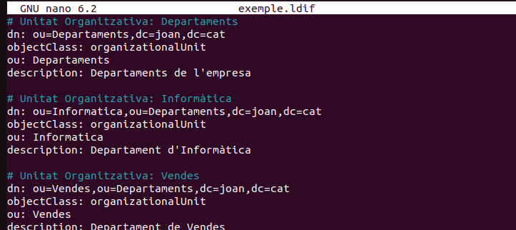

```bash
ldapadd -c -x -D "cn=admin,dc=joan,dc=cat" -W -f exemple.ldif
```

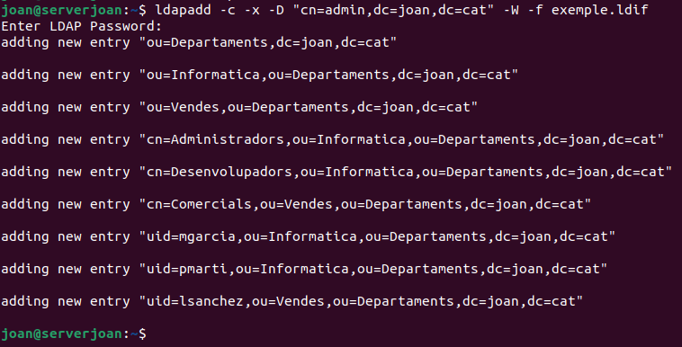

---


### Activitat 1: Cerques amb `ldapsearch`

La comanda `ldapsearch` permet cercar i consultar entrades al directori LDAP.

#### 1.1. Llistar totes les entrades del directori

```bash
ldapsearch -x -LLL -b "dc=joan,dc=cat"
```

**Explicació**:
- `-x`: Autenticació simple
- `-LLL`: Format de sortida LDIF simplificat
- `-b`: Base DN per a la cerca

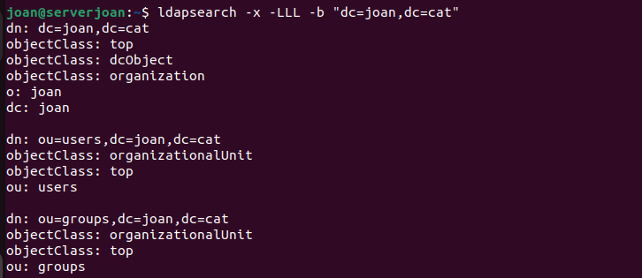

#### 1.2. Cercar tots els usuaris

```bash
ldapsearch -x -LLL -b "dc=joan,dc=cat" "(objectClass=posixAccount)"
```

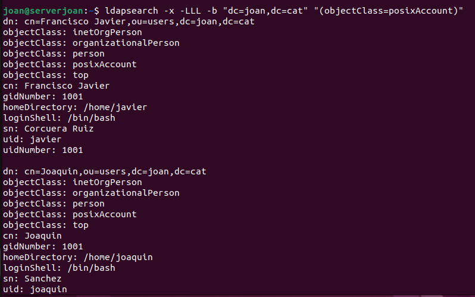

#### 1.3. Cercar un usuari específic

```bash
ldapsearch -x -LLL -b "dc=joan,dc=cat" "(uid=mgarcia)"
```

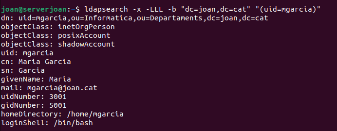

#### 1.4. Cercar tots els grups

```bash
ldapsearch -x -LLL -b "dc=joan,dc=cat" "(objectClass=posixGroup)"
```
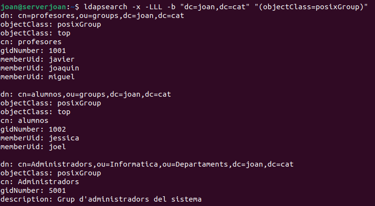

#### 1.5. Cercar usuaris del departament d'Informàtica

```bash
ldapsearch -x -LLL -b "ou=Informatica,ou=Departaments,dc=joan,dc=cat" "(objectClass=posixAccount)"
```
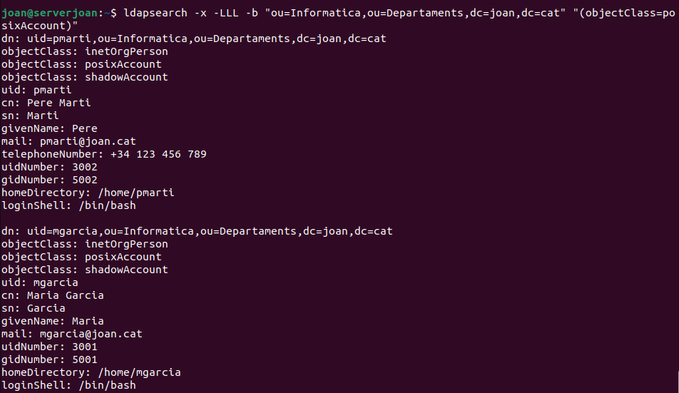

#### 1.6. Cercar usuaris amb un atribut específic (correu electrònic)

```bash
ldapsearch -x -LLL -b "dc=joan,dc=cat" "(mail=*@joan.cat)" mail cn
```
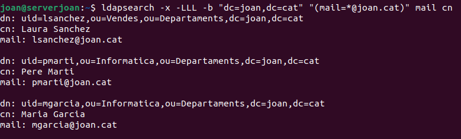

### Activitat 2: Afegir entrades amb `ldapadd`

La comanda `ldapadd` permet afegir noves entrades al directori LDAP.

#### 2.1. Afegir un nou departament

Crear el fitxer `noudept.ldif`:

```bash
nano noudept.ldif
```

Contingut:

```ldif
dn: ou=RRHH,ou=Departaments,dc=joan,dc=cat
objectClass: organizationalUnit
ou: RRHH
description: Departament de Recursos Humans
```

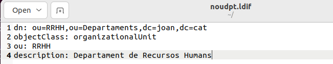

Afegir al directori:

```bash
ldapadd -x -D "cn=admin,dc=joan,dc=cat" -W -f noudept.ldif
```

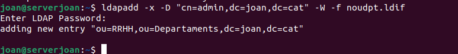

Verificar:

```bash
ldapsearch -x -LLL -b "dc=joan,dc=cat" "(ou=RRHH)"
```
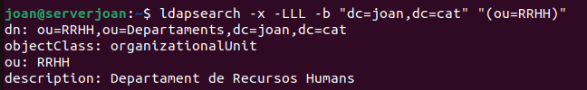


### Activitat 3: Modificar entrades amb `ldapmodify`

La comanda `ldapmodify` permet modificar atributs d'entrades existents. Utilitzarem el mateix fitxer `exemple.ldif` per afegir-hi les modificacions.

#### 3.1. Modificar el telèfon d'un usuari

Editar el fitxer `exemple.ldif` i afegir al final:

```bash
nano exemple.ldif
```

Afegir al final del fitxer:

```ldif
dn: uid=pmarti,ou=Informatica,ou=Departaments,dc=joan,dc=cat
changetype: modify
replace: telephoneNumber
telephoneNumber: +34 555 666 777
```

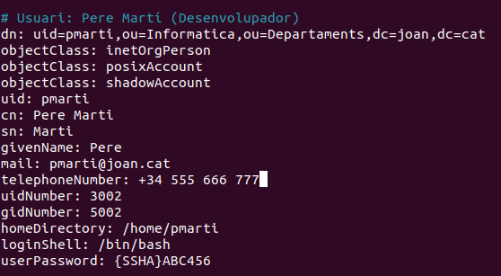

Aplicar la modificació:

```bash
ldapmodify -x -D "cn=admin,dc=joan,dc=cat" -W -f exemple.ldif
```

Verificar: `ldapsearch -x -LLL -b "dc=joan,dc=cat" "(uid=pmarti)" telephoneNumber`

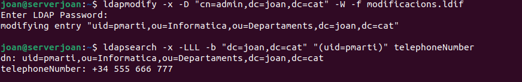

#### 3.2. Afegir un atribut a un usuari

Editar el mateix fitxer i afegir:

```ldif
dn: uid=lsanchez,ou=Vendes,ou=Departaments,dc=joan,dc=cat
changetype: modify
add: description
description: Responsable de vendes a Catalunya
```

Aplicar: `ldapmodify -x -D "cn=admin,dc=joan,dc=cat" -W -f exemple.ldif`

Verificar: `ldapsearch -x -LLL -b "dc=joan,dc=cat" "(uid=lsanchez)" description`

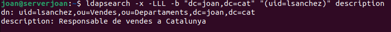

#### 3.3. Eliminar un atribut d'un usuari

Afegir al mateix fitxer:

```ldif
dn: uid=pmarti,ou=Informatica,ou=Departaments,dc=joan,dc=cat
changetype: modify
delete: telephoneNumber
```

Aplicar: `ldapmodify -x -D "cn=admin,dc=joan,dc=cat" -W -f exemple.ldif`

Verificar: `ldapsearch -x -LLL -b "dc=joan,dc=cat" "(uid=pmarti)" telephoneNumber`

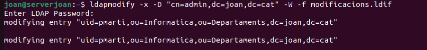

### Activitat 4: Eliminar entrades amb `ldapdelete`

La comanda `ldapdelete` permet eliminar entrades del directori LDAP.

> [!CAUTION]
> Les operacions d'eliminació són irreversibles. Assegura't sempre abans d'eliminar.

#### 4.1. Eliminar un usuari

Verificar que existeix: `ldapsearch -x -LLL -b "dc=joan,dc=cat" "(uid=pmarti)"`

Eliminar:

```bash
ldapdelete -x -D "cn=admin,dc=joan,dc=cat" -W "uid=pmarti,ou=Informatica,ou=Departaments,dc=joan,dc=cat"
```

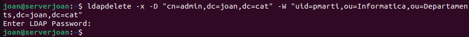

#### 4.2. Eliminar un grup

Verificar que existeix: `ldapsearch -x -LLL -b "dc=joan,dc=cat" "(cn=Desenvolupadors)"`

Eliminar:

```bash
ldapdelete -x -D "cn=admin,dc=joan,dc=cat" -W "cn=Desenvolupadors,ou=Informatica,ou=Departaments,dc=joan,dc=cat"
```

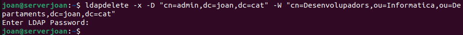


## Resum de Comandes

| Comanda | Funció | Exemple |
|---------|--------|---------|
| `ldapsearch` | Cercar entrades | `ldapsearch -x -LLL -b "dc=joan,dc=cat" "(uid=usuari)"` |
| `ldapadd` | Afegir entrades | `ldapadd -x -D "cn=admin,dc=joan,dc=cat" -W -f fitxer.ldif` |
| `ldapmodify` | Modificar entrades | `ldapmodify -x -D "cn=admin,dc=joan,dc=cat" -W -f modif.ldif` |
| `ldapdelete` | Eliminar entrades | `ldapdelete -x -D "cn=admin,dc=joan,dc=cat" -W "dn_a_eliminar"` |

### Opcions comunes

- `-x`: Autenticació simple
- `-D`: DN de l'usuari que executa l'operació (normalment admin)
- `-W`: Demanar contrasenya de forma interactiva
- `-w`: Especificar contrasenya a la línia de comandes (menys segur)
- `-f`: Fitxer LDIF a processar
- `-b`: Base DN per a cerques
- `-LLL`: Format de sortida LDIF simplificat (només ldapsearch)
- `-c`: Continuar malgrat errors (ldapadd)
