# Sprint 5: Monitoratge, auditories i programari client-servidor

## Introduccio

En aquest sprint treballarem tres blocs principals:

- L'analisi i tractament dels logs del sistema.
- L'enviament remot de logs entre dues maquines.
- La configuracio d'un servidor d'actualitzacions amb `apt-mirror`.

L'objectiu es entendre com es registra l'activitat del sistema, com es pot centralitzar aquesta informacio en un servidor i com es poden distribuir paquets i actualitzacions a diversos clients des d'un mirall intern.

---

## Bloc 1: Logs del sistema

### Que son els logs?

Els logs son fitxers o registres on el sistema operatiu i els serveis guarden informacio sobre el seu funcionament. Serveixen per:

- detectar errors;
- auditar accions i incidencies;
- comprovar si un servei s'ha iniciat o aturat correctament;
- fer seguiment de missatges del sistema i de les aplicacions.

A Linux, una bona part dels logs es troben a `/var/log`, tot i que alguns serveis fan servir el journal de `systemd` i es consulten amb `journalctl`.

---

### Exercici 1: Consultar els logs locals

Primer llistem el contingut del directori on habitualment es desen els logs del sistema:

```bash
ls -la /var/log
```

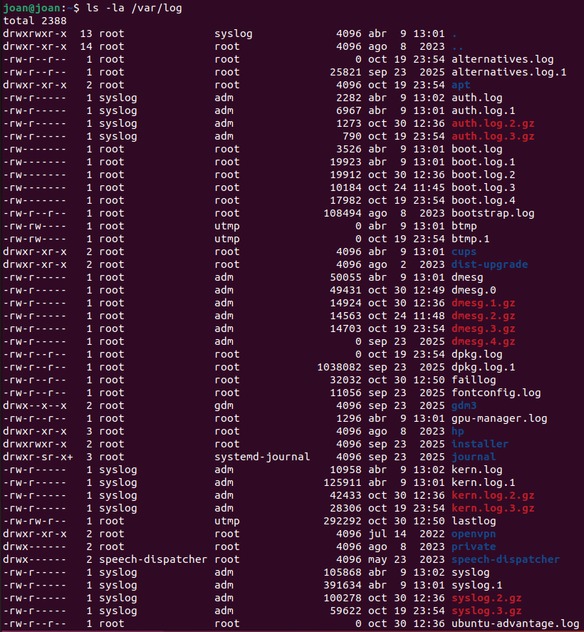

Aquest directori conte fitxers i subdirectoris de registre generats per serveis com `apt`, `apache2`, `dpkg`, `kern`, `syslog` o `auth`.

---

### Visualitzar el log principal del sistema

Ara consultem el contingut del fitxer principal de logs:

```bash
cat /var/log/syslog
```

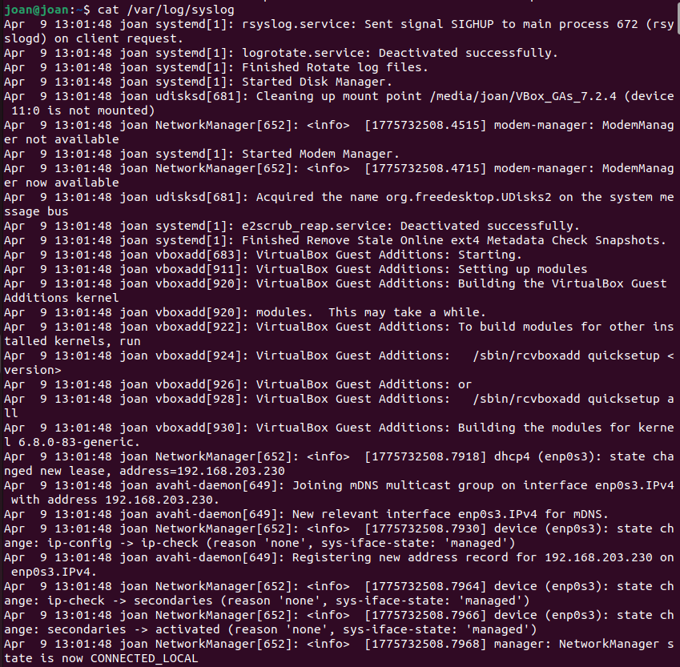

En aquest fitxer solen apareixer missatges generals del sistema, serveis, dimonis i esdeveniments del sistema operatiu.

---

### Seguir el log en temps real

Per observar com arriben nous missatges al log mentre el sistema esta en funcionament:

```bash
tail -f /var/log/syslog
```

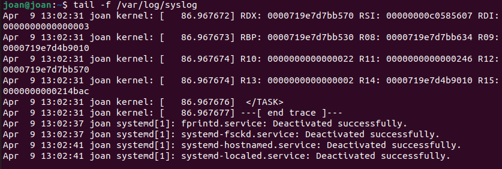

Amb aquesta comanda veiem els nous esdeveniments a mesura que es generen. Per sortir de `tail -f`, prem `Ctrl + C`.

---

## Rotacio de logs

La rotacio de logs evita que els fitxers de registre creixin indefinidament i acabin ocupant massa espai al disc. A Linux, aquesta tasca es gestiona habitualment amb `logrotate`.

### Veure la configuracio de rotacio disponible

```bash
ls -la /etc/logrotate.d
```

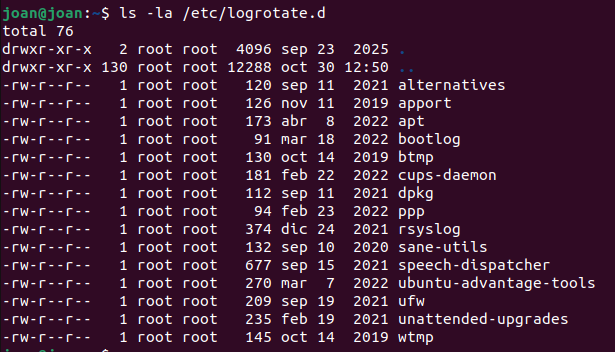

En aquest directori hi ha configuracions especifiques per a diferents paquets i serveis.

---

### Consultar la rotacio de `rsyslog`

```bash
cat /etc/logrotate.d/rsyslog
```

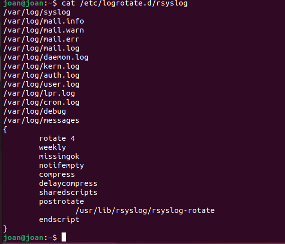

Aqui podem veure cada quant es roten els logs, quantes copies es guarden i si es comprimeixen.

---

### Consultar la rotacio de `apt`

```bash
cat /etc/logrotate.d/apt
```

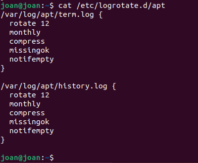

Aquesta configuracio controla la rotacio dels logs relacionats amb instal·lacions i actualitzacions de paquets.

---

### Consultar la configuracio principal de `rsyslog`

Primer obrim el fitxer:

```bash
sudo nano /etc/rsyslog.conf
```
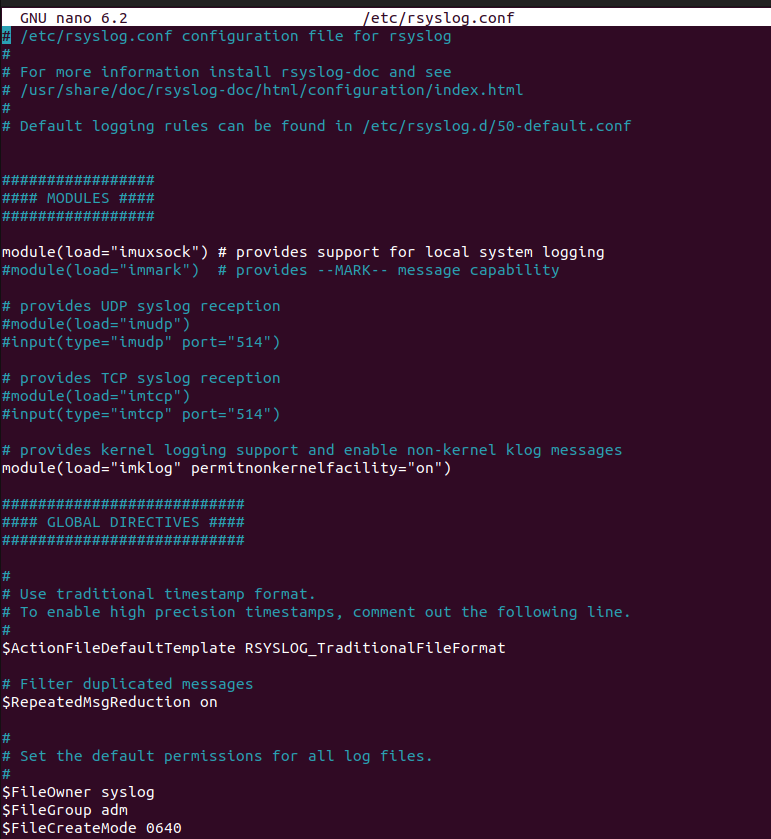

En aquest fitxer s'hi defineixen moduls, directives globals i inclusions de configuracions addicionals des de `/etc/rsyslog.d/`.

---

## Proves amb `logger`

La comanda `logger` permet enviar missatges de prova al sistema de logs indicant la facility i la priority.

### Prova 1: `kern.notice`

```bash
logger -p kern.notice "Prova Joan"
tail -n 20 /var/log/syslog
```

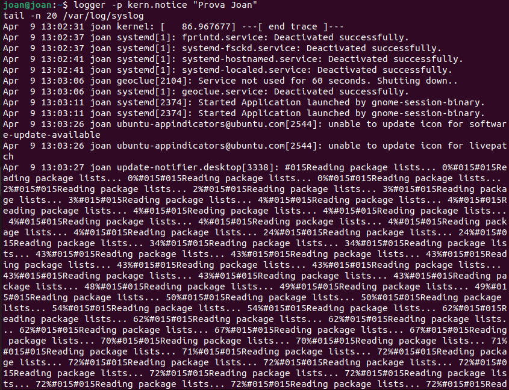

Aquest missatge hauria d'apareixer al `syslog`.

---

### Prova 2: `mail.notice`

```bash
logger -p mail.notice "Prova Joan9"
cat /var/log/mail.log
```

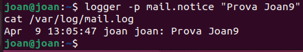


Segons la configuracio del sistema, aquest missatge pot no apareixer encara a `mail.log`.

---

### Comprovar la regla actual de `mail` a `50-default.conf`

```bash
sudo nano /etc/rsyslog.d/50-default.conf
```

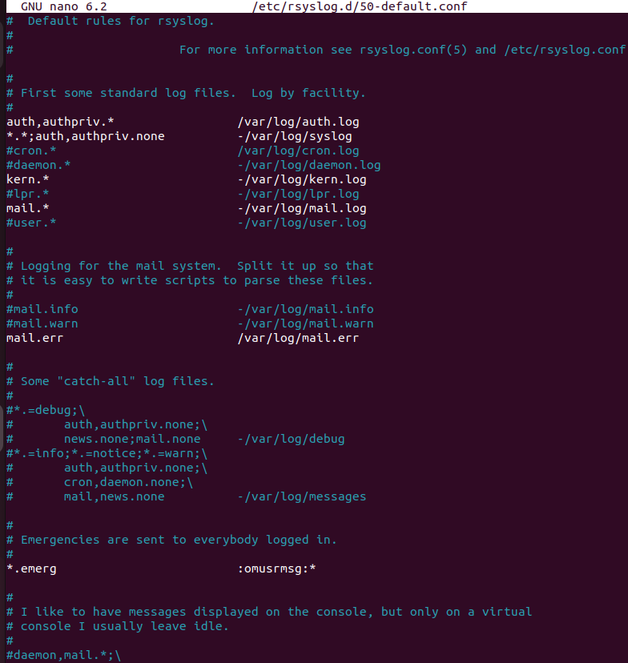

Cal localitzar la regla associada als missatges de correu per entendre quins nivells s'estan desant a `/var/log/mail.log`.

---

### Prova 3: repetir `mail.notice`

```bash
logger -p mail.notice "Prova Joan2"
cat /var/log/mail.log
```

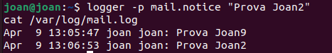

Si la regla encara no inclou aquest nivell, el missatge tampoc no apareixera al `mail.log`.

Per comprovar on ha anat a parar, podem buscar-lo al log general:

```bash
grep "Prova Joan3" /var/log/syslog
```

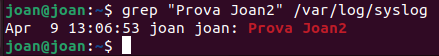
---

### Prova 4: `mail.err`

```bash
logger -p mail.err "Prova Joan8"
cat /var/log/mail.log
```

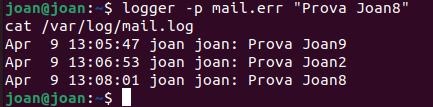

Aquest nivell acostuma a estar redirigit al fitxer `mail.log`, aixi que normalment hi hauria d'apareixer.

---

### Prova 5: `mail.crit`

```bash
logger -p mail.crit "Prova Joan7"
cat /var/log/mail.log
```

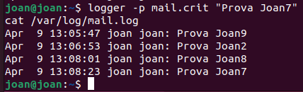

El resultat dependra de la regla exacta definida al fitxer `50-default.conf`. El que interessa aqui es comparar el comportament amb la prova anterior.

---

### Crear un log personalitzat per als missatges `crit`

Ara editarem el fitxer de configuracio per afegir una regla nova:

```bash
sudo nano /etc/rsyslog.d/50-default.conf
```

Afegim aquesta linia al final:

```text
*.crit    -/var/log/joan.log
```

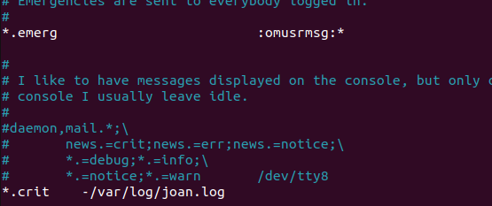

Aquesta regla fara que tots els missatges de nivell `crit` es desin tambe a `/var/log/joan.log`.

---

### Reiniciar `rsyslog` i provar de nou

```bash
sudo systemctl restart rsyslog
logger -p mail.crit "Prova Ferran6"
```


Despres podem tornar a obrir la configuracio per verificar que la regla segueix present:

```bash
sudo nano /etc/rsyslog.d/50-default.conf
```
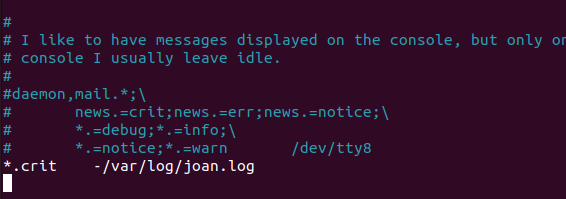

---

### Verificar el nou fitxer de log

```bash
logger -p cron.crit "hola"
cat /var/log/ferran.log
```

CAPTURA 20: contingut de `/var/log/ferran.log` despres d'enviar un missatge `cron.crit`.

Si la regla esta ben aplicada, el missatge apareixera en aquest nou fitxer.

---

## Consultes amb `journalctl`

`journalctl` permet consultar el journal gestionat per `systemd`, amb filtres molt utils per prioritat, servei o facility.

### Filtrar per prioritat critica

```bash
journalctl -p crit
```

CAPTURA 21: sortida de `journalctl -p crit`.

Aqui s'han de veure tots els esdeveniments de nivell critic o superior.

---

### Filtrar per facility `mail`

```bash
journalctl --facility=mail
```

CAPTURA 22: sortida de `journalctl --facility=mail`.

En aquesta consulta haurien d'apareixer les proves que hem enviat amb `logger` usant la facility `mail`.

---

## Bloc 2: Enviar logs remotament a una altra maquina

En aquesta part configurarem una maquina servidora per rebre logs remots i una maquina client per reenviar-los.

### Dades de la practica

Pots adaptar aquests valors als teus equips, pero en aquesta documentacio farem servir els de la guia:

- Servidor de logs: `10.0.2.15`
- Client: una altra maquina de la mateixa xarxa

---

### Configuracio del servidor de logs

A la maquina servidora, creem un fitxer de configuracio nou:

```bash
sudo nano /etc/rsyslog.d/10-remote.conf
```

Amb aquest contingut:

```conf
module(load="imudp")
input(type="imudp" port="514")

module(load="imtcp")
input(type="imtcp" port="514")

template(name="RemoteLogs" type="string" string="/var/log/remote/%HOSTNAME%/syslog.log")
*.* ?RemoteLogs
& stop
```

Despres preparem el directori i reiniciem el servei:

```bash
sudo mkdir -p /var/log/remote
sudo systemctl restart rsyslog
```

CAPTURA 23: contingut de `/etc/rsyslog.d/10-remote.conf`.

---

### Comprovar que el servidor escolta al port 514

```bash
ss -tulpn | grep 514
```

CAPTURA 24: `rsyslog` escoltant als ports 514 UDP i TCP.

Si la configuracio es correcta, hi hauries de veure entrades per `udp` i `tcp`.

---

### Configuracio del client

A la maquina client, creem el fitxer de reenviament:

```bash
sudo nano /etc/rsyslog.d/90-forward.conf
```

Amb aquest contingut:

```conf
*.* @@10.0.2.15:514
```

Despres reiniciem `rsyslog`:

```bash
sudo systemctl restart rsyslog
```

CAPTURA 25: contingut de `/etc/rsyslog.d/90-forward.conf`.

Els dos simbols `@@` indiquen enviament via TCP. Si fos UDP, se'n faria servir nomes un (`@`).

---

### Enviar un missatge de prova des del client

```bash
logger "PROVA"
```

CAPTURA 26: enviament del missatge `PROVA` des del client.

---

### Verificar al servidor que s'han creat els logs remots

```bash
ls -la /var/log/remote
```

CAPTURA 27: contingut de `/var/log/remote`.

Dins d'aquest directori hauria d'apareixer una carpeta amb el nom del client.

---

### Veure la carpeta del client

Substitueix el nom pel hostname real del teu client si es diferent:

```bash
ls -la /var/log/remote/ferranbernis1-VirtualBox
```

CAPTURA 28: contingut de la carpeta remota del client.

En aquesta carpeta hi hauria d'haver el fitxer `syslog.log`.

---

### Comprovar que el missatge ha arribat

```bash
cat /var/log/remote/ferranbernis1-VirtualBox/syslog.log
```

CAPTURA 29: visualitzacio del `syslog.log` remot amb el missatge `PROVA`.

Amb aquesta comprovacio confirmem que el servidor centralitza correctament els logs del client.

---

## Bloc 3: Servidor d'actualitzacions amb `apt-mirror`

### Per que es recomanable tenir un servidor d'actualitzacions?

Un servidor d'actualitzacions permet:

- centralitzar la distribucio de paquets;
- estalviar ample de banda;
- controlar millor les versions que s'instal·len;
- reduir el temps de descarrega als clients;
- millorar la gestio i manteniment dels equips.

En aquesta practica farem servir:

- `apache2` per servir els paquets via HTTP;
- `apt-mirror` per descarregar una copia local de repositoris.

---

### Instal·lacio d'Apache2 al servidor

```bash
sudo apt update
sudo apt install apache2
```

CAPTURA 30: instal·lacio d'Apache2.

---

### Instal·lacio de `apt-mirror`

```bash
sudo apt install apt-mirror
```

CAPTURA 31: instal·lacio de `apt-mirror`.

---

### Configuracio de `/etc/apt/mirror.list`

Editem el fitxer de configuracio principal:

```bash
sudo nano /etc/apt/mirror.list
```

Pots fer servir una configuracio semblant a aquesta:

```text
set base_path    /var/spool/apt-mirror
set mirror_path  $base_path/mirror
set skel_path    $base_path/skel
set var_path     $base_path/var
set cleanscript  $var_path/clean.sh
set defaultarch  amd64
set nthreads     20
set _tilde 0

deb http://archive.ubuntu.com/ubuntu jammy main restricted universe multiverse
deb http://archive.ubuntu.com/ubuntu jammy-updates main restricted universe multiverse
deb http://security.ubuntu.com/ubuntu jammy-security main restricted universe multiverse

deb [arch=amd64] https://dl.google.com/linux/chrome/deb stable main

clean http://archive.ubuntu.com/ubuntu
clean http://security.ubuntu.com/ubuntu
clean https://dl.google.com/linux/chrome/deb
```

CAPTURA 32: contingut de `/etc/apt/mirror.list`.

Abans d'executar el mirall, revisa que els repositoris coincideixen amb els de la practica que t'han demanat a classe.

---

### Executar `apt-mirror`

```bash
sudo apt-mirror
```

CAPTURA 33: execucio de `apt-mirror`.

Aquest proces pot trigar bastant i descarregar centenars de MB o mes d'1 GB, segons la configuracio.

---

### Crear els enllacos simbolics per servir el mirror amb Apache

Per tal que Apache pugui servir tant els repositoris d'Ubuntu com el de Google Chrome, creem els enllacos seguents:

```bash
sudo ln -s /var/spool/apt-mirror/mirror/archive.ubuntu.com /var/www/html/archive.ubuntu.com
sudo ln -s /var/spool/apt-mirror/mirror/security.ubuntu.com /var/www/html/security.ubuntu.com
sudo ln -s /var/spool/apt-mirror/mirror/dl.google.com /var/www/html/dl.google.com
ls -la /var/www/html
```

CAPTURA 34: enllacos simbolics del mirall dins `/var/www/html`.

---

### Configuracio del client: repositoris apuntant al servidor intern

Al client, editem:

```bash
sudo nano /etc/apt/sources.list
```

Amb una configuracio semblant a aquesta:

```text
deb http://10.0.2.13/archive.ubuntu.com/ubuntu jammy main restricted universe multiverse
deb http://10.0.2.13/archive.ubuntu.com/ubuntu jammy-updates main restricted universe multiverse
deb http://10.0.2.13/security.ubuntu.com/ubuntu jammy-security main restricted universe multiverse
deb [arch=amd64] http://10.0.2.13/dl.google.com/linux/chrome/deb stable main
```

CAPTURA 35: `/etc/apt/sources.list` del client apuntant al mirall local.

Substitueix `10.0.2.13` per la IP real del teu servidor mirall si es diferent.

---

### Afegir la clau GPG de Google al client

```bash
wget -q -O - https://dl.google.com/linux/linux_signing_key.pub | sudo apt-key add -
```

CAPTURA 36: importacio de la clau GPG de Google.

Tot i que `apt-key` esta obsolet en sistemes moderns, en moltes practiques de laboratori encara s'utilitza per simplicitat.

---

### Actualitzar la informacio de paquets al client

```bash
sudo apt update
```

CAPTURA 37: `apt update` al client usant el servidor intern.

Aqui s'ha de veure que el client descarrega la informacio des de la IP del teu servidor mirall, incloent les rutes `archive.ubuntu.com`, `security.ubuntu.com` i `dl.google.com`.

---

### Instal·lar Google Chrome des del mirror local

```bash
sudo apt install google-chrome-stable
```

CAPTURA 38: instal·lacio de `google-chrome-stable` des del mirall local.

Si el mirall i la configuracio del client son correctes, la descarrega es fara des del servidor intern i no des d'Internet.

---

## Activitat individual: mirror del repositori de nginx

Per a l'activitat individual, afegirem un segon repositori al servidor mirall.

### Afegir nginx a `mirror.list`

```bash
sudo nano /etc/apt/mirror.list
```

Afegim la linia del repositori oficial de nginx:

```text
deb http://nginx.org/packages/ubuntu jammy nginx
clean http://nginx.org/packages/ubuntu
```

CAPTURA 39: `mirror.list` amb el repositori de nginx afegit.

---

### Tornar a executar `apt-mirror`

```bash
sudo apt-mirror
```

CAPTURA 40: execucio de `apt-mirror` descarregant nginx.

Aquest segon mirall tambe pot ocupar bastant espai segons els paquets disponibles.

---

### Crear l'enllac simbolic per nginx

```bash
sudo ln -s /var/spool/apt-mirror/mirror/nginx.org /var/www/html/nginx.org
ls -la /var/www/html
```

CAPTURA 41: presencia de `dl.google.com` i `nginx.org` dins `/var/www/html`.

---

### Afegir nginx al `sources.list` del client

```bash
sudo nano /etc/apt/sources.list
```

Afegim aquesta linia:

```text
deb http://10.0.2.13/nginx.org/packages/ubuntu jammy nginx
```

CAPTURA 42: `sources.list` del client amb el repositori de nginx.

---

### Afegir la clau GPG de nginx al client

```bash
wget -q -O - https://nginx.org/keys/nginx_signing.key | sudo apt-key add -
```

CAPTURA 43: importacio de la clau GPG de nginx.

---

### Actualitzar paquets des del client

```bash
sudo apt update
```

CAPTURA 44: `apt update` descarregant la informacio del repositori de nginx des del servidor intern.

En aquesta sortida s'hauria de veure que la font del repositori es la IP del teu servidor mirall.

---

### Instal·lar `nginx` des del mirror local

```bash
sudo apt install nginx
```

CAPTURA 45: instal·lacio de `nginx` des del mirall local.

---

## Conclusio

En aquest sprint hem treballat tres aspectes clau de l'administracio de sistemes. En primer lloc, hem consultat i interpretat logs del sistema, hem revisat la seva rotacio i hem generat missatges de prova amb `logger` per entendre com `rsyslog` classifica i desa la informacio.

En segon lloc, hem configurat un servidor centralitzat de logs capac de rebre registres remots des d'un client, fet que permet una auditoria i una supervisio molt mes eficients en xarxes amb diversos equips.

Finalment, hem desplegat un servidor d'actualitzacions amb `apt-mirror` i `apache2`, i hem comprovat que els clients poden instal·lar paquets des d'un mirall intern, tant per al repositori de Google Chrome com per al repositori oficial de nginx.

Aquestes practiques demostren la importància del monitoratge, la centralitzacio i l'automatitzacio en la gestio d'infraestructures Linux.
