# Sprint 2:

# Instal·lació, configuració de programari de base i gestió de fitxers.

## Sistemes de fixers i particions

### Mida sector

El sector és la unitat mínima física on es guarden les dades en un disco. I per defecte són 512 Bytes. Aquesta mida no es pot canviar, tots els discos tenen aquesta mida per defecte. 

### Mida bloc

Un bloc es la mida mínima lògica on es guarden las dades en el nostre SO, té una mida de 4096 per defecte. Aquesta mida sí es pot canviar, només quan formatem el disc. El nostre SO per defecte agarra 8 sectors per bloc.
La mida de bloc, així com el sistema de fitxers pot ser diferent a cada partició del disc.

  - Fragmentació interna

La fragmentació interna es quan es desaprofiten blocs del disco perquè els blocs són massa grans per al que s'ha d'emmagatzemar a dintre.
  
  - Fragmentació externa

A mesura que vas treballant el sistema, els arxius es van separant en diferents blocs, 
  
### Tipus de formatieg

Aquí tenim els diferents tipus de sistemes de formateig.
      
  - Baix nivell
   
Borra fitxers, el sistema fitxers i si troba algun sector defectuós els intenta reparar.

  - Mig nivell
      
Borra el sistema de fitxers, però si troba algun sector defectuós, el marca per a no guardar fitxers dintre.

  - Alt nivell
   
Només borra el sistema de fitxers.

  - Gestió de particions
      - GPARTED
      - Comandes


Una partició és un tros físic de disc, però el volum és una agrupació de particions lògiques. És afegir una capa d'abstracció damunt de les particions.

## Pràctica

Aquí podem comprovar com creem un arxiu anomenat "adeu" amb el text "Bon dia" dintre. Mirem cuants bytes ocupa i ens mostra que ocupa 8 bytes, però la seva mida del sector es de 4096 bytes, és a dir, que estem desaprofitant espai.


Si fem

```
fdisk -l
```
podrem observar la nostra mida del sector del disc per defecte


Per a poder treure la mida del bloc de cada partició, utilitzant tune2fs podem observar que el nsotre disc sda3 te la mida de bloc de 4096


Si volem saber si és necessari desfragmentar el sistema.


Si volem desfragmentar és la mateixa comanda però sense el -c


### Particions

Per a realitzar particions podem utilitzar gparted, és una eina uqe ens crear particions però no permet canviar la mida del bloc. 


### Particions per comandes

Amb l'eina fdisk podem crear particions per comandes.


Ara creem una segona partició i guardem.


Com podem observar, aquí tenim les dues particions.


Canviem la mida del bloc del sdb1, per tant, passarem la mida del bloc de 4096 a 2048.


Comprovem que la mida del bloc s'hagicanviat correctament.


Ara canviem el sistema de fitxers de la segona partició a ntfs i comprovem que s'hagi fet correctament.


Per a poder fer una comprovació més visual, tenim el gparted


# Gestió d'usuaris i grups i permisos

definir que son usuaris i grups

### Fitxers importants

L'arxiu /etc/passwd és un fitxer important on podem observar els usuaris. 

Quan creem un uusari sempre es crea un grup amb el mateix nom uqe l'usuari, aquest grup té un numero identificador. Tots els usuaris formen part d'un grup prinicipal, només pot ser un. 


En l'arxiu _/etc/shadow_ podem observar l'arxiu amb les contrasenyes de tots els usuaris, però aquestes sempre estarán encriptades, normalment, amb md5. Aquest arxiu també conté informació sobre la caducitat de les contrasenyes.


En l'arxiu /etc/group podem observar els grups. 


En l'arxiu gshadow també podem observar els usuaris que formen part d'un grup. Al gshadow, a diferencia del _/etc/group_, podem observar qui és administrador del group. 


### Comandes bàsiques

Nosaltres organitzarem els nostres usuaris i grups mitjançant comandes, però existeix una eina anomenada gnome-system-tools que ens permet gestionar els nnostres usuaris d'una manera bastant còmoda, podent gestionar els permisos de l'usuari. 


Aquí podem observar com és l'eina gràficament. Podem afegir, esborrar i gestionar grups. 


Ara passem a la creació d'usuaris mitjançant comandes. Podem crear un usuari mitjançant la comanda adduser. Creem un usuari anomenat Luffy


Si anem a /etc/passwd podem observar com l'usuari Luffy s'ha creat correctament. 


També podem observar que al _/etc/shadow_ està el nostre usuari Luffy


Si fem un ls de _/home_ podem observar com l'usuari luffy té el seu propi directori 


No obstant, si esborrrem l'usuari luffy manté el seu propi directori


Però si fem un deluser -r luffy llavors la seva hom si que s'esborraria. Tornem a crear l'usuari luffy i ho comprovem. 


Si accedim a la home de l'usuari, podrem observar que te la seva home completa.


També tenim l'opció d'utilitzar l'eina useradd, que ens permet crear usuaris que no hagin de accedir gràficament. 

Primer fem un useradd, amb el nom d'usuari que vulguem. De moment aquest usuari no té cap utilitat


Podem observar que l'usuari existeix


Però no existeix el direcotri de l'usuari zoro


També podem observar que el grup zoro s'ha creat


Ara modificarem l'usuari mitjançant l'eina usermod. Modificarem el shell. Abans teniem /bin/sh, i ara tenim /bin/bash.


Ara creem un directori per a l'usuari zoro. Però el problema és que el propietari d'aquesta és root, i no zoro. 


Amb la comanda chown li podem canviar la propietat de la carpeta. 


Per a poder accedir a l'usuari, necessitarem una contrasenya per a l'usuari Zoro. Mitjançant passwd li podem assiganar-li una


I com podem observar, ja podem accedir a l'usuari Zoro


Si volem bloquejar un usuari, podem utilitzar usermod -L. I el que fa es posar un "!" a l'encriptació del _/etc/shadow_.


I per a desbloquejar l'usuari, amb usermod -U i podrem tornar accedir a l'usuari.


Per a poder crear groups, farem addgroup, i per a modificar el seu nom és amb groupmod -n


Si volem afegir un usuari a un group, podem fer adduser "nom de l'usuari" "nom del group"


Es pot observar com l'usuari forma part del group pirates


Aquí podem observar la diferència entre l'usuari luffy i l'usuari amb el que hem creat la màquina.


Si volem esborrar un usuari d'un group ho podem fer mitjançant deluser.


## Canviar nom usuari correctament

Si volem canviar el nom d'un usuari ho podem fer amb usermod, amb les coletilles -l, per a canviar el nom antic, -d, per a establir una home nova, i molt important el -m per a poder moure tots els arxius de la home de luffy per a donar-li al usuari zoro.


## Crear un usuari amb una sola comanda

Per a crear un usuari amb userad afegirem les coletilles -m, que li crea una home automàticament, i -s per a que li crei una shell al usuari nami.


# Permisos

## Permisos Bàsics (XWR) a Linux

Els permisos **XWR** són la notació simbòlica clau utilitzada en el sistema de permisos UGO (Usuari, Grup, Altres) de Linux per determinar les accions permeses sobre un fitxer o directori.

| Lletra | Nom Complert | Notació Octal | Funció sobre Fitxers | Funció sobre Directoris |
| :---: | :---: | :---: | :--- | :--- |
| **r** | **Lectura** (Read) | 4 | Permet visualitzar el contingut del fitxer. | Permet **llistar** el contingut del directori (`ls`). |
| **w** | **Escriptura** (Write) | 2 | Permet **modificar, desar i eliminar** el fitxer. | Permet **crear, eliminar i canviar el nom** dels fitxers dins del directori. |
| **x** | **Execució** (Execute) | 1 | Permet **executar** el fitxer (si és un programa). | Permet **accedir** al directori (`cd`) i als seus subdirectoris (sense aquest permís no es pot entrar). |

Per a canviar la propietat d'un arxiu o carpeta d'un usuari al altre, podem fer-ho de dues formes diferents.


També podem establir un gup per a la carpeta. 


També podem observar que li podem llevar permisos sobre aquest arxiu a qualsevol usuari que no formi part del grup o sigui propietari.


Si entrem al usuari nick, es pot observar com pot crear arxius dintre i accedir a la carpeta.


Intentem accedir a l'usuari cire, i entrar a la carpeta, ens deixa, però com que no forma part del grup no ens deixa crear fitxers dintre. 


I com que l'usuari ferran no forma part del grup palomes no ens deixa entrar dintre del directori palomes.


Ara establim que tots els usuaris dintre del grup palomes pot accedir i crear dintre.


Ara, l'usuari deivy que esta dintre del grup palomes, pot crear arxius dintre d'aquesta. 


I els altres usuaris tambe poden acedir, crear i visualitzar els fitxers de dintre.


## UMASK

Sense sudo és 0022 i l'usuari normal és 0002


Editem el fitxer login.defs


Al .profile podem observar quina és la màscara de l'usuari.


Fem un canvi de la màscara de l'usuari 


Canviem umask a 0004 i canvien els permisos dels fitxers que hem creat.


Per a fer-ho definitiu podem modificar el login.defs


Creem un usari nou, i per a comprovar el funcionament del canvi de màscara, a part del umask, podem crear una carpeta i un arxiu. 


# ACLs

Les ACLS (Access Control Lists o Llistes de Control d'Accés) són un sistema de permisos que complementa els permisos bàsics UGO (Usuari, Grup, Altres) de Linux, oferint un control d'accés més granular i flexible. Permeten assignar permisos concrets de lectura, escriptura o execució a usuaris individuals o grups específics que no siguin el propietari o el grup principal del fitxer. Això és fonamental en entorns col·laboratius on el control d'accés ha de ser precís i detallat.

Creo una carpeta anomenada "1piece", i amb la comanda getfacl podem comprovar els permisos. 


Si volem que algun usuari no pugui accedir a la carpeta podem uilitzar la comanda 

```
setfacl -m user:usuari: --- carpeta
```

  

Ens connectem amb l'usuari luffy i accedm a la carpeta 1piece, veurem que no podrem accedir.


Ara podem resetejar les ACL utilitzant la coletilla -b a setfacl.


# Permisos especials

## Permisos Especials (Especials) a Linux

| Nom del Permís | Notació Octal | Notació Simbòlica | Aplicació Típica | Funció Principal |
| :--- | :---: | :---: | :--- | :--- |
| **SetUID (SUID)** | 4000 | `s` (a la posició de l'usuari) | Fitxers executables (com `passwd`) | Permet executar el fitxer amb els **permisos del propietari** (sovint *root*). |
| **SetGID (SGID)** | 2000 | `s` (a la posició del grup) | Directoris de projectes compartits | **Directoris:** Tots els fitxers nous **hereten el grup** del directori pare. |
| **Sticky Bit** | 1000 | `t` (a la posició dels altres) | Directoris públics (com `/tmp`) | Impedeix que un usuari **esborri fitxers d'un altre usuari**, fins i tot si té permisos d'escriptura (`w`). |

Podem observar sense el sticky bit altres ususaris poden esborrar arxius d'altres.


I amb el sticky bit no funciona


---

# Gestió de Processos

## Introducció

En Linux, un **procés** és una instància d'un programa en execució. Cada procés té un identificador únic anomenat **PID (Process ID)**. El sistema operatiu gestiona aquests processos assignant-los recursos com CPU, memòria i temps d'execució.

La gestió de processos és fonamental per:
- Monitoritzar l'ús de recursos del sistema
- Identificar processos que consumeixen massa CPU o memòria
- Finalitzar processos que no responen
- Ajustar prioritats d'execució
- Gestionar tasques en segon pla

## Comandes bàsiques de visualització

### `ps` - Process Status

La comanda `ps` mostra informació sobre els processos actius. L'opció més utilitzada és `ps aux`:

- **a**: mostra processos de tots els usuaris
- **u**: mostra informació detallada (usuari, %CPU, %MEM)
- **x**: inclou processos sense terminal associada

[alt text](image.png)

També podem filtrar processos específics utilitzant `grep`:

```bash
ps aux | grep firefox
```

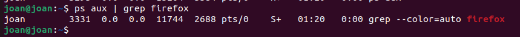

Per veure només els processos d'un usuari:

```bash
ps -u nom_usuari
```

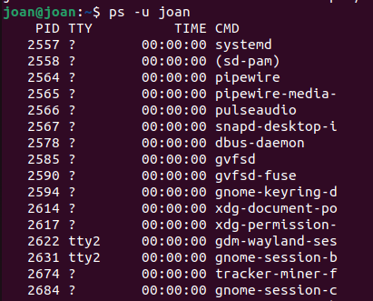

### `pstree` - Arbre de processos

La comanda `pstree` mostra la jerarquia de processos en forma d'arbre, facilitant la visualització de les relacions pare-fill entre processos.

```bash
pstree
```

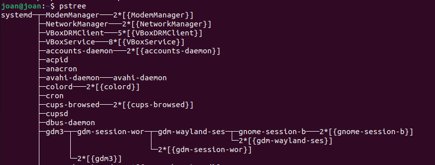

Per veure també els PIDs:

```bash
pstree -p
```


## Monitorització en temps real

### `top` - Monitor de processos

`top` és una eina interactiva que mostra els processos en temps real, actualitzant la informació cada pocs segons. Per defecte, ordena els processos per consum de CPU.

```bash
top
```

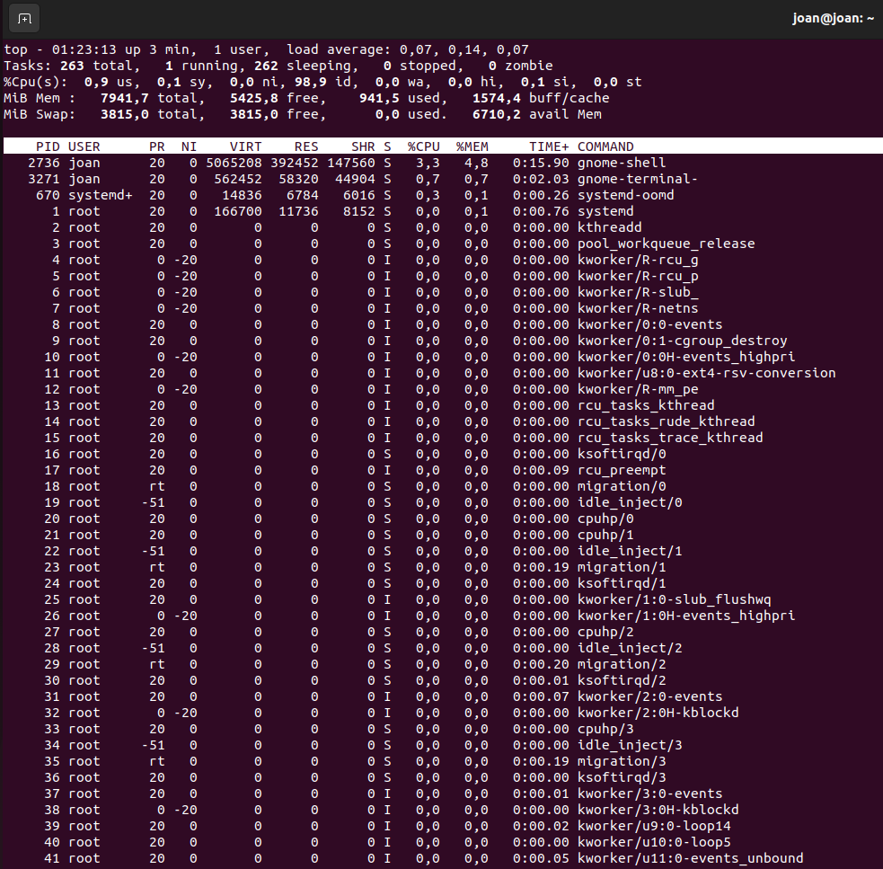

Tecles útils dins de `top`:
- **q**: sortir
- **k**: matar un procés (demana el PID)
- **M**: ordenar per ús de memòria
- **P**: ordenar per ús de CPU
- **h**: ajuda

### `htop` - Monitor millorat

`htop` és una versió millorada de `top` amb una interfície més visual i fàcil d'utilitzar. Permet utilitzar el ratolí i té colors per facilitar la lectura.

```bash
htop
```

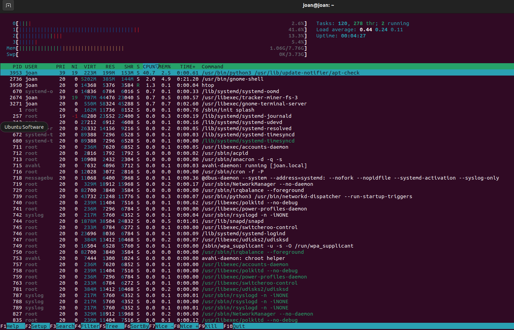

Funcions principals:
- **F4**: filtrar processos per nom
- **F9**: matar un procés (selecciona la senyal)
- **F6**: ordenar per diferents criteris
- **F10** o **q**: sortir


### `btop` - Monitor modern

`btop` és una eina de monitorització molt potent i visualment atractiva. Mostra gràfics detallats de CPU, RAM, xarxa i discos.

Primer cal instal·lar-lo:

```bash
sudo apt install btop
```

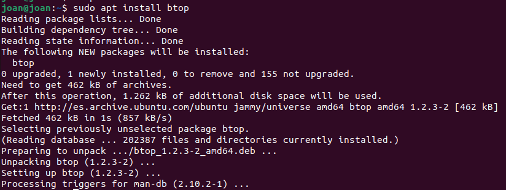

Després executem:

```bash
btop
```

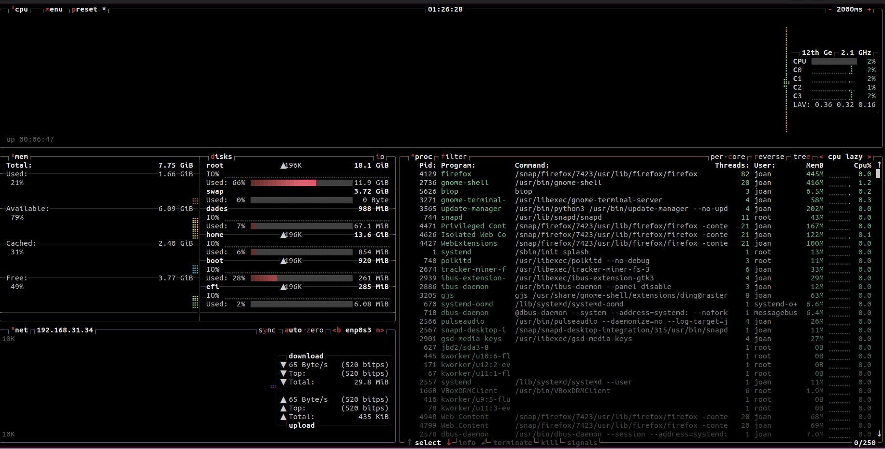

Característiques de `btop`:
- Gràfics animats de CPU i RAM
- Monitorització de xarxa en temps real
- Temperatures del sistema
- Ús del disc
- Suport per ratolí
- Interfície personalitzable

## Gestió de processos - Senyals

### `kill` - Finalitzar processos

La comanda `kill` envia senyals als processos. La senyal més comuna és **SIGTERM (15)**, que demana al procés que es tanqui de manera ordenada.

Primer identifiquem el PID del procés:

```bash
ps aux | grep nom_proces
```

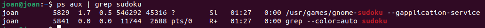

Després enviem la senyal de terminació:

```bash
kill PID
```

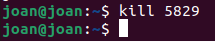

### `kill -9` - Terminació forçada

Si un procés no respon a `kill`, podem forçar la seva finalització amb la senyal **SIGKILL (9)**:

```bash
kill -9 PID
```

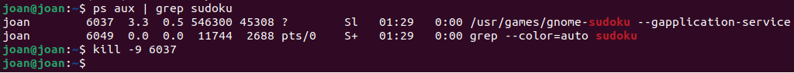

**Diferències entre senyals:**

| Senyal | Número | Descripció |
|--------|--------|------------|
| SIGTERM | 15 | Terminació ordenada (per defecte) |
| SIGKILL | 9 | Terminació forçada immediata |
| SIGHUP | 1 | Reiniciar procés |
| SIGSTOP | 19 | Pausar procés |
| SIGCONT | 18 | Continuar procés pausat |

## Prioritats de processos

### Concepte de prioritat (Nice)

Linux utilitza un sistema de prioritats anomenat **nice** que va de **-20** (màxima prioritat) a **19** (mínima prioritat). Per defecte, els processos s'inicien amb prioritat 0.

- **Valors negatius (-20 a -1)**: Major prioritat (només root)
- **Valor 0**: Prioritat normal
- **Valors positius (1 a 19)**: Menor prioritat

### `nice` - Iniciar procés amb prioritat

Per iniciar un procés amb una prioritat específica:

```bash
nice -n 10 sleep 100 &
ps -l | grep sleep
```

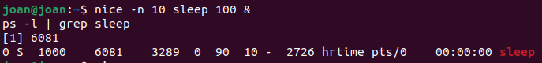


### `renice` - Canviar prioritat d'un procés existent

Per canviar la prioritat d'un procés que ja està en execució:

```bash
# Primer iniciem un procés
sleep 200 &
# Anotem el PID
# Canviem la seva prioritat
sudo renice -n -5 -p PID
ps -l | grep sleep
```


## Treballs en segon pla (Background Jobs)

### Executar processos en segon pla amb `&`

Per executar un procés en segon pla (background), afegim `&` al final de la comanda:

```bash
sleep 300 &
```


### `jobs` - Llistar treballs

Per veure els treballs en execució en la sessió actual:

```bash
jobs
```

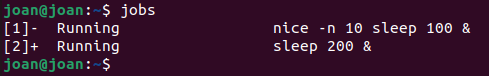

Per veure també els PIDs:

```bash
jobs -l
```

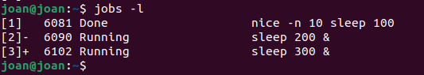

### `bg` - Continuar en segon pla

Si hem pausat un procés amb **Ctrl+Z**, podem continuar-lo en segon pla:

```bash
# Iniciem un procés
sleep 400
# Premem Ctrl+Z per pausar-lo
# Després executem:
bg
jobs
```

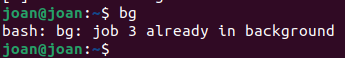

### `fg` - Portar a primer pla

Per portar un treball de segon pla a primer pla:

```bash
fg %1
```

On `%1` és el número del treball mostrat per `jobs`.

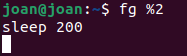

## Resum de comandes

| Comanda | Funció |
|---------|--------|
| `ps aux` | Llista tots els processos amb detalls |
| `ps -u usuari` | Processos d'un usuari específic |
| `pstree` | Arbre jeràrquic de processos |
| `pstree -p` | Arbre amb PIDs |
| `top` | Monitor en temps real |
| `htop` | Monitor millorat interactiu |
| `btop` | Monitor modern amb gràfics |
| `kill PID` | Finalitzar procés (SIGTERM) |
| `kill -9 PID` | Forçar finalització (SIGKILL) |
| `nice -n X comanda` | Iniciar amb prioritat X |
| `renice -n X -p PID` | Canviar prioritat a X |
| `comanda &` | Executar en segon pla |
| `jobs` | Llistar treballs actius |
| `jobs -l` | Llistar treballs amb PIDs |
| `bg` | Continuar treball en segon pla |
| `fg %N` | Portar treball N a primer pla |
| `Ctrl+Z` | Pausar procés actual |

---


---

# Còpies de Seguretat i Automatització de Tasques

## Introducció

Les còpies de seguretat (backups) són essencials per protegir les dades davant de pèrdues accidentals, fallades de maquinari o atacs maliciosos. L'automatització d'aquestes tasques garanteix que es realitzin de manera regular sense intervenció manual.

En aquesta secció aprendrem:
- Comandes per crear còpies de seguretat (`tar`, `rsync`)
- Automatització de tasques amb `cron` i `anacron`
- Scripts per automatitzar backups
- Diferències entre Cron i Anacron

---

## Comandes de Backup

### `tar` - Arxius comprimits

`tar` (Tape Archive) és una eina per crear arxius que agrupen múltiples fitxers i directoris en un sol fitxer. Pot comprimir-los per estalviar espai.

#### Crear un arxiu tar

```bash
tar -cvf backup.tar /ruta/directori/
```

Opcions:
- **c**: crear arxiu
- **v**: verbose (mostra el progrés)
- **f**: especifica el nom del fitxer

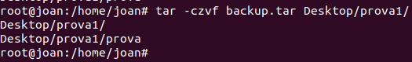

#### Crear arxiu tar comprimit amb gzip

```bash
tar -czvf backup.tar.gz /ruta/directori/
```

Opcions addicionals:
- **z**: comprimir amb gzip

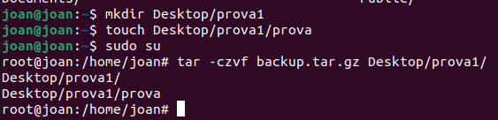

#### Llistar contingut d'un tar

```bash
tar -tvf backup.tar.gz
```

Opcions:
- **t**: llistar contingut
- **v**: mode verbose

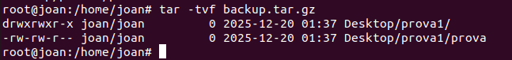

#### Extreure un arxiu tar

```bash
tar -xzvf backup.tar.gz -C /ruta/destino/
```

Opcions:
- **x**: extreure
- **C**: especificar directori de destinació

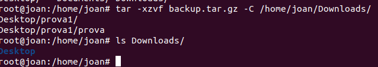

### `rsync` - Sincronització de fitxers

`rsync` és una eina potent per sincronitzar fitxers i directoris entre ubicacions. És més eficient que `cp` perquè només copia els canvis.

#### Sincronització bàsica

```bash
rsync -av /origen/ /destino/
```

Opcions:
- **a**: mode arxiu (preserva permisos, timestamps, etc.)
- **v**: verbose

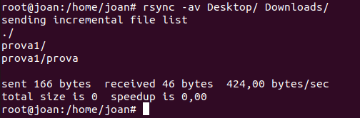

---

## Automatització de Tasques

### Cron - Programador de tasques

**Cron** és un dimoni (servei) que executa tasques programades a hores específiques. És ideal per sistemes que estan sempre encesos.

#### Estructura de crontab

El format d'una línia crontab és:

```
* * * * * comanda_a_executar
│ │ │ │ │
│ │ │ │ └─── Dia de la setmana (0-7, 0 i 7 són diumenge)
│ │ │ └───── Mes (1-12)
│ │ └─────── Dia del mes (1-31)
│ └───────── Hora (0-23)
└─────────── Minut (0-59)
```

**Exemples:**
- `0 2 * * *` - Cada dia a les 2:00 AM
- `*/15 * * * *` - Cada 15 minuts
- `0 0 * * 0` - Cada diumenge a mitjanit
- `30 3 1 * *` - Dia 1 de cada mes a les 3:30 AM

#### Veure /etc/crontab

```bash
cat /etc/crontab
```

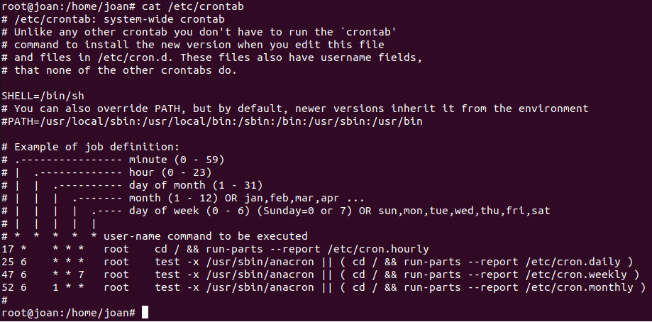

#### Editar crontab d'usuari

```bash
crontab -e
```

Obre l'editor per afegir tasques del usuari actual.

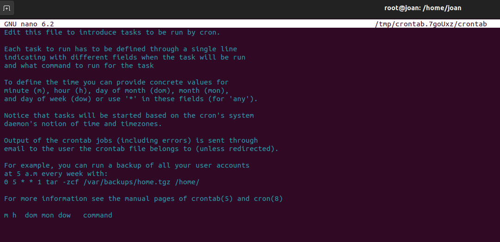

#### Exemple: Script de backup automatitzat

Creem un script que faci backup automàtic:

```bash
#!/bin/bash
FECHA=$(date +%Y%m%d_%H%M%S)
tar -czf /backup/backup_$FECHA.tar.gz /home/usuario/datos/
echo "Backup creat: $FECHA" >> /var/log/backup.log
```

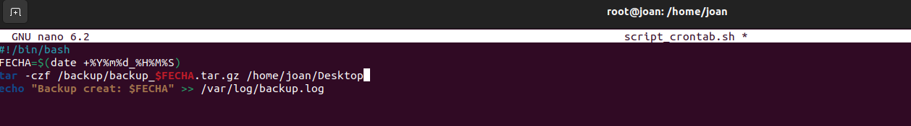

Afegim al crontab per executar cada dia a les 2 AM:

```
0 2 * * * /home/usuario/backup_script.sh
```

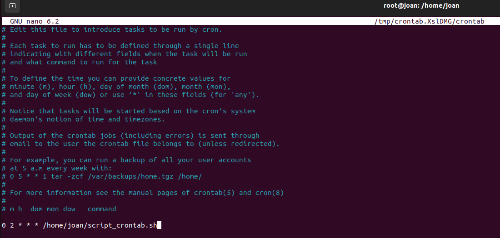

#### Verificar logs de cron

```bash
sudo grep CRON /var/log/syslog | tail -n 20
```

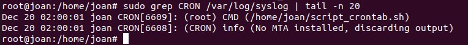

---

### Anacron - Tasques periòdiques

**Anacron** està dissenyat per sistemes que no estan sempre encesos (portàtils, PCs d'escriptori). Executa tasques pendents quan el sistema arranca.

#### Diferències Cron vs Anacron

| Característica | Cron | Anacron |
|----------------|------|---------|
| **Precisió** | Hora exacta | Dia aproximat |
| **Requisit** | Sistema sempre encès | Pot estar apagat |
| **Ús típic** | Servidors | Portàtils, PCs |
| **Granularitat** | Minuts | Dies |
| **Execució perduda** | No es recupera | S'executa al arrancar |


#### Configuració d'anacron

```bash
cat /etc/anacrontab
```

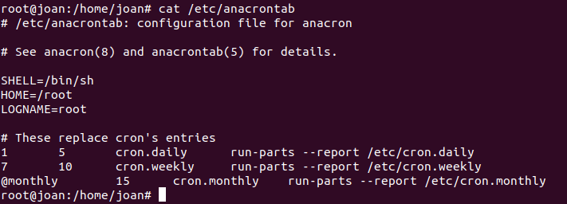

Format d'anacrontab:
```
període_dies   retard_minuts   identificador   comanda
```

Exemple:
```
1    5    cron.daily    run-parts /etc/cron.daily
7    10   cron.weekly   run-parts /etc/cron.weekly
```

#### Directoris de scripts automàtics

Linux té directoris predefinits per scripts que s'executen automàticament:

```bash
ls -l /etc/cron.daily/
ls -l /etc/cron.weekly/
ls -l /etc/cron.monthly/
```

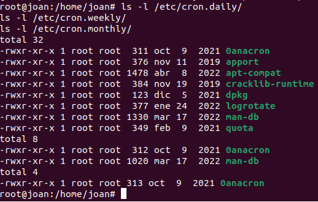

Qualsevol script executable en aquests directoris s'executarà automàticament.

#### Crear script en cron.daily

```bash
sudo nano /etc/cron.daily/cleanup_temp
```

Contingut del script:
```bash
#!/bin/bash
find /tmp -type f -mtime +7 -delete
echo "Neteja executada: $(date)" >> /var/log/cleanup.log
```

Donar permisos:
```bash
sudo chmod +x /etc/cron.daily/cleanup_temp
```

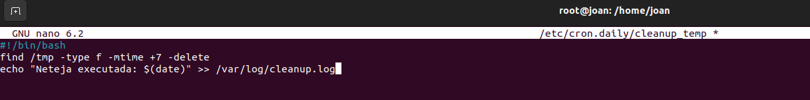
---

### Directori /etc/cron.d/

Aquest directori permet crear fitxers de configuració cron personalitzats amb el mateix format que `/etc/crontab`.

```bash
sudo nano /etc/cron.d/backup_personalitzat
```

Contingut:
```
30 3 * * * root /home/usuario/backup_script.sh
```

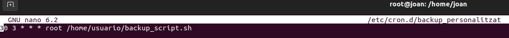

---


---

## Resum de comandes

| Comanda | Funció |
|---------|--------|
| `tar -cvf arxiu.tar dir/` | Crear arxiu tar |
| `tar -czvf arxiu.tar.gz dir/` | Crear tar comprimit |
| `tar -xzvf arxiu.tar.gz` | Extreure tar comprimit |
| `tar -tvf arxiu.tar.gz` | Llistar contingut |
| `rsync -av origen/ desti/` | Sincronitzar directoris |
| `rsync -av --delete origen/ desti/` | Sincronitzar i eliminar obsolets |
| `rsync -av --dry-run origen/ desti/` | Simular sincronització |
| `crontab -e` | Editar tasques cron |
| `crontab -l` | Llistar tasques cron |
| `cat /etc/crontab` | Veure crontab del sistema |
| `cat /etc/anacrontab` | Veure configuració anacron |
| `/etc/cron.daily/` | Scripts diaris |
| `/etc/cron.weekly/` | Scripts setmanals |
| `/etc/cron.monthly/` | Scripts mensuals |
| `/etc/cron.d/` | Configuracions cron personalitzades |

---


---

# Quotes de Disc

## Introducció

Les **quotes de disc** (disk quotas) són un mecanisme del sistema operatiu que permet limitar la quantitat d'espai de disc que un usuari o grup pot utilitzar en una partició. Això és essencial en entorns multiusuari per:

- Evitar que un usuari ompli tot el disc
- Distribuir equitativament l'espai disponible
- Controlar el creixement de dades
- Prevenir atacs de denegació de servei (DoS)

En aquesta secció aprendrem:
- Instal·lar i configurar el sistema de quotes
- Establir límits per usuaris i grups
- Monitoritzar l'ús de quotes
- Provar els límits configurats

---

## Conceptes bàsics

### Tipus de límits

Les quotes de disc tenen dos tipus de límits:

| Tipus | Descripció | Comportament |
|-------|------------|--------------|
| **Soft Limit** | Límit tou o flexible | Es pot excedir temporalment amb advertències. Té un període de gràcia (normalment 7 dies) |
| **Hard Limit** | Límit dur o absolut | NO es pot excedir mai. El sistema bloqueja l'escriptura quan s'arriba a aquest límit |

### Mètriques de quota

Les quotes es poden aplicar a:

- **Blocks**: Espai de disc utilitzat (normalment mesurat en KB o MB)
- **Inodes**: Nombre de fitxers i directoris creats

---

## Instal·lació

### Instal·lar el paquet quota

```bash
sudo apt update
sudo apt install quota
```


---

## Configuració

### 1. Preparar la partició

Primer identifiquem les particions disponibles:

```bash
df -h
lsblk
```


Creem un directori de dades (si no existeix):

```bash
sudo mkdir -p /mnt/datos
```


### 2. Editar /etc/fstab

Per activar les quotes, hem d'afegir les opcions `usrquota` i `grpquota` a la partició en `/etc/fstab`.

Abans de modificar, veiem el contingut actual:

```bash
cat /etc/fstab
```


Editem el fitxer:

```bash
sudo nano /etc/fstab
```

Afegim les opcions a la línia de la partició:

```
/dev/sdb1  /mnt/datos  ext4  defaults,usrquota,grpquota  0  2
```


Verifiquem els canvis:

```bash
cat /etc/fstab | grep quota
```


### 3. Remontar la partició

Apliquem els canvis remuntant la partició:

```bash
sudo mount -o remount /mnt/datos
mount | grep /mnt/datos
```


### 4. Crear fitxers de base de dades de quotes

```bash
sudo quotacheck -cugm /mnt/datos
```

Opcions:
- **c**: crear fitxers de quota
- **u**: comprovar quotes d'usuari
- **g**: comprovar quotes de grup
- **m**: no remontar en mode només lectura

Verifiquem que s'han creat els fitxers:

```bash
ls -l /mnt/datos/aquota.*
```

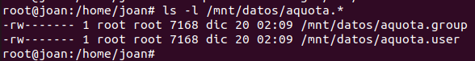

### 5. Activar les quotes

```bash
sudo quotaon /mnt/datos
```

Verifiquem que estan actives:

```bash
sudo quotaon -p /mnt/datos
```

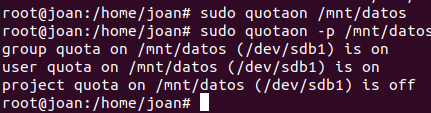

---

## Establir quotes per usuaris

### Crear usuari de prova

```bash
sudo adduser testquota
sudo mkdir /mnt/datos/testquota
sudo chown testquota:testquota /mnt/datos/testquota
```

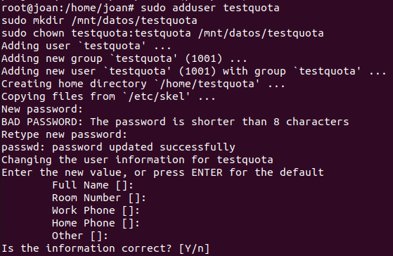

### Editar quota de l'usuari

```bash
sudo edquota -u testquota
```

S'obrirà un editor (vim o nano) amb aquest format:

```
Filesystem  blocks  soft    hard    inodes  soft  hard
/dev/sdb1   0       10000   15000   0       100   150
```

On:
- **blocks**: Espai actual utilitzat
- **soft/hard (blocks)**: Límits en KB (10MB soft, 15MB hard)
- **inodes**: Nombre de fitxers actual
- **soft/hard (inodes)**: Límits de fitxers (100 soft, 150 hard)

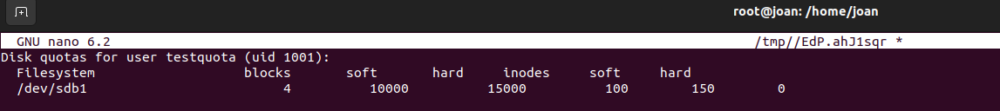

### Verificar quota establerta

```bash
sudo quota -u testquota
```

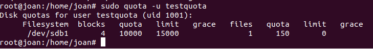

### Veure reporte de totes les quotes

```bash
sudo repquota -a
```

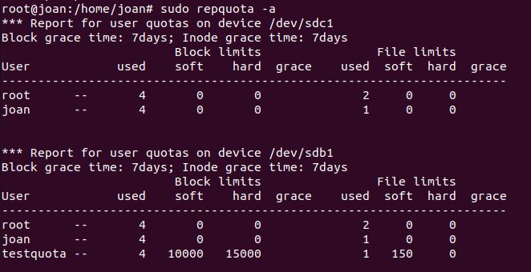

---

## Provar les quotes

### Canviar a l'usuari de prova

```bash
su - testquota
cd /mnt/datos/testquota
```

### Crear fitxer dins del límit

```bash
dd if=/dev/zero of=archivo1.dat bs=1M count=5
ls -lh
```

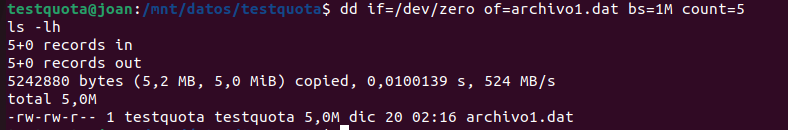

### Verificar ús de quota

```bash
quota
```

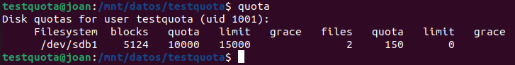

### Excedir el límit soft

```bash
dd if=/dev/zero of=archivo2.dat bs=1M count=8
quota
```

Veurem un missatge d'advertència indicant que s'ha excedit el límit soft.

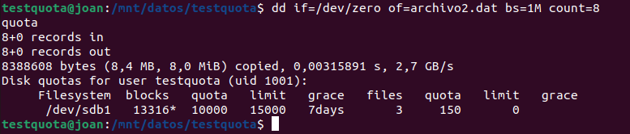


### Intentar excedir el límit hard

```bash
dd if=/dev/zero of=archivo3.dat bs=1M count=10
```

Obtindrem un error: **"Disk quota exceeded"**

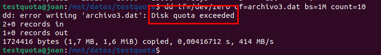

---

## Quotes de grup

### Crear grup i establir quota

```bash
sudo groupadd proyectoA
sudo edquota -g proyectoA
```


### Verificar quota de grup

```bash
sudo quota -g proyectoA
```


---

## Gestió de quotes

### Desactivar quotes

```bash
sudo quotaoff /mnt/datos
```

### Reactivar quotes

```bash
sudo quotaon /mnt/datos
```


### Comprovar estat de quotes

```bash
sudo quotaon -p /mnt/datos
```

Mostra si les quotes estan actives o no.

---

## Resum de comandes

| Comanda | Funció |
|---------|--------|
| `apt install quota` | Instal·lar paquet de quotes |
| `quotacheck -cugm /particio` | Crear fitxers de base de dades |
| `quotaon /particio` | Activar quotes |
| `quotaoff /particio` | Desactivar quotes |
| `quotaon -p /particio` | Veure estat de quotes |
| `edquota -u usuari` | Editar quota d'usuari |
| `edquota -g grup` | Editar quota de grup |
| `quota -u usuari` | Veure quota d'usuari |
| `quota -g grup` | Veure quota de grup |
| `quota` | Veure quota de l'usuari actual |
| `repquota -a` | Reporte de totes les quotes |
| `repquota /particio` | Reporte de quotes d'una partició |

---

