# Sprint 1 de Windows: Instal·lacio i configuracio inicial

## Introduccio

En aquesta practica s'ha dut a terme la instal·lacio de Windows dins d'una maquina virtual i s'han revisat alguns aspectes basics del sistema un cop finalitzat el proces. Concretament, s'ha treballat la creacio de la maquina virtual, la configuracio de recursos, la instal·lacio del sistema operatiu, la creacio de punts de restauracio, la comprovacio de l'estat de la llicencia i una primera revisio del gestor d'arrencada.

---

## Fase 1: Instal·lacio del sistema operatiu

### Creacio de la maquina virtual

El primer pas ha estat crear una maquina virtual nova a VirtualBox per instal·lar-hi Windows. En aquest punt s'ha seleccionat el tipus de sistema operatiu corresponent i s'ha preparat l'entorn per a la instal·lacio.

Captura 1: creacio inicial de la maquina virtual.

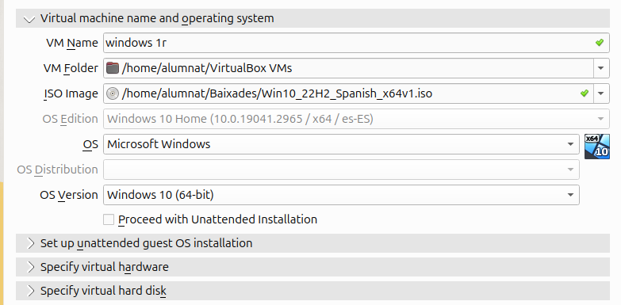

---

### Assignacio de recursos

Un cop creada la maquina virtual, s'han assignat els recursos basics necessaris. En aquesta practica s'ha configurat una quantitat suficient de memoria RAM i un disc dur virtual amb espai adequat per poder instal·lar Windows sense problemes.

Captura 2: configuracio de la memoria RAM de la maquina virtual.

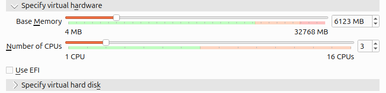

Captura 3: configuracio del disc dur virtual.

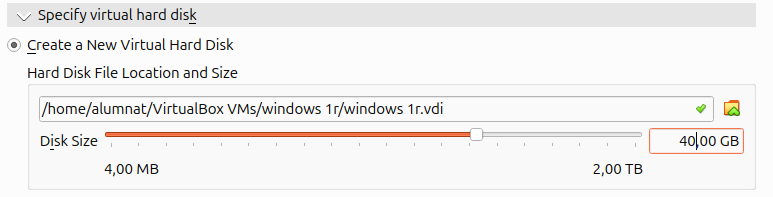

---

### Assignacio de la imatge ISO

Despres de configurar els recursos, s'ha associat la imatge ISO de Windows al lector optic virtual per tal de poder iniciar la instal·lacio del sistema operatiu.

Captura 4: configuracio de l'emmagatzematge amb la ISO de Windows.

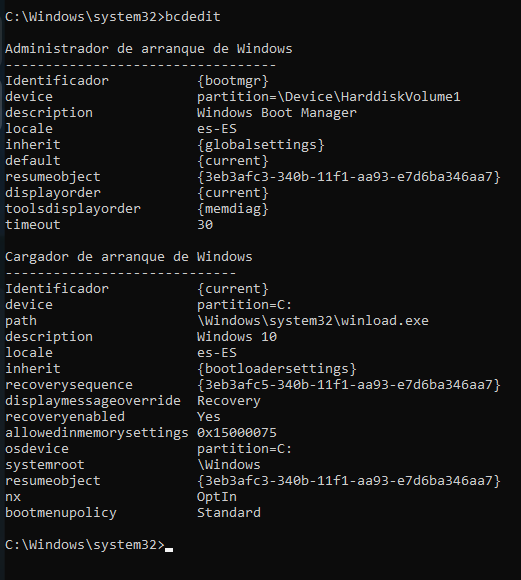

---

### Instal·lacio de Windows

A continuacio s'ha arrencat la maquina virtual i s'ha seguit l'assistent d'instal·lacio de Windows. Durant aquest proces s'han definit els ajustos inicials, com ara l'idioma, la regio i altres opcions basiques de configuracio.

Captura 5: inici de l'assistent d'instal·lacio de Windows.

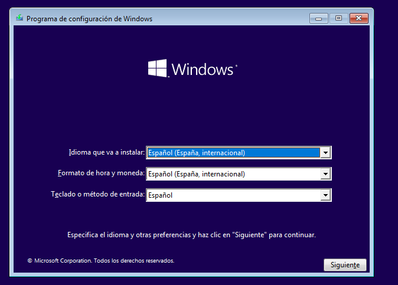

Captura 6: configuracio de les opcions inicials del sistema.

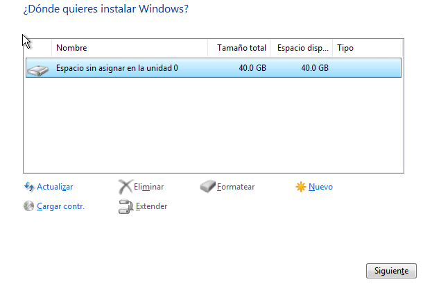

Captura 7: proces d'instal·lacio i copia de fitxers.

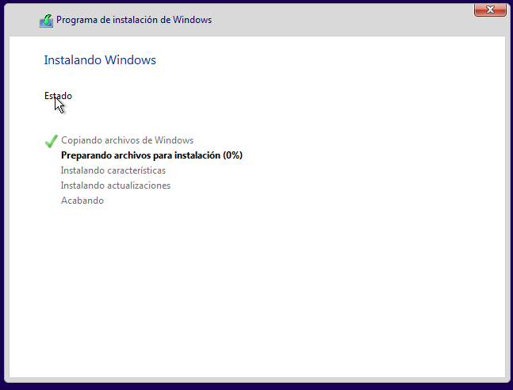

Captura 8: configuracio final abans d'accedir a l'escriptori.

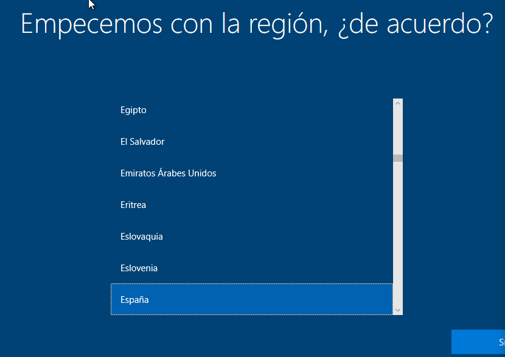

---

### Comprovacio de l'arrencada correcta

Un cop finalitzada la instal·lacio, s'ha comprovat que el sistema arrenca correctament i que es pot accedir amb normalitat a l'escriptori de Windows.

Captura 9: escriptori inicial de Windows.

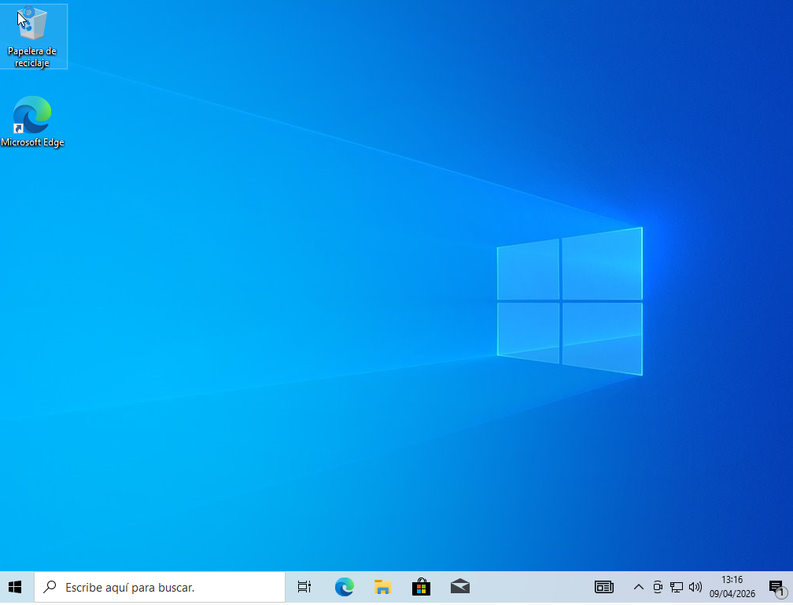

---

## Fase 2: Punts de restauracio

Els punts de restauracio permeten desar l'estat del sistema en un moment concret per poder tornar enrere en cas de problema o d'un canvi no desitjat.

### Acces a la restauracio del sistema

Des del cercador de Windows s'ha buscat l'opcio per crear un punt de restauracio i s'ha obert la finestra corresponent.

Captura 10: cerca de l'opcio "Crear un punt de restauracio".

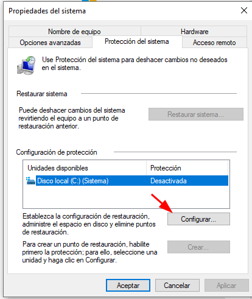

---

### Activacio de la proteccio del sistema

Dins la finestra de proteccio del sistema s'ha comprovat l'estat inicial del disc `C:` i s'ha activat la proteccio per poder crear punts de restauracio manuals.

Captura 11: estat inicial de la proteccio del sistema.

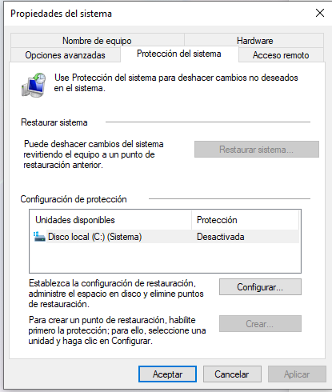

Captura 12: activacio de la proteccio del sistema.

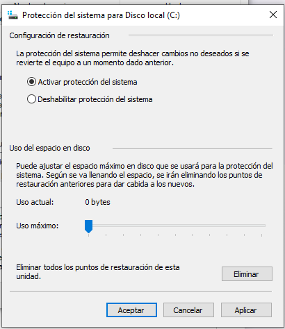

Captura 13: confirmacio de la configuracio aplicada.

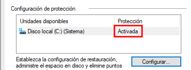

---

### Creacio d'un punt de restauracio manual

Despres d'activar la proteccio del sistema, s'ha creat un punt de restauracio manual amb un nom identificatiu per poder-lo utilitzar posteriorment si calia tornar a l'estat inicial.

Captura 14: creacio del punt de restauracio manual.

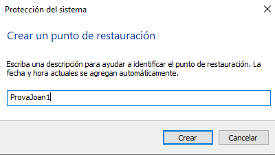

---

### Realitzacio d'un canvi al sistema

Per comprovar el funcionament de la restauracio del sistema, s'ha fet un canvi visible a l'entorn de Windows. En aquest cas, el canvi es pot observar a l'escriptori.

Captura 15: canvi aplicat al sistema abans de restaurar-lo.

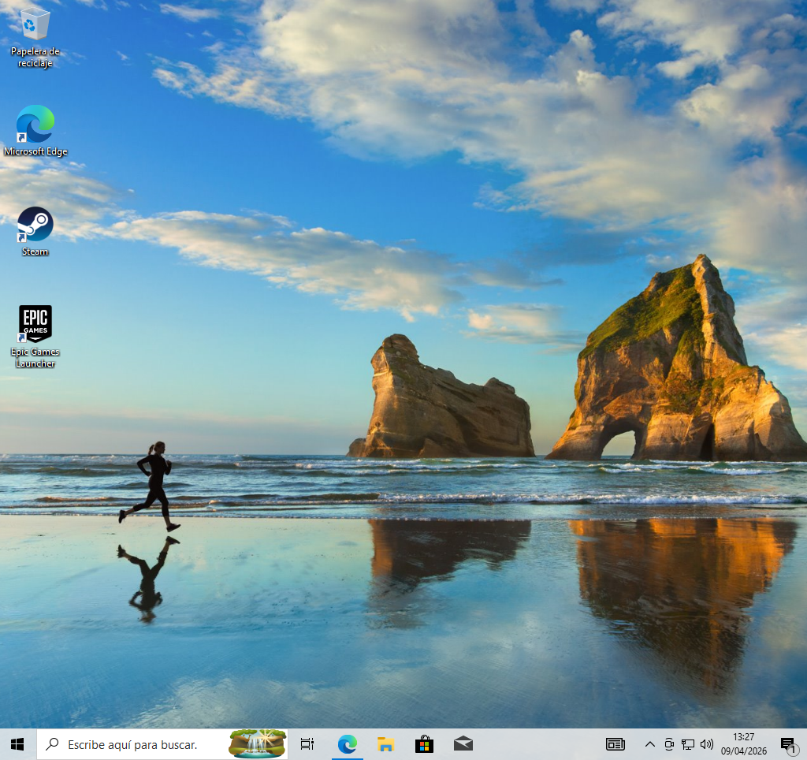

---

### Restauracio del sistema

Un cop fet el canvi, s'ha iniciat el proces de restauracio del sistema per tornar a l'estat anterior guardat amb el punt de restauracio.

Captura 16: inici del proces de restauracio.

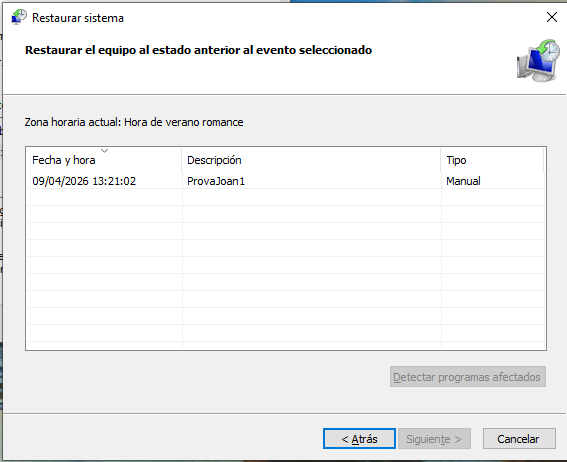

Captura 17: preparacio de la restauracio de fitxers i configuracio.

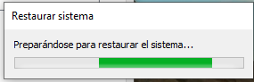

Captura 18: comprovacio final despres de completar la restauracio.

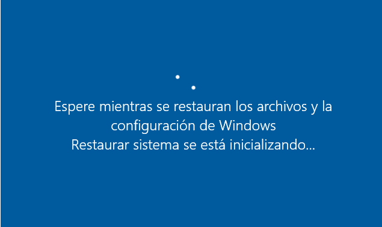

---

## Fase 3: Llicencies de Windows

### Consulta de l'estat d'activacio

Des de l'apartat `Configuracio > Sistema > Activacio` s'ha comprovat l'estat de la llicencia de Windows i el tipus d'activacio que mostrava el sistema.

Captura 19: pantalla d'activacio de Windows.

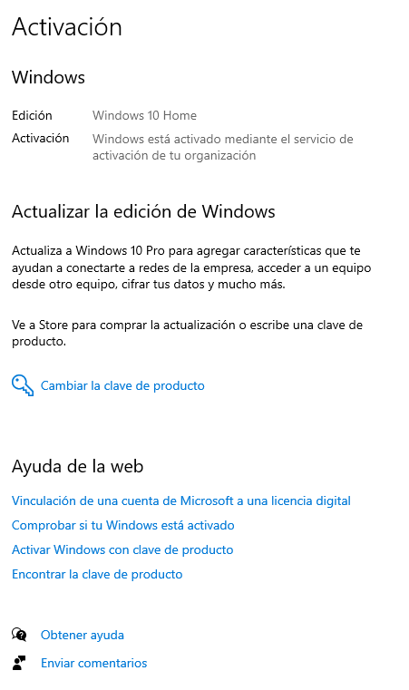

En aquest cas, el sistema indica que Windows esta activat mitjancant el servei d'activacio d'una organitzacio.

---

### Comanda `slmgr /xpr`

Per ampliar la informacio sobre la llicencia, s'ha obert el simbol del sistema amb permisos d'administrador i s'ha executat la comanda:

```cmd
slmgr /xpr
```

Captura 20: simbol del sistema obert com a administrador.

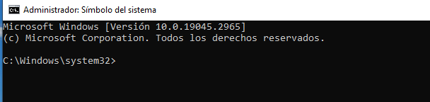

Captura 21: resultat de la comanda `slmgr /xpr`.

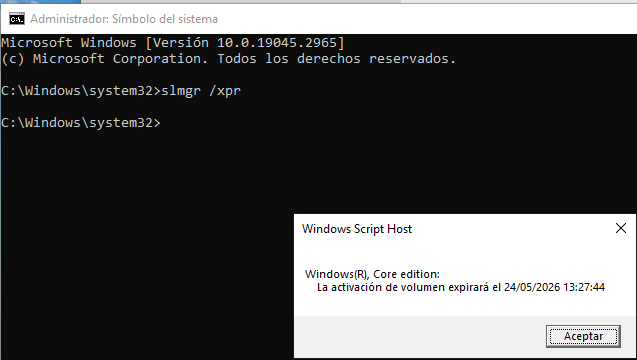

Segons la informacio mostrada, es tracta d'una activacio per volum associada a una organitzacio i amb una data de caducitat concreta. Per tant, no es tracta d'una activacio personal permanent, sino d'una activacio temporal gestionada per l'entorn on s'ha instal·lat el sistema.

---

### Consulta del preu aproximat d'una llicencia

També s'ha fet una consulta orientativa del preu d'una llicencia de Windows en una botiga o web de referencia per tenir una idea del cost aproximat del producte.

Captura 22: consulta del preu d'una llicencia de Windows.

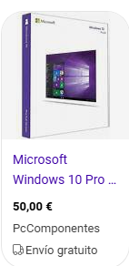

En aquesta consulta s'observa que una llicencia de Windows es pot trobar aproximadament a partir de 50 euros, tot i que el preu pot variar segons l'edicio i el proveidor.

---

## Fase 4: Gestor d'arrencada

### Comprovacio amb `bcdedit`

Finalment, s'ha obert el simbol del sistema i s'ha executat la comanda `bcdedit` per consultar la informacio del gestor d'arrencada de Windows.

```cmd
bcdedit
```

Captura 23: sortida de la comanda `bcdedit`.


En aquesta sortida es poden identificar dos blocs principals:

- `Windows Boot Manager`, que s'encarrega de gestionar l'arrencada;
- `Windows Boot Loader`, que s'encarrega de carregar el sistema operatiu.

També es pot observar que el sistema arrenca des de la particio `C:` i que el temps d'espera configurat abans de l'arrencada es de 30 segons.

---

## Conclusio

En aquesta practica s'ha realitzat una instal·lacio completa de Windows en una maquina virtual i s'han revisat diverses opcions de configuracio basica del sistema. A mes, s'ha comprovat el funcionament dels punts de restauracio, s'ha revisat l'estat de la llicencia del sistema i s'ha fet una primera consulta del gestor d'arrencada amb `bcdedit`.

Tot plegat permet adquirir una base inicial solida sobre la instal·lacio i l'administracio basica de Windows dins d'un entorn virtualitzat.
