# Sprint 1 de Windows: Instal·lació i configuració bàsica

## Introducció

En aquest sprint treballarem la instal·lació i la configuració inicial de Windows, els punts de restauració, les llicències del sistema, el gestor d'arrencada, la xarxa bàsica, diverses comandes útils i la instal·lació d'aplicacions.

---

## Fase 1: Instal·lació del sistema operatiu

### Pas 1: Crear la màquina virtual

El primer pas és crear una màquina virtual nova per instal·lar-hi Windows.

Cal configurar-la amb un nom identificable i seleccionar el tipus de sistema operatiu correcte.


---

### Pas 2: Assignar recursos

Ara cal assignar recursos suficients a la màquina virtual:

- 4 GB de RAM com a mínim
- 40 GB de disc com a mínim

Si el teu ordinador ho permet, pots assignar una mica més de memòria per treballar amb més comoditat.


---

### Pas 3: Instal·lar el sistema

Arrenquem la màquina virtual i seguim l'assistent d'instal·lació de Windows.

Durant aquest procés s'han de configurar:

- idioma;
- distribució de teclat;
- usuari;
- contrasenya.


---

### Pas 4: Comprovar que Windows arrenca correctament

Un cop acabada la instal·lació, comprovem que el sistema arrenca correctament i arriba fins a l'escriptori.


---

## Fase 2: Punts de restauració

Els punts de restauració permeten desar l'estat del sistema per poder tornar enrere si fem un canvi que provoca problemes.

### Pas 5: Cercar "Crear un punt de restauració"

Des del cercador de Windows, escrivim:

```text
Crear un punto de restauración
```

Obrim l'opció corresponent.


---

### Pas 6: Activar la protecció del sistema al disc C:

Dins la configuració de protecció del sistema, seleccionem el disc `C:` i activem la protecció si encara no està activada.


---

### Pas 7: Crear un punt manual

Ara creem un punt de restauració manual.

Pots posar-li un nom descriptiu, per exemple:

```text
Punt inicial
```


---

### Pas 8: Fer un canvi al sistema

Per comprovar que la restauració funciona, fem un canvi visible al sistema. En aquest cas, instal·lem Steam i Epic Games, i canviem el fons de pantalla.


---

### Pas 9: Restaurar i comprovar

Després fem la restauració del sistema i comprovem que el sistema torna a l'estat anterior.


Un cop completada la restauració, comprovem els resultats: Steam i Epic Games s'han desinstal·lat correctament. No obstant això, el fons de pantalla no s'ha restaurat, ja que els punts de restauració no afecten les preferències personals de l'usuari.

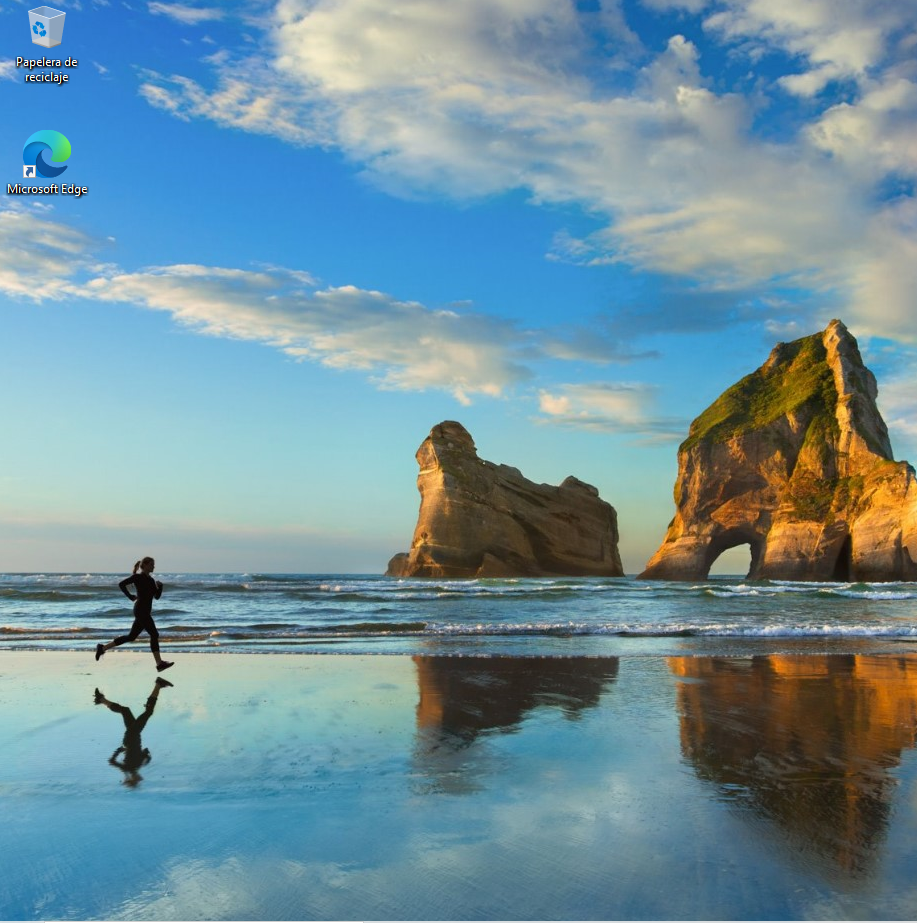

---

## Fase 3: Llicències de Windows

### Pas 10: Obrir Configuració > Sistema > Activació

Anem a:

```text
Configuración > Sistema > Activación
```

En aquest cas, el sistema està activat amb KMS (Key Management Service).


---

### Pas 11: Executar `slmgr /xpr`

Obrim `cmd` com a administrador i executem:

```cmd
slmgr /xpr
```

Aquesta comanda mostra l'estat d'activació del sistema.


---

### Pas 12: Explicar el tipus de llicència

En aquest apartat s'ha d'escriure una explicació breu sobre el tipus d'activació o llicència que mostra el Windows. Es pot comentar si es tracta d'una activació permanent, d'una activació digital o d'una llicència temporal, segons el que indiqui el sistema.

> 📸 **Captura**: Fes una captura de la finestra que apareix en executar `slmgr /xpr` o de la pantalla de `Configuración > Sistema > Activación` on es vegi el tipus de llicència activa.

---

### Pas 13: Consultar el preu aproximat d'una llicència

Busquem el preu aproximat d'una llicència de Windows a la web oficial de Microsoft o a botigues conegudes.


El preu oficial de Windows 11 Home és d'uns 145 €, però a les keyshops es pot trobar per uns 5 € aproximadament.

---

## Fase 4: Gestor d'arrencada

### Pas 14: Obrir `cmd` com a administrador

Al cercador de Windows, escrivim `cmd`, fem clic dret i seleccionem **"Ejecutar como administrador"**.


---

### Pas 15: Executar `bcdedit`

Dins la consola, executem:

```cmd
bcdedit
```

Aquesta comanda mostra la configuració del gestor d'arrencada de Windows.


---

### Pas 16: Identificar els blocs principals

Dins la sortida de `bcdedit`, identifiquem dos blocs principals:

- **Windows Boot Manager**: gestiona l'arrencada i decideix quin sistema operatiu carregar.
- **Windows Boot Loader**: conté la configuració del sistema operatiu que es carrega.

Del bloc **Windows Boot Manager**, els camps importants són:

- `default {current}` — indica quin sistema arrenca per defecte.
- `timeout 30` — el temps d'espera (en segons) abans d'arrencar automàticament.

Del bloc **Windows Boot Loader**, els camps importants són:

- `device partition=C:` — la partició on està instal·lat Windows.
- `path \Windows\system32\winload.efi` — el fitxer que inicia l'arrencada del sistema.
- `description Windows 11` — el nom descriptiu del sistema operatiu.

---

### Pas 17: Interpretar les dades

La sortida de `bcdedit` indica que l'entrada d'arrencada per defecte és la que està marcada com a `{current}`, que correspon al Windows instal·lat actualment. El gestor d'arrencada té configurat un temps d'espera de 30 segons abans d'iniciar automàticament el sistema. També es veu que Windows està instal·lat a la partició `C:` i que el fitxer que carrega l'arrencada del sistema és `\Windows\system32\winload.efi`.

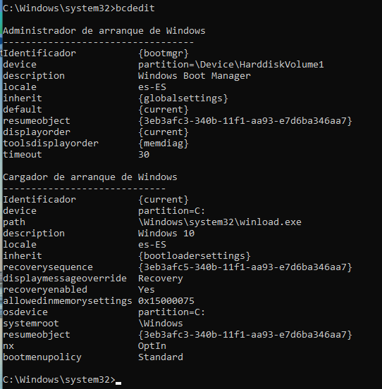

---

### Pas 18: Respondre preguntes curtes

1. **Quin sistema s'està arrencant?** — Windows 11 (o la versió que mostri el camp `description` del Boot Loader).
2. **A quin disc o partició està instal·lat?** — A la partició `C:` (camp `device partition=C:`).
3. **Quant temps espera abans d'arrencar?** — 30 segons (camp `timeout 30` del Boot Manager).
4. **Quin fitxer inicia Windows?** — `\Windows\system32\winload.efi` (camp `path` del Boot Loader).


---

### Pas 19: Interpretació final

El **Boot Manager** és el component que decideix quin sistema operatiu s'ha d'arrencar. Gestiona el menú d'arrencada i selecciona l'entrada per defecte si no hi ha intervenció de l'usuari. El **Boot Loader** és el component que carrega efectivament el sistema operatiu seleccionat, llegint els fitxers necessaris des de la partició corresponent.


---

## Fase 5: Xarxa bàsica

### Pas 20: Obrir la configuració de xarxa

Obrim la configuració de xarxa de Windows i accedim a l'adaptador que estem fent servir.

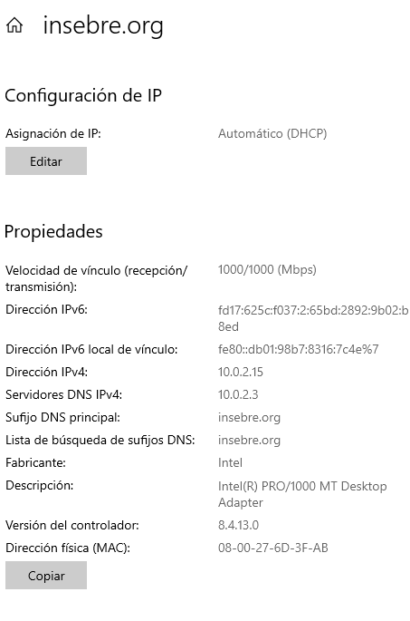

---

### Pas 21: Consultar la IP actual

Revisem la configuració actual de la xarxa per veure la IP assignada.

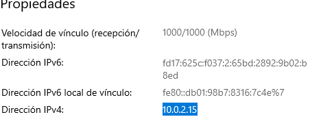

---

### Pas 22: Configurar IP dinàmica

Configurem l'adaptador per obtenir automàticament:

- IP
- Màscara
- Gateway (passarel·la)
- DNS

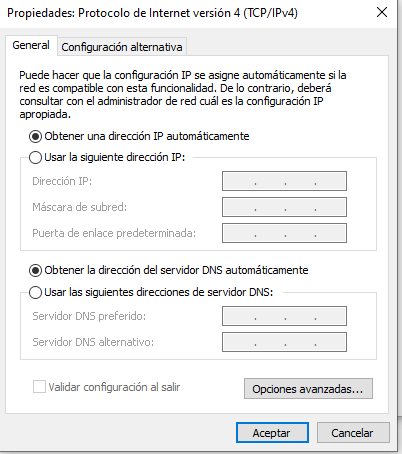

---

### Pas 23: Configurar IP fixa

Ara fem la prova contrària i configurem una IP fixa manualment.

Cal indicar:

- IP
- Màscara de subxarxa
- Passarel·la (gateway)
- DNS

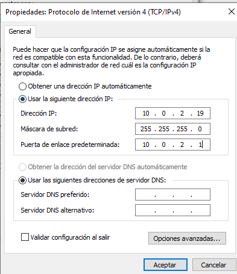manual.

---

### Pas 24: Comprovar la connexió amb `ping`

Obrim `cmd` i executem:

```cmd
ping google.com
```

Aquesta prova serveix per comprovar si la connectivitat i la resolució DNS funcionen correctament.

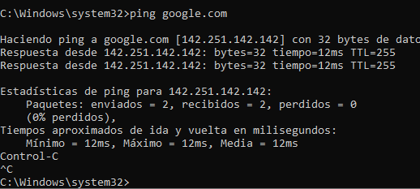

---

## Fase 6: Comandes generals

### Pas 25: Obrir PowerShell

Busquem i obrim PowerShell des del cercador de Windows.

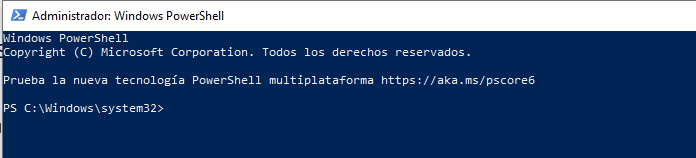

---

### Pas 26: Diferenciar `cmd` i PowerShell

- **`cmd`** (Símbol del sistema): és la consola clàssica de comandes de Windows. Permet executar comandes bàsiques del sistema, però té funcionalitats limitades.
- **PowerShell**: és una consola més potent i moderna, orientada a l'administració i l'automatització de tasques. Permet treballar amb objectes, scripts i mòduls avançats.

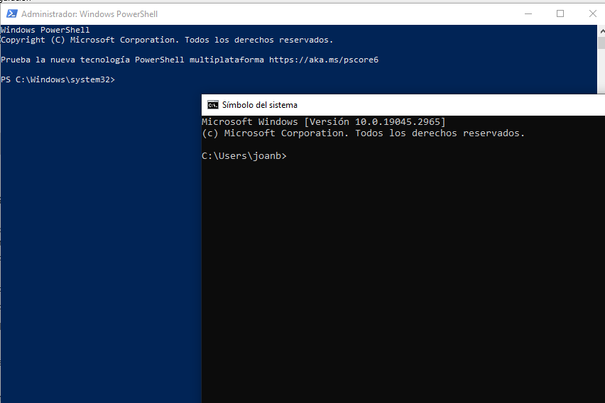

---

### Pas 27: Comandes bàsiques

Executem aquestes comandes a `cmd`:

```cmd
dir

cd ..
mkdir prova
echo hola > fitxer.txt
del fitxer.txt
```

Explicació de cada comanda:

| Comanda | Funció |
|---------|--------|
| `dir` | Llista els fitxers i carpetes del directori actual |
| `cd ..` | Puja un nivell al directori pare |
| `mkdir prova` | Crea una carpeta nova anomenada "prova" |
| `echo hola > fitxer.txt` | Crea un fitxer de text amb el contingut "hola" |
| `del fitxer.txt` | Elimina el fitxer especificat |

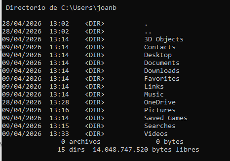

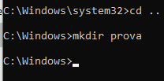

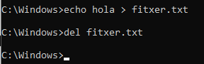
---

### Pas 28: Comandes útils del sistema

Executem les comandes següents:

```cmd
tasklist
taskkill /IM notepad.exe /F
systeminfo
hostname
whoami
```

Explicació de cada comanda:

| Comanda | Funció |
|---------|--------|
| `tasklist` | Mostra tots els processos en execució |
| `taskkill /IM notepad.exe /F` | Tanca el procés del Bloc de notes de manera forçada |
| `systeminfo` | Mostra informació detallada del sistema (SO, RAM, xarxa...) |
| `hostname` | Mostra el nom de l'equip |
| `whoami` | Mostra l'usuari actual amb el qual s'ha iniciat sessió |

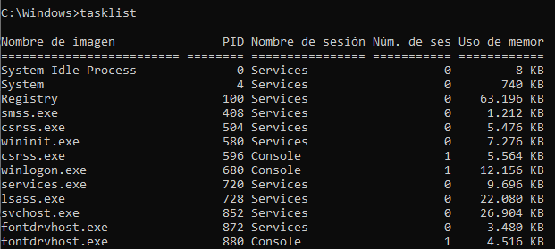

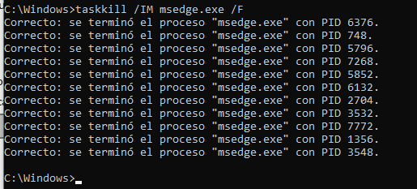


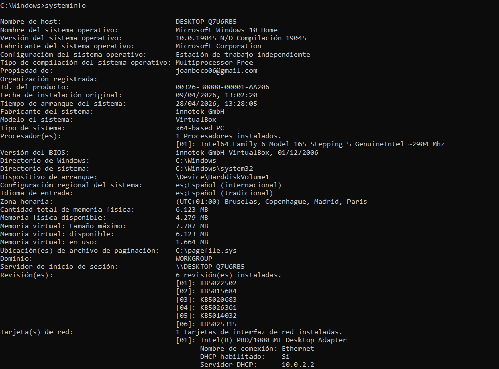

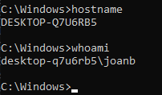
---

### Pas 29: Comandes de xarxa

Executem:

```cmd
ipconfig
ping google.com
netstat -an
```

| Comanda | Funció |
|---------|--------|
| `ipconfig` | Mostra la configuració de xarxa de tots els adaptadors |
| `ping google.com` | Comprova la connectivitat amb un servidor extern |
| `netstat -an` | Mostra totes les connexions de xarxa actives i els ports oberts |


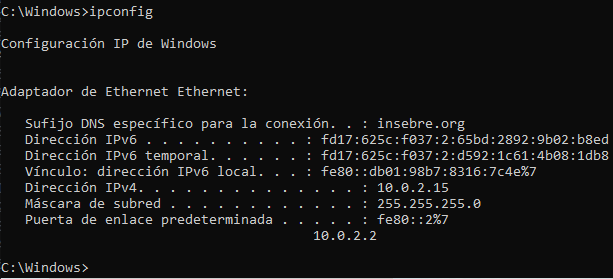

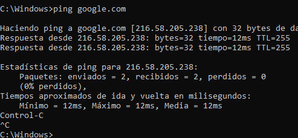

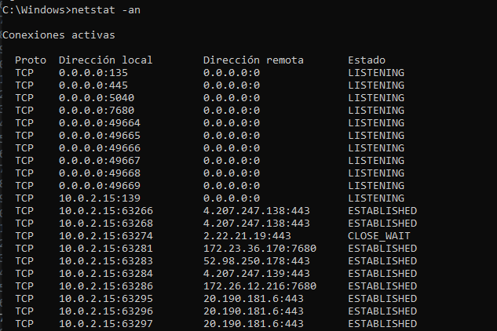
---

### Pas 30: Comandes interessants

Executem algunes comandes addicionals:

```cmd
tree
cls
help
shutdown /s /t 0
```

| Comanda | Funció |
|---------|--------|
| `tree` | Mostra l'estructura de directoris en forma d'arbre |
| `cls` | Neteja la pantalla de la consola |
| `help` | Mostra la llista de comandes disponibles |
| `shutdown /s /t 0` | Apaga l'equip immediatament |

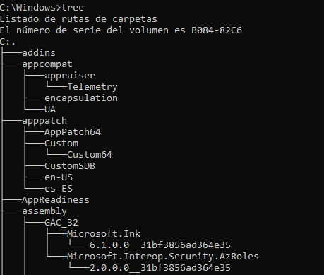

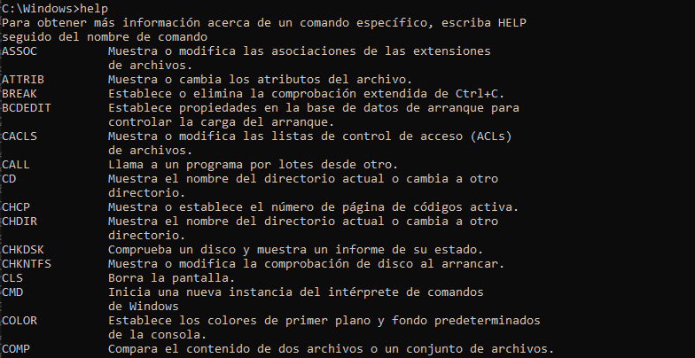

---

## Fase 7: Instal·lació d'aplicacions

### Pas 32: Descarregar un programa des del navegador

Descarreguem un programa des del navegador, per exemple Google Chrome o Visual Studio Code.


---

### Pas 33: Instal·lar-lo seguint l'assistent

Executem l'instal·lador descarregat i seguim l'assistent d'instal·lació.

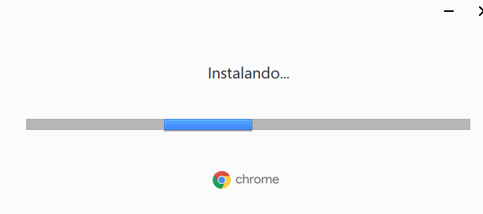

---

### Pas 34: Obrir-lo i comprovar que funciona

Un cop instal·lat, obrim el programa i comprovem que funciona correctament.


---

### Pas 37: Desinstal·lar una aplicació

Anem a:

```text
Configuración > Aplicaciones > Aplicaciones instaladas
```

I desinstal·lem una de les aplicacions.

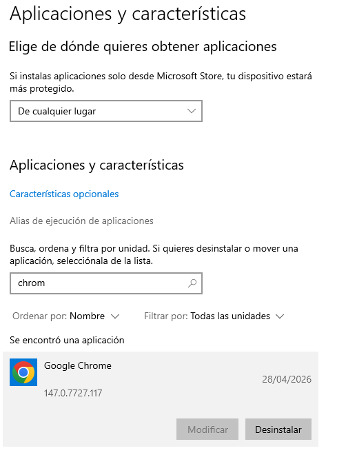
---

### Pas 38: Verificar que ja no apareix al sistema

Comprovem que el programa ja no apareix a la llista d'aplicacions o que ja no es pot executar.

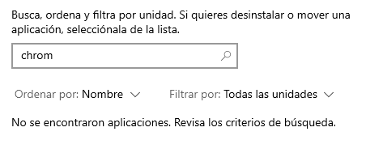.

