# Sprint 2 de Windows: Discos, quotes, scripts, processos i ACL

## Introducció

En aquest sprint he treballat la gestió de discs a Windows Server, la configuració de quotes de disc, la creació d'usuaris i grups locals, l'automatització de tasques amb scripts d'inici de sessió, la gestió de processos des de la línia de comandes i la configuració de permisos ACL sobre carpetes.

L'objectiu era posar en pràctica tots aquests conceptes dins d'un entorn virtualitzat amb VirtualBox, simulant un escenari d'administració real.

---

## Fase 1: Preparació del sistema i discs

### Pas 1: Afegir un nou disc virtual a la màquina virtual

El primer que he fet ha estat afegir un segon disc dur virtual a la màquina de Windows des de la configuració de VirtualBox. He anat a l'apartat d'emmagatzematge i he creat un disc VDI de `5 GB` amb mida dinàmica.

L'objectiu d'aquest disc és poder crear-hi dues particions amb sistemes de fitxers diferents per veure les diferències entre NTFS i FAT32.

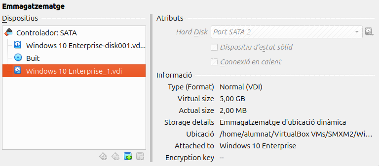

---

### Pas 2: Obrir la gestió de discs de Windows

Un cop arrencada la màquina virtual, he obert la gestió de discs executant `diskmgmt.msc`. Es pot veure que apareix un disc nou sense inicialitzar, amb tot l'espai com a no assignat.

```text
diskmgmt.msc
```

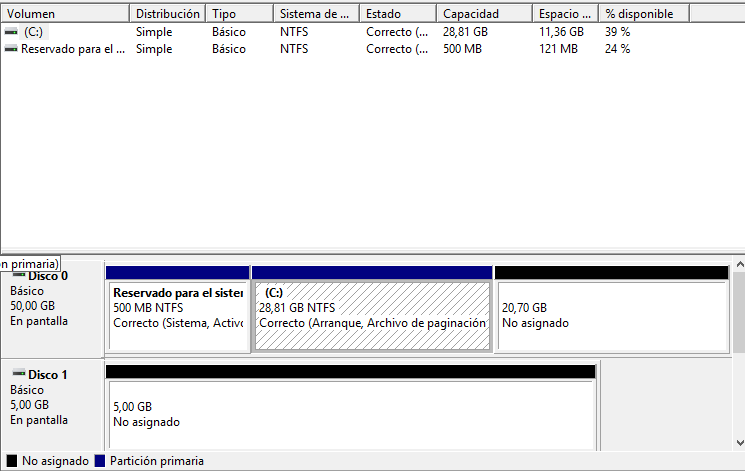

---

### Pas 3: Inicialitzar el disc i crear la partició Dades

He inicialitzat el disc i he creat una primera partició de `500 MB` amb la lletra `E:`. L'he formatada en NTFS perquè és el sistema de fitxers que suporta quotes de disc i permisos ACL avançats, que necessitaré més endavant.

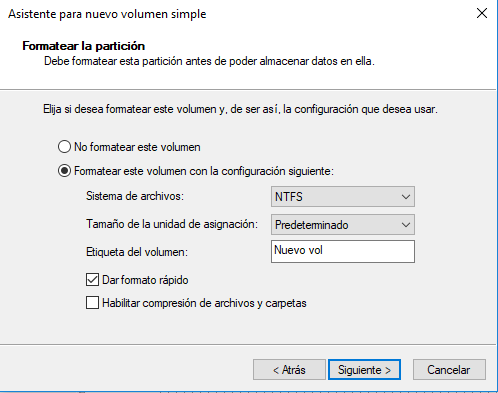

---

### Pas 4: Crear la partició Portable

Amb l'espai restant del disc he creat una segona partició amb la lletra `F:` i l'etiqueta `Portable`, formatada en FAT32.

He triat FAT32 perquè és un sistema de fitxers molt compatible amb altres dispositius (pendrives, càmeres, etc.), però cal tenir en compte que no suporta quotes ni permisos ACL avançats. Per a funcionalitats d'administració avançada, NTFS és necessari.

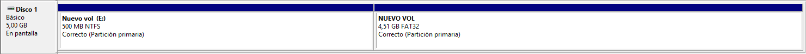

---

### Pas 5: Verificar la configuració amb diskpart

Per comprovar que tot s'ha configurat correctament, he obert una consola CMD com a administrador i he utilitzat `diskpart`:

```cmd
diskpart
list disk
sel disk 1
list part
list vol
```

A la sortida es pot veure que el disc 1 té les dues particions creades: la de 500 MB (E: Dades, NTFS) i la resta (F: Portable, FAT32).

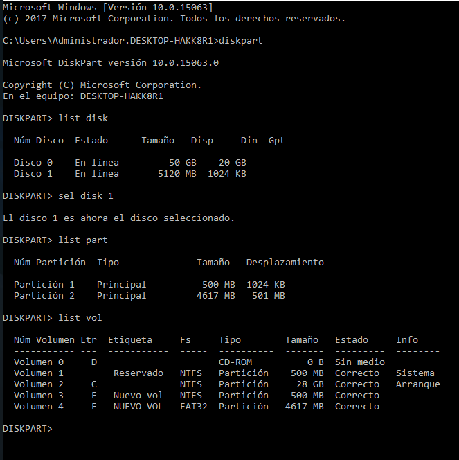

---

## Fase 2: Quotes de disc i usuaris

### Pas 6: Activar quotes a la partició Dades

He obert l'Explorador de fitxers, he fet clic dret sobre la unitat `E:` i he entrat a Propietats. A la pestanya de quota he activat la gestió de quotes.

Les quotes només funcionen en particions NTFS, que és el motiu pel qual he formatat la partició Dades amb aquest sistema de fitxers.

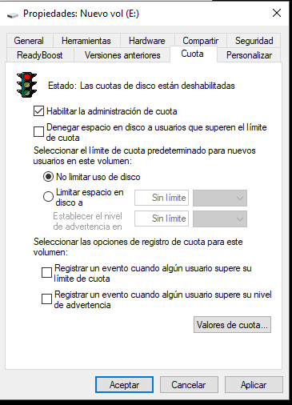

---

### Pas 7: Configurar el límit de quota

Dins la configuració de quotes he establert els paràmetres següents:

- Límit de disc: `350 MB`
- Nivell d'advertència configurat
- Registre d'esdeveniments quan se supera el límit o l'avís

D'aquesta manera, cada usuari tindrà un espai màxim limitat a la unitat `E:`.

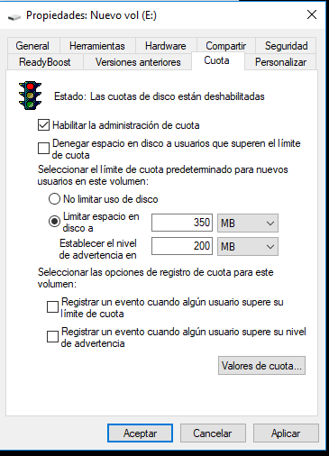

---

### Pas 8: Crear els usuaris locals alumne1 i alumne2

He obert la consola d'administració d'usuaris i grups locals amb `lusrmgr.msc` i he creat dos usuaris nous: `alumne1` i `alumne2`.

```text
lusrmgr.msc
```

He activat l'opció perquè la contrasenya no caduqui, per evitar problemes durant les proves.


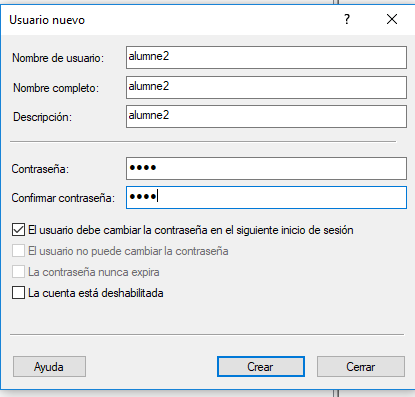

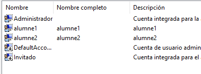

---

### Pas 9: Crear el grup Limitats i afegir-hi els usuaris

Des de la mateixa consola, he creat un grup nou anomenat `Limitats` i hi he afegit els usuaris `alumne1` i `alumne2` com a membres.

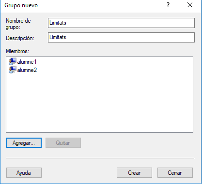

---

### Pas 10: Provar que les quotes funcionen

He iniciat sessió com a `alumne1` i he intentat crear fitxers grans a `E:\` amb la comanda `fsutil`:

```cmd
fsutil file createnew E:\prova.dat 3500000
fsutil file createnew E:\prova5.dat 150000000
```

El primer fitxer s'ha creat sense problemes, però en intentar crear el segon (que supera el límit de quota), Windows ha retornat un error d'espai insuficient. Això confirma que les quotes estan funcionant correctament.

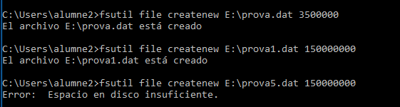

---

## Fase 3: Script de còpia i automatització

### Pas 11: Afegir un tercer disc virtual per a còpies

He tornat a la configuració de VirtualBox i he afegit un tercer disc virtual de `5 GB`. Aquest disc servirà exclusivament per guardar còpies de seguretat dels perfils d'usuari.

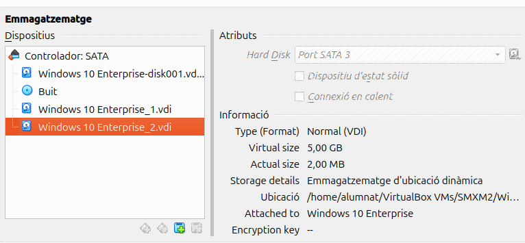

---

### Pas 12: Formatar el tercer disc com a Backups

Dins de Windows, he obert la gestió de discs i he creat un volum simple al nou disc. Li he assignat la lletra `B:`, l'etiqueta `Backups` i l'he formatat en NTFS.

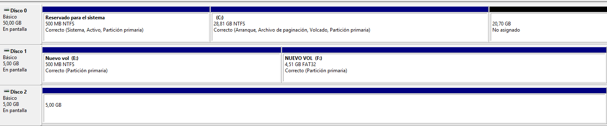

---

### Pas 13: Crear la carpeta CòpiesUsuaris

He creat la carpeta `CòpiesUsuaris` dins de la unitat `B:`. Aquesta carpeta serà la destinació on l'script guardarà les còpies dels perfils.

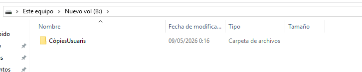

---

### Pas 14: Crear l'script de còpia

He creat un fitxer `script.bat` amb el contingut següent:

```bat
@echo off
xcopy C:\Users\%USERNAME% B:\CòpiesUsuaris\%USERNAME% /E /I /Y
```

Aquest script copia tot el perfil de l'usuari que ha iniciat sessió cap a la carpeta de còpies del disc `B:`. La variable `%USERNAME%` fa que cada usuari tingui la seva pròpia subcarpeta.

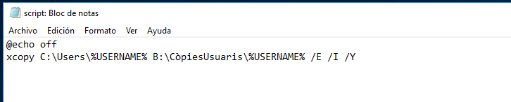

---

### Pas 15: Obrir l'editor de directives de grup

He executat `gpedit.msc` i he navegat fins a:

```text
Configuració d'usuari > Configuració de Windows > Scripts (inici o tancament de sessió)
```

Des d'aquí es pot configurar quins scripts s'executen automàticament quan un usuari inicia sessió.

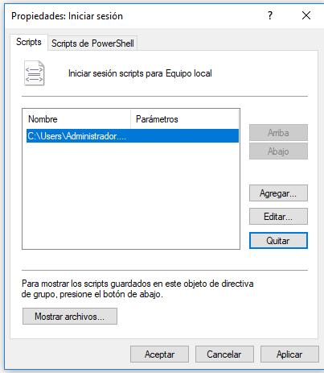

---

### Pas 16: Assignar l'script a l'inici de sessió

He afegit el fitxer `script.bat` a la configuració d'inici de sessió. D'aquesta manera, cada vegada que un usuari entri al sistema, es farà automàticament una còpia del seu perfil.

Aquesta configuració és local i afecta tots els usuaris del sistema segons la política aplicada.


---

### Pas 17: Verificar que la còpia es fa correctament

He iniciat sessió com a `alumne1` i he comprovat que s'ha creat la carpeta `B:\CòpiesUsuaris\alumne1` amb les carpetes habituals del perfil d'usuari (Desktop, Documents, Downloads, etc.).

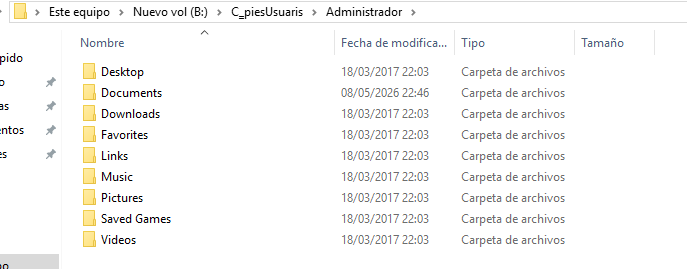

---

## Fase 4: Gestió de processos

### Pas 18: Llistar els processos actius

He obert CMD i he executat `tasklist` per veure tots els processos en execució. Aquesta comanda mostra el nom del procés, el PID, la sessió i l'ús de memòria.

```cmd
tasklist
```

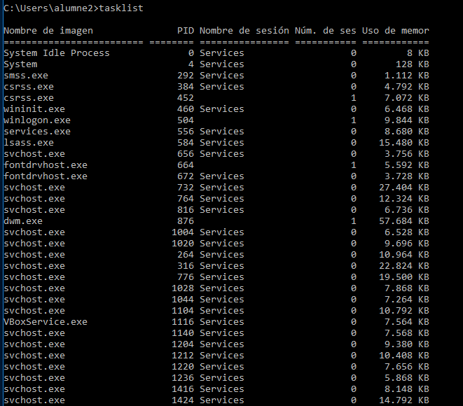

---

### Pas 19: Guardar la llista de processos en un fitxer

He redirigit la sortida de `tasklist` a un fitxer de text per poder-la analitzar després:

```cmd
tasklist > C:\Users\%USERNAME%\processos_inici.txt
```

Amb un `dir` he comprovat que el fitxer s'ha creat correctament.

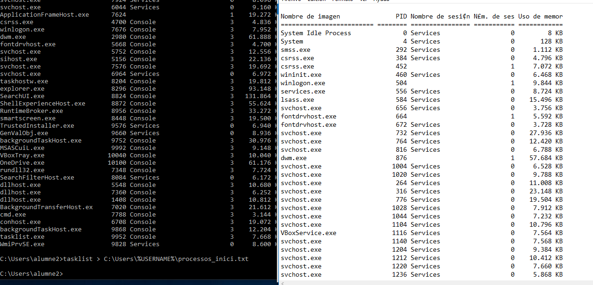

---

### Pas 20: Analitzar alguns processos importants

He filtrat el fitxer per buscar processos concrets amb `findstr`:

```cmd
findstr explorer.exe C:\Users\%USERNAME%\processos_inici.txt
findstr SearchIndexer.exe C:\Users\%USERNAME%\processos_inici.txt
findstr OneDrive.exe C:\Users\%USERNAME%\processos_inici.txt
```

Cadascun d'aquests processos té una funció específica:

- **explorer.exe**: gestiona l'escriptori, la barra de tasques i l'explorador de fitxers.
- **SearchIndexer.exe**: s'encarrega de la indexació de fitxers per agilitzar les cerques del sistema.
- **OneDrive.exe**: sincronitza fitxers amb el núvol de Microsoft.

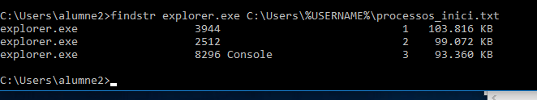

---

### Pas 21: Identificar processos prescindibles

He buscat processos que no són essencials en una màquina virtual de laboratori:

```cmd
tasklist | findstr "OneDrive.exe Teams.exe SkypeApp.exe"
```

En un entorn de pràctiques, processos com `OneDrive` o `Teams` consumeixen memòria RAM innecessàriament. Eliminar-los pot millorar el rendiment de la màquina virtual.

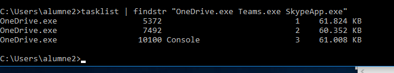

---

### Pas 22: Tancar un procés manualment

He tancat el procés `OneDrive.exe` amb la comanda `taskkill`:

```cmd
taskkill /IM OneDrive.exe /F
```

Després he comprovat que ja no hi ha cap instància en execució:

```cmd
tasklist | findstr OneDrive.exe
```

Com que no surt cap resultat, el procés s'ha tancat correctament.

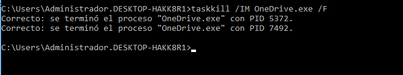

---

### Pas 23: Automatitzar l'eliminació de processos a l'inici de sessió

He modificat l'script `script.bat` per afegir-hi les línies de `taskkill`:

```bat
@echo off
xcopy C:\Users\%USERNAME% B:\CòpiesUsuaris\%USERNAME% /E /I /Y
taskkill /IM OneDrive.exe /F
taskkill /IM Teams.exe /F
```

Ara, cada cop que un usuari inicia sessió, es fa la còpia del perfil i es tanquen automàticament els processos innecessaris.

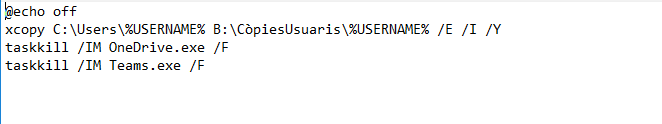

---

### Pas 24: Verificar l'automatització amb un altre usuari

He iniciat sessió com a `alumne2` i he comprovat si `OneDrive.exe` seguia actiu:

```cmd
tasklist | findstr OneDrive.exe
```

No ha sortit cap resultat, la qual cosa confirma que l'script ha funcionat correctament i ha tancat el procés automàticament.

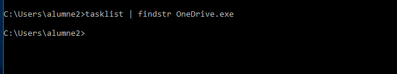

---

### Pas 25: Explicar què passa si es tanca explorer.exe

Si es tanca el procés `explorer.exe`, desapareixen l'escriptori, la barra de tasques i totes les finestres de l'explorador de fitxers. Tot i això, el sistema no queda completament bloquejat: les aplicacions que ja estaven obertes continuen funcionant.

Per recuperar l'escriptori, es pot obrir l'Administrador de tasques (Ctrl+Shift+Esc) i executar de nou:

```cmd
explorer.exe
```

Això torna a carregar tota la interfície gràfica amb normalitat.

---

## Fase 5: ACL i permisos

### Pas 26: Crear la carpeta Projectes

Com a administrador, he creat la carpeta `E:\Projectes`. Aquesta carpeta servirà per practicar la configuració de permisos ACL amb diferents nivells d'accés per a cada usuari.

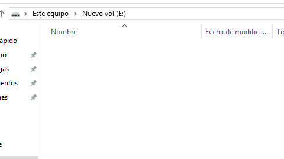

---

### Pas 27: Configurar els permisos per al grup Limitats

He entrat a les propietats de seguretat de la carpeta `E:\Projectes` (Propietats > Seguretat > Opcions avançades). He desactivat l'herència de permisos i he configurat el grup `Limitats` perquè tingui control sobre la carpeta.

D'aquesta manera, `alumne1` i `alumne2`, pel fet de pertànyer al grup `Limitats`, poden accedir i treballar amb la carpeta.

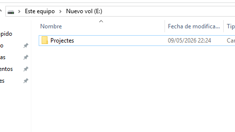

---

### Pas 28: Comprovar que alumne1 pot escriure

He iniciat sessió com a `alumne1` i he creat un fitxer `hey.txt` dins de `E:\Projectes` amb el contingut "hola". El fitxer s'ha creat i desat sense cap problema, confirmant que els permisos del grup `Limitats` funcionen correctament.

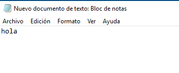

---

### Pas 29: Denegar l'escriptura a alumne2

He tornat a entrar com a administrador i he executat la comanda següent per denegar explícitament l'escriptura a `alumne2`:

```cmd
icacls "E:\Projectes" /deny alumne2:(W)
```

He fet servir `/deny` en lloc de `/grant:r` perquè a les ACL de Windows els permisos "Allow" són acumulatius: si donés només lectura amb `/grant:r`, `alumne2` seguiria podent escriure gràcies als permisos heretats del grup `Limitats`. En canvi, les entrades **Deny sempre tenen prioritat sobre les Allow**, independentment de si vénen d'un grup o de l'usuari. Per tant, `/deny alumne2:(W)` és la manera correcta de bloquejar l'escriptura.

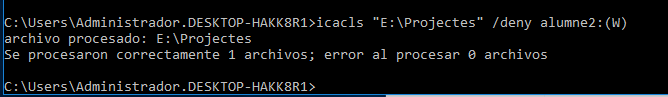

---

### Pas 30: Verificar que alumne2 no pot modificar

He iniciat sessió com a `alumne2` i he intentat crear i modificar fitxers dins de `E:\Projectes`. Windows ha denegat l'acció, confirmant que la configuració de denegació explícita funciona correctament.

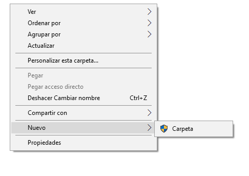

---

### Pas 31: Consultar l'estat final dels permisos amb icacls

Finalment, he executat `icacls "E:\Projectes"` per veure l'estat final de totes les entrades ACL de la carpeta:

```cmd
icacls "E:\Projectes"
```

A la sortida es poden identificar els codis de permisos següents:

- **(F)** = control total (Full control)
- **(R)** = només lectura (Read)
- **(W)** = escriptura (Write)
- **(OI)** = herència cap als fitxers (Object Inherit)
- **(CI)** = herència cap a les subcarpetes (Container Inherit)
- **(N)** = denegació explícita (en combinació amb Deny)

Aquí es pot veure com `alumne2` té una entrada de denegació d'escriptura, mentre que el grup `Limitats` manté els seus permisos generals.

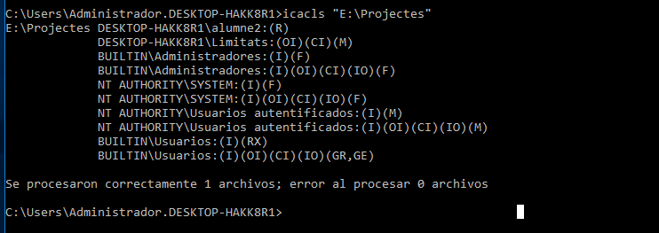

---

## Conclusió

En aquest sprint he posat en pràctica diverses tasques d'administració a Windows: he preparat discs amb particions NTFS i FAT32, he configurat quotes de disc per limitar l'espai dels usuaris, he creat usuaris i grups locals, he automatitzat còpies de seguretat amb scripts d'inici de sessió, he analitzat i gestionat processos del sistema, i he configurat permisos avançats amb ACL.

Un dels aprenentatges més importants ha estat entendre com funcionen les ACL de Windows: els permisos Allow s'acumulen entre usuari i grup, però les entrades Deny sempre tenen prioritat. Això és clau per aplicar excepcions de seguretat a usuaris concrets dins d'un grup.

També he comprovat que Windows ofereix tant eines gràfiques com de consola per administrar el sistema, i que combinar-les permet un control molt complet.
