# Sprint 3 de Windows: Administració de dominis amb Active Directory

## Introducció

En aquest sprint treballarem la instal·lació i configuració d'un Controlador de Domini (DC) amb Active Directory Domain Services (AD DS) sobre Windows Server 2022, la creació d'usuaris de domini i la unió d'un client Windows 11 al domini.

La idea d'aquest document és que puguis seguir-lo pas a pas. A cada apartat hi tens també indicada la captura de pantalla que has de fer. Després només hauràs d'esborrar el text de la captura i enganxar-hi la imatge corresponent.

---

## Fase 1: Configuració de xarxa del servidor

### Pas 1: Configurar una IP estàtica al servidor

El primer que has de fer és assignar una adreça IP estàtica al servidor perquè el client sempre el trobi a la mateixa adreça. Ves a:

```text
Panel de control → Redes e Internet → Conexiones de red
```

Selecciona l'adaptador Ethernet, obre les seves propietats i configura el Protocol TCP/IPv4 amb els valors següents:

- **Adreça IP**: `10.0.2.20`
- **Màscara de subxarxa**: `255.255.255.0`
- **Passarel·la predeterminada**: `10.0.2.1`

El servidor DNS el pots deixar buit de moment. Un cop instal·lat el rol d'Active Directory, el DNS passarà a ser `127.0.0.1` (ell mateix).

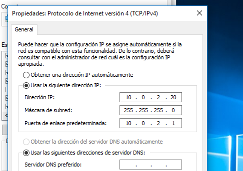
---

### Pas 2: Comprovar la configuració de xarxa

Obre una consola CMD i executa:

```cmd
ipconfig
```

Verifica que l'adreça IP, la màscara i la passarel·la coincideixen amb els valors que has configurat al pas anterior.

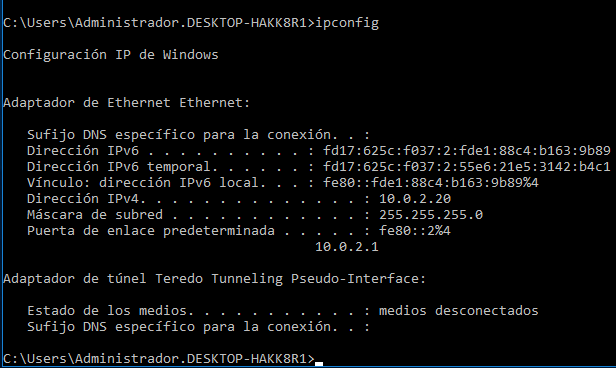

---

## Fase 2: Instal·lació d'Active Directory Domain Services

### Pas 3: Obrir l'Administrador del servidor

Accedeix a l'Administrador del servidor (Server Manager). Normalment s'obre automàticament en iniciar sessió, però si no, el pots trobar al menú d'inici.

Des d'aquí iniciarem l'assistent per agregar rols.

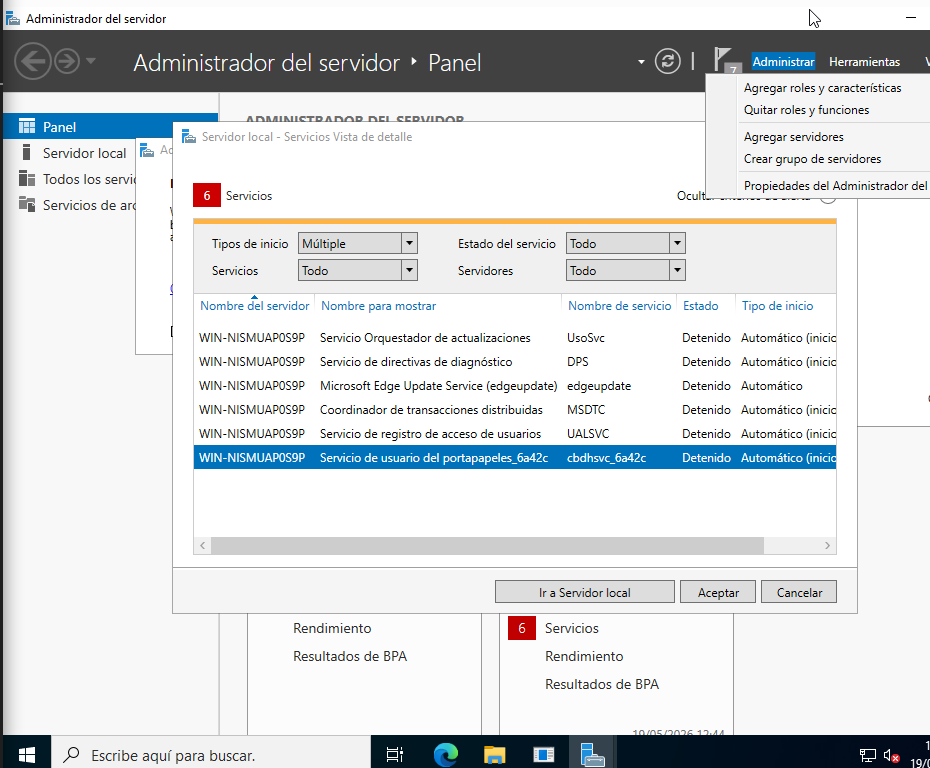

---

### Pas 4: Iniciar l'assistent d'agregar rols i característiques

Ves al menú:

```text
Administrar → Agregar roles y características
```

L'assistent t'anirà guiant pels passos d'instal·lació.

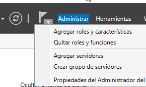

---

### Pas 5: Seleccionar el servidor de destí

L'assistent et demanarà sobre quin servidor vols instal·lar el rol. Selecciona el servidor local (hauria d'aparèixer amb la IP `10.0.2.15` i el sistema operatiu Windows Server 2022).

Fes clic a **Siguiente**.

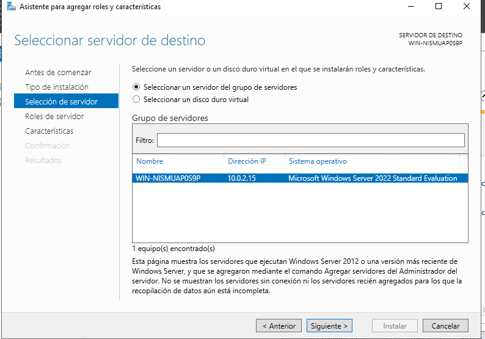.

---

### Pas 6: Seleccionar el rol d'Active Directory

A la llista de rols disponibles, marca:

```text
Servicios de dominio de Active Directory
```

Automàticament apareixerà un quadre de diàleg indicant que s'instal·laran també les eines d'administració necessàries (RSAT, mòdul PowerShell per a AD, etc.). Fes clic a **Agregar características** per acceptar i continua.

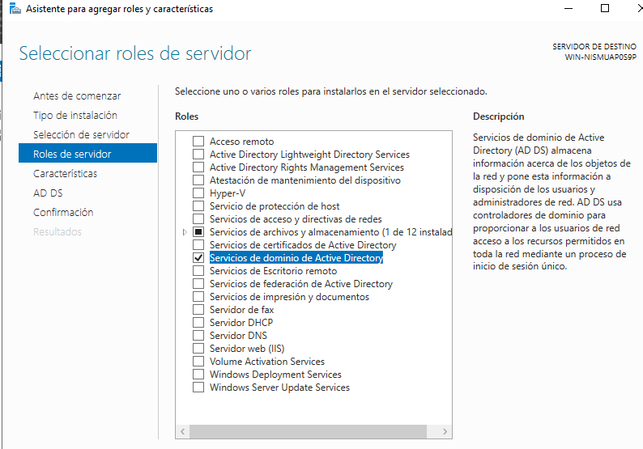
---

### Pas 7: Confirmar i iniciar la instal·lació

Revisa el resum de tot el que s'instal·larà i fes clic a **Instalar**.

L'assistent mostrarà el progrés en temps real. Pots tancar la finestra sense interrompre el procés, ja que s'executa en segon pla.

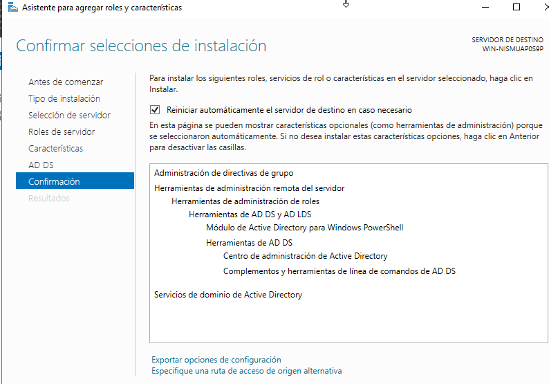

---

## Fase 3: Promoure el servidor a Controlador de Domini

### Pas 8: Promoure el servidor a controlador de domini

Un cop finalitzada la instal·lació del rol, l'Administrador del servidor mostrarà una notificació amb una icona de bandera groga. Fes clic sobre la notificació i selecciona:

```text
Promover este servidor a controlador de dominio
```

Això obrirà l'assistent de configuració d'AD DS.

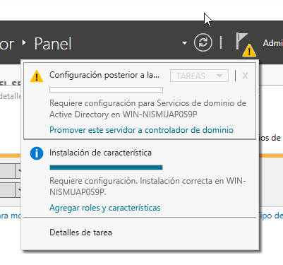

---

### Pas 9: Crear un nou bosc i definir el domini

Com que és la primera vegada que creem un domini, selecciona l'opció:

```text
Agregar un nuevo bosque
```

I introdueix el nom del domini arrel. Per exemple:

```text
joan.cat
```

Adapta el nom de domini al que hagis decidit per a la teva pràctica. Fes clic a **Siguiente**.

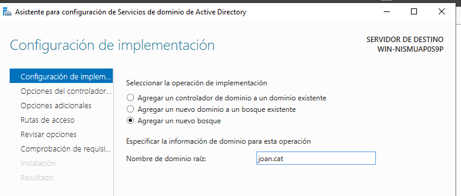

---

### Pas 10: Configurar les opcions del controlador de domini

Configura els paràmetres següents:

- **Nivell funcional del bosc**: `Windows Server 2016`
- **Nivell funcional del domini**: `Windows Server 2016`
- Deixa marcades les opcions de **Servidor DNS** i **Catálogo global (GC)**
- Estableix la **contrasenya DSRM** (mode de restauració de serveis de directori)

La contrasenya DSRM és important per si mai necessites restaurar l'Active Directory. Apunta-la bé.

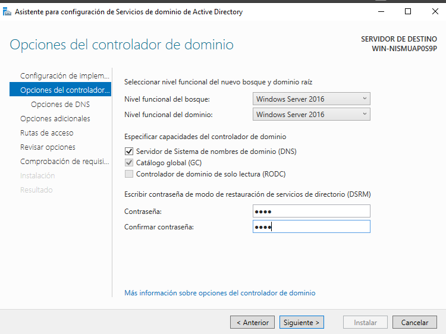

---

### Pas 11: Nom NetBIOS del domini

L'assistent assignarà automàticament un nom NetBIOS per al domini. Aquest és el nom curt amb el qual els clients podran identificar el domini (per exemple, `JOAN`).

Deixa'l tal qual i continua.

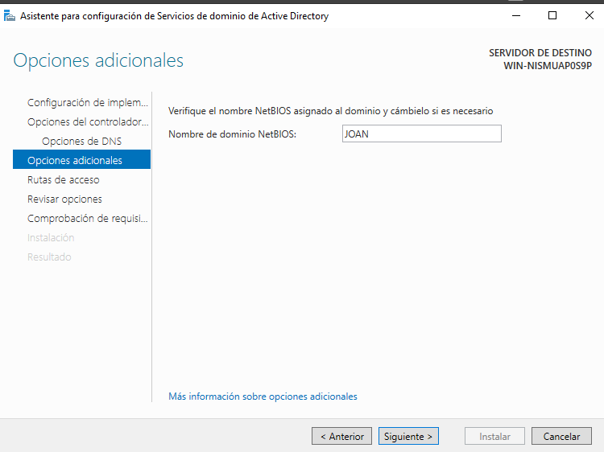

---

### Pas 12: Rutes d'emmagatzematge

L'assistent et demanarà les rutes on AD DS emmagatzemarà les dades. Deixa les rutes per defecte:

- **Base de dades**: `C:\Windows\NTDS`
- **Arxius de registre**: `C:\Windows\NTDS`
- **SYSVOL**: `C:\Windows\SYSVOL`

Fes clic a **Siguiente**.

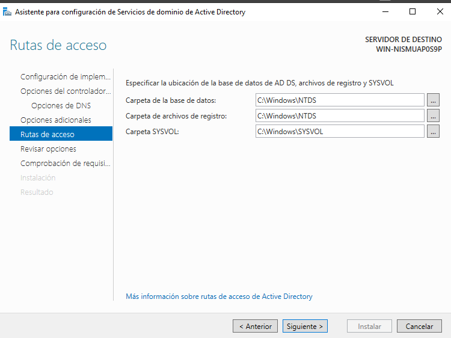

---

### Pas 13: Comprovació de requisits i instal·lació final

L'assistent verificarà que tots els prerequisits es compleixen. Si tot està correcte, veuràs un indicador verd.

Pot aparèixer un avís informatiu sobre la delegació DNS, però no és bloquejant.

Fes clic a **Instalar** per finalitzar la promoció. El servidor es reiniciarà automàticament en acabar.

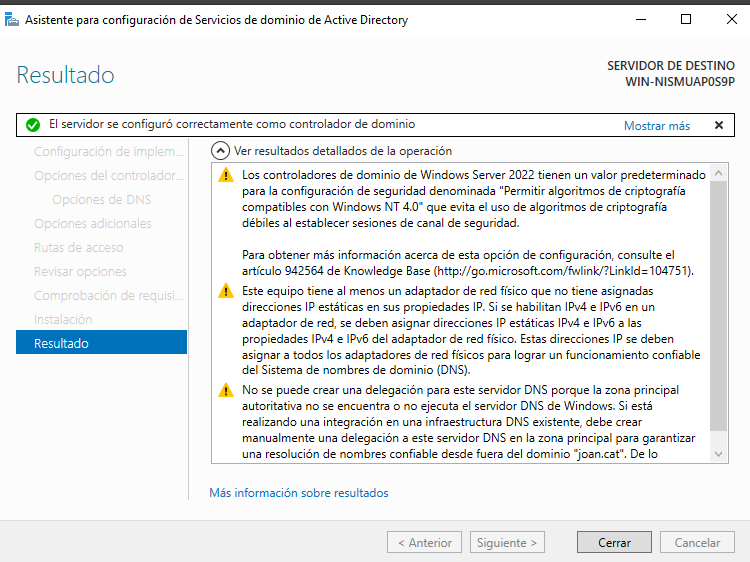

---

### Pas 14: Verificar el reinici i l'inici de sessió com a domini

Després del reinici, la pantalla d'inici de sessió hauria de mostrar el compte de domini, per exemple:

```text
JOAN\Administrador
```

Això confirma que el servidor ja és un Controlador de Domini operatiu.

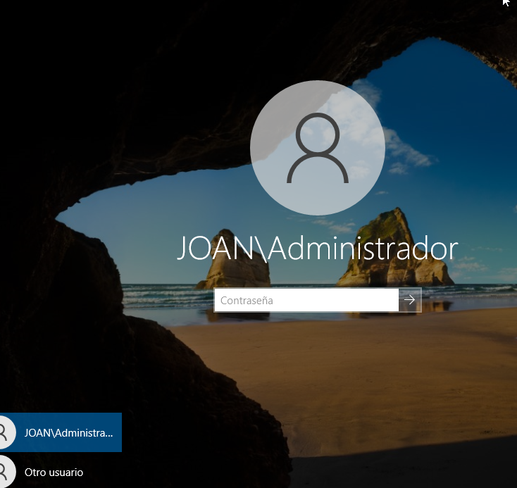

---

## Fase 4: Creació d'usuaris de domini

### Pas 15: Obrir "Usuarios y equipos de Active Directory"

Busca al menú d'inici:

```text
Usuarios y equipos de Active Directory
```

Aquesta consola et permetrà gestionar els usuaris, grups i equips del domini.

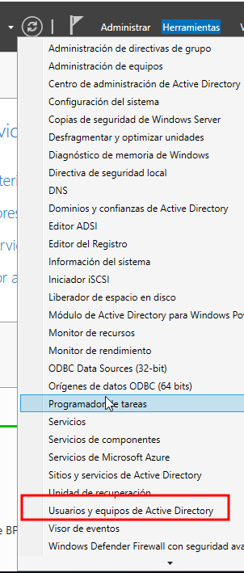

---

### Pas 16: Crear un nou usuari de domini

A la consola, expandeix el domini i fes clic dret sobre el contenidor **Users**. Selecciona:

```text
Nuevo → Usuario
```

Omple les dades del nou usuari:

- **Nombre de pila**: el nom que vulguis (per exemple, `alumne1`)
- **Nombre de inicio de sesión**: `alumne1@joan.cat`

Fes clic a **Siguiente**.

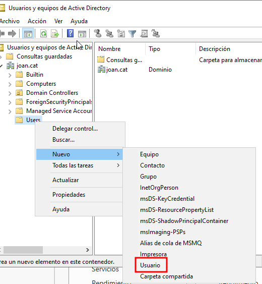

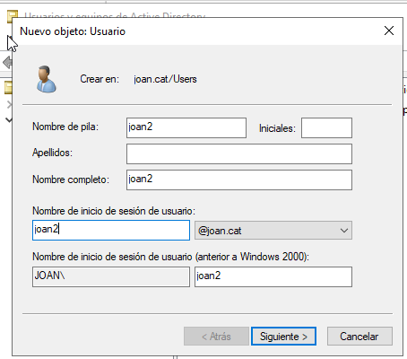

---

### Pas 17: Configurar la contrasenya de l'usuari

Estableix la contrasenya per al nou usuari i configura les opcions de seguretat. Per a un entorn de proves, pots marcar:

- ✅ **El usuario no puede cambiar la contraseña**
- ✅ **La contraseña nunca expira**

Així t'assegures que el compte funcioni sempre sense problemes de caducitat.

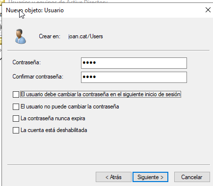
---

### Pas 18: Verificar que l'usuari s'ha creat correctament

Comprova que a la llista d'objectes del contenidor **Users** ja apareix el nou usuari que has creat, amb el tipus **Usuario**.

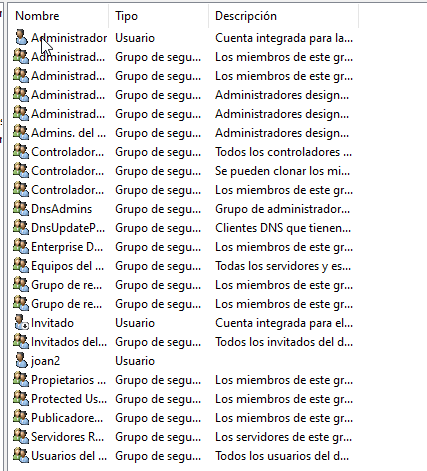

---

## Fase 5: Unió del client Windows 11 al domini

### Pas 19: Iniciar la màquina virtual del client

Arrenca la màquina virtual del client Windows 11 des de VirtualBox. Assegura't que estigui a la mateixa xarxa que el servidor.

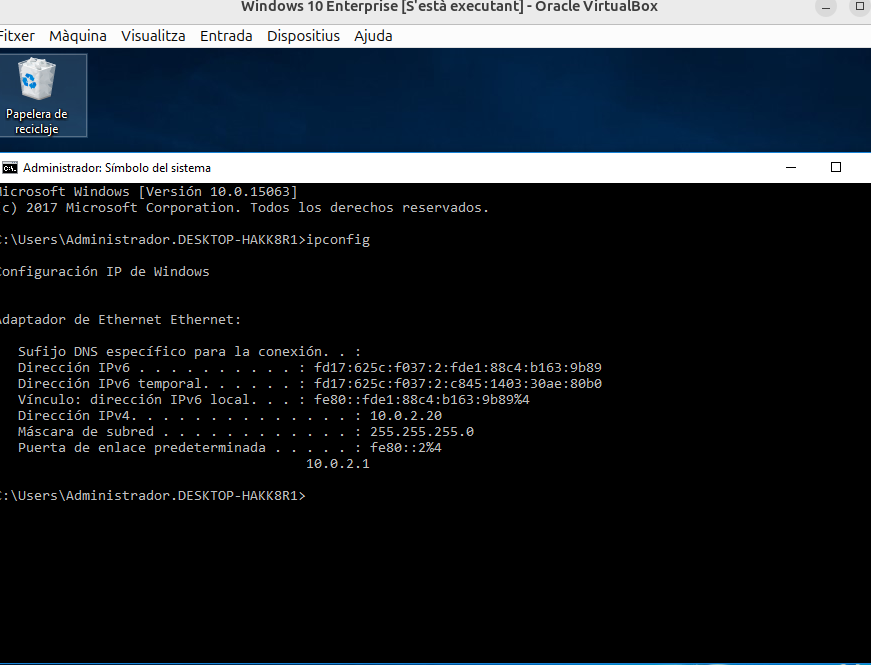
---

### Pas 20: Configurar el DNS del client perquè apunti al servidor

Aquesta és la configuració crítica. Ves a les propietats de xarxa del client i configura el Protocol TCP/IPv4:

- **IP del client**: pot ser automàtica (DHCP) o estàtica
- **Servidor DNS preferit**: `10.0.2.15` (la IP del servidor/DC)

Si el client no pot resoldre el nom del domini a través del DNS del DC, no podrà unir-se al domini.

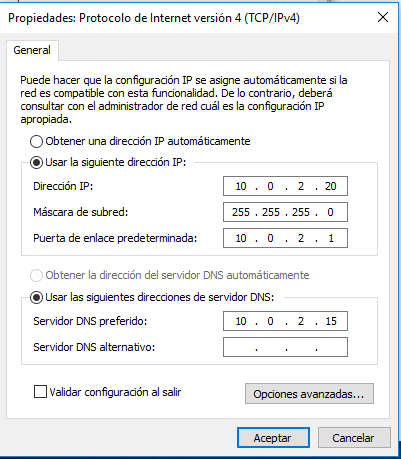

---

### Pas 21: Comprovar la connectivitat amb ping

Obre una consola CMD al client i verifica que pot arribar al servidor:

```cmd
ping 10.0.2.17
```

Si el ping funciona, el client té connectivitat amb el servidor. Si no, revisa la configuració de xarxa i el tallafocs.

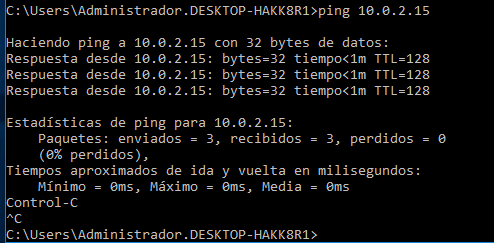
---

### Pas 22: Unir el client al domini

Al client Windows 11, ves a:

```text
Configuración → Cuentas → Obtener acceso a trabajo o escuela
```

Fes clic a **Conectar** i, a la part inferior del diàleg, selecciona:

```text
Unir este dispositivo a un dominio local de Active Directory
```

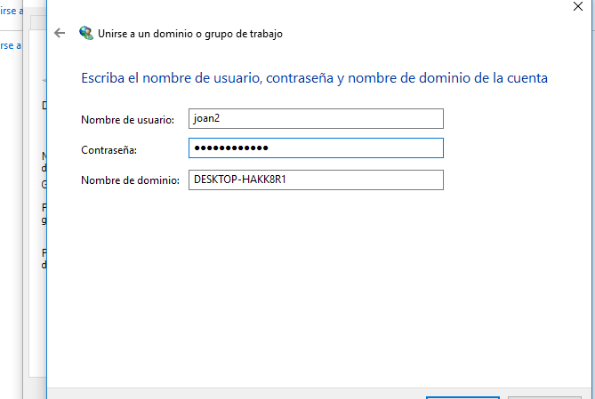

---

### Pas 23: Introduir el nom del domini

S'obrirà el diàleg "Unirse a un dominio". Introdueix el nom del teu domini, per exemple:

```text
joan.cat
```

Fes clic a **Siguiente**. Windows intentarà localitzar el controlador de domini a través del DNS.

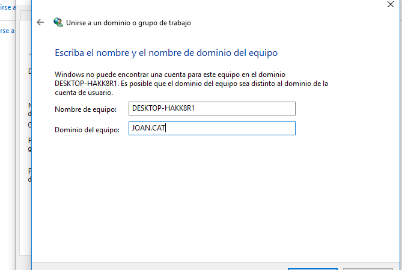
---

### Pas 24: Autenticar-se amb credencials del domini

Windows et demanarà les credencials d'un compte que tingui permís per unir equips al domini. Introdueix:

- **Nom d'usuari**: `Administrador`
- **Contrasenya**: la contrasenya de l'Administrador del domini

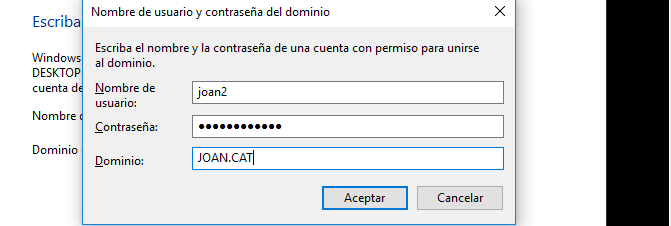

---

### Pas 26: Reiniciar el client

Windows et demanarà que reiniciïs l'equip per completar la unió al domini. Reinicia el client.


---

### Pas 27: Iniciar sessió al client amb l'usuari de domini

Després del reinici, a la pantalla d'inici de sessió del client Windows 11, selecciona **Otro usuario** i introdueix les credencials de l'usuari de domini:

```text
joan.cat\alumne1
```

O bé:

```text
alumne1@joan.cat
```

Si tot està configurat correctament, podràs iniciar sessió amb l'usuari del domini.

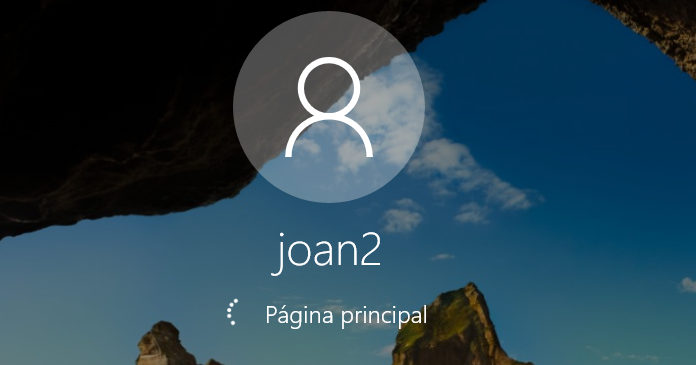
---

### Pas 28: Verificar la sessió iniciada correctament

Un cop dins, Windows mostrarà la pantalla de benvinguda mentre prepara el perfil d'usuari per primera vegada.

Pots comprovar que estàs dins del domini obrint una consola CMD i executant:

```cmd
whoami
```

La sortida hauria de mostrar alguna cosa com `joan\joan2`, confirmant que has iniciat sessió amb un compte del domini.

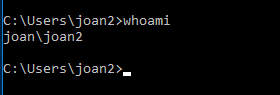
---

## Conclusió

Amb aquest sprint has practicat la instal·lació i configuració completa d'un entorn de domini amb Active Directory: has configurat la xarxa del servidor, has instal·lat el rol d'AD DS, has promogut el servidor a Controlador de Domini, has creat usuaris de domini i has unit un client Windows 11 al domini.

Tot això simula un escenari real d'empresa on un administrador de sistemes ha de centralitzar la gestió dels comptes d'usuari i dels equips mitjançant un domini Active Directory.