# Sprint 4 de Windows: Configuració de RAID 5 per programari

## Introducció

En aquest sprint treballarem la configuració d'un sistema RAID 5 per programari a Windows Server 2022. Aprendràs a afegir discos virtuals, convertir-los a dinàmics, crear un volum RAID 5, i simular fallades de disc per comprovar la tolerància a errors del sistema.

La idea d'aquest document és que puguis seguir-lo pas a pas. A cada apartat hi tens també indicada la captura de pantalla que has de fer. Després només hauràs d'esborrar el text de la captura i enganxar-hi la imatge corresponent.

---

## Teoria: Què és un RAID?

Els **RAID** (Redundant Array of Independent Disks) són sistemes que permeten combinar diversos discos físics en una sola unitat lògica per aconseguir millores en rendiment, capacitat o seguretat. Poden ser gestionats per maquinari (controladores RAID dedicades) o per programari, com és el cas de Windows Server.

Cada nivell de RAID ofereix característiques diferents:

| Nivell | Mínim de discos | Tolerància a fallades | Capacitat útil | Ús habitual |
|--------|----------------|-----------------------|----------------|-------------|
| RAID 0 | 2 | Cap | 100% | Rendiment màxim |
| RAID 1 | 2 | 1 disc | 50% | Mirall / seguretat |
| RAID 5 | 3 | 1 disc | (N-1) × mida | Equilibri rendiment/seguretat |
| RAID 6 | 4 | 2 discos | (N-2) × mida | Alta disponibilitat |
| RAID 10 | 4 | 1 disc per mirall | 50% | Rendiment + seguretat |

> ⚠️ **Important**: Cap nivell de RAID substitueix una còpia de seguretat. El RAID protegeix contra fallades de disc, però **no** contra errors humans, corrupció de dades o desastres físics.

### El RAID 5 en detall

El RAID 5 és un dels nivells més utilitzats en entorns professionals perquè aconsegueix un equilibri entre rendiment, capacitat i tolerància a fallades. Característiques clau:

- Necessita un mínim de **3 discos**.
- La capacitat útil és la suma de tots els discos menys un: `(N-1) × mida_disc`. Exemple: 3 × 10 GB = **20 GB útils**.
- La **paritat** es distribueix entre tots els discos (no hi ha un disc dedicat exclusivament a paritat).
- La **lectura** és molt eficient perquè es llegeix en paral·lel de múltiples discos.
- **No tolera** la fallada de 2 o més discos simultàniament.

---

## Fase 1: Preparació dels discos

### Pas 1: Afegir 3 discos nous a la màquina virtual

Apaga completament la màquina virtual de Windows Server i ves a VirtualBox:

```text
Configuració → Emmagatzematge
```

Afegeix **3 nous discos durs virtuals** de `10 GB` cadascun, en format VDI amb reserva dinàmica. Pots anomenar-los, per exemple:

- `disc_raid_1.vdi` — 10 GB
- `disc_raid_2.vdi` — 10 GB
- `disc_raid_3.vdi` — 10 GB

Comprova que els tres discos apareixen al controlador SATA de la màquina virtual.

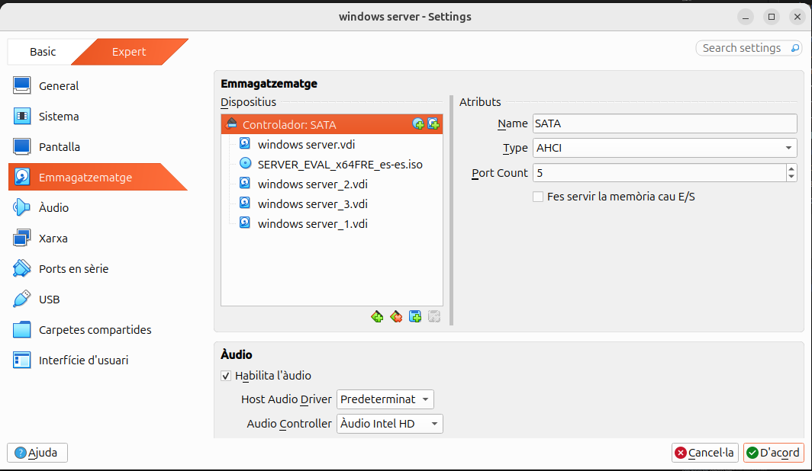

---

### Pas 2: Obrir el Gestor de discos

Un cop iniciada la màquina virtual, obre el Gestor de discos executant:

```cmd
diskmgmt.msc
```

Hauria d'aparèixer l'assistent per inicialitzar els discos nous automàticament.

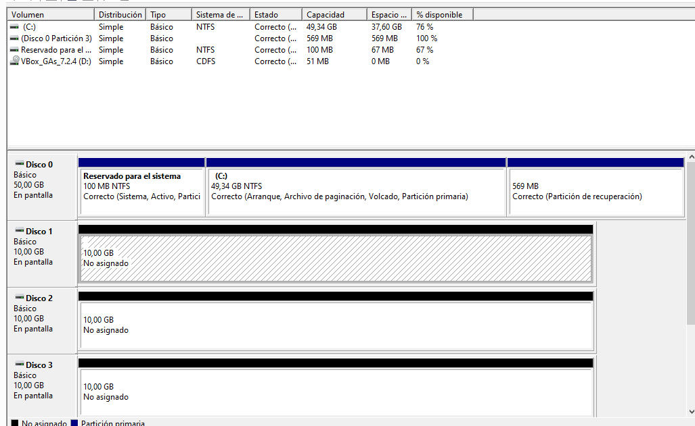
---

### Pas 3: Inicialitzar els 3 discos nous

En obrir el Gestor de discos, apareixerà automàticament l'assistent per inicialitzar els discos. Selecciona els tres discos (Disco 1, Disco 2, Disco 3) i tria l'estil de partició:

```text
GPT (GUID Partition Table)
```

GPT és recomanat per a sistemes moderns i discos de més de 2 TB. Fes clic a **Aceptar**.

---

### Pas 4: Verificar que els discos estan inicialitzats

Després de la inicialització, el Gestor de discos hauria de mostrar els tres discos com a **Bàsic**, amb aproximadament 9,98 GB cadascun i tot l'espai com a **No asignat**.

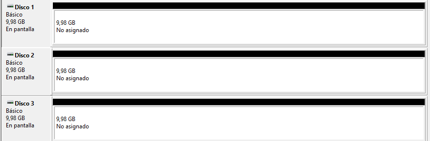

---

### Pas 5: Convertir els discos a dinàmics

Per poder crear un volum RAID 5, els discos han de ser de tipus **Dinàmic**. Fes clic dret sobre el Disco 1 i selecciona:

```text
Convertir en disco dinámico…
```

Al diàleg que apareix, marca els tres discos (Disco 1, Disco 2, Disco 3) i fes clic a **Aceptar** per convertir-los tots d'un sol cop.

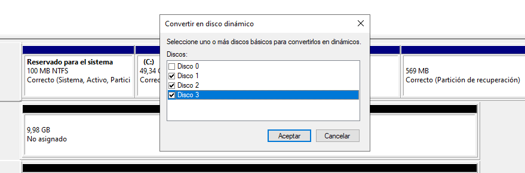
---

### Pas 6: Verificar la conversió a dinàmics

Després de la conversió, el Gestor de discos hauria de mostrar els tres discos amb l'etiqueta **Dinámico** i tot l'espai com a **No asignat**. Ja estan preparats per crear el RAID 5.

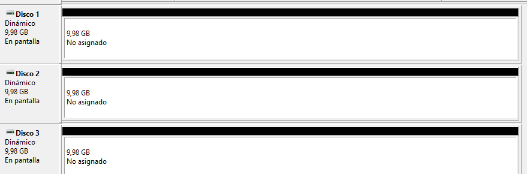
---

## Fase 2: Creació del volum RAID 5

### Pas 7: Iniciar l'assistent de creació del RAID 5

Fes clic dret sobre l'espai no assignat de qualsevol dels discos dinàmics i selecciona:

```text
Nuevo volumen RAID-5…
```

Això obrirà l'assistent de creació del volum.

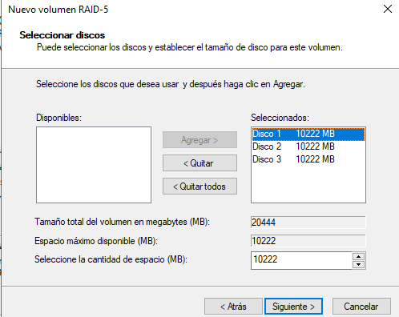
---

### Pas 8: Seleccionar els discos per al RAID 5

A l'assistent, afegeix els tres discos (Disco 1, Disco 2, Disco 3) a la columna de seleccionats.

El sistema calcularà automàticament la capacitat:

- **Tamany total del volum**: ~20 GB (aproximadament)
- **Espai per disc**: ~10 GB

Recorda que en RAID 5 la capacitat útil és `(N-1) × mida_disc = 2 × 10 GB = 20 GB`.

---

### Pas 9: Assignar la lletra d'unitat

Assigna la lletra `E:` al nou volum RAID 5. Amb aquesta lletra podràs accedir al RAID des de l'explorador de fitxers.

> 📸 **Captura**: Fes una captura de la pantalla d'assignació de lletra amb `R:` seleccionada.

---

### Pas 10: Formatar el volum RAID 5

Configura el format del volum amb els paràmetres següents:

- **Sistema de fitxers**: `NTFS`
- **Mida de la unitat d'assignació**: Predeterminada
- **Etiqueta del volum**: Posa-hi un nom identificatiu, per exemple `RAID5-Dades`

Fes clic a **Siguiente**.


---

### Pas 11: Revisar el resum i crear el RAID

L'assistent mostrarà un resum de la configuració seleccionada:

- Tipus de volum: RAID-5
- Discos seleccionats: Disco 1, Disco 2, Disco 3
- Tamany del volum: ~20 GB
- Lletra d'unitat: R:
- Sistema de fitxers: NTFS

Fes clic a **Finalizar** per crear el RAID.


---

### Pas 12: Esperar el format i la sincronització

El Gestor de discos mostrarà els tres discos mentre s'estan formatant i sincronitzant. Espera que el procés arribi al 100%.

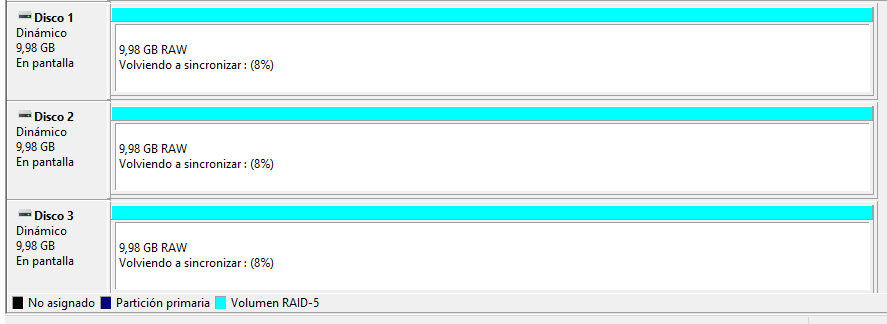

---

### Pas 13: Comprovar que el RAID 5 és operatiu

Un cop completat el format, els tres discos haurien de mostrar l'estat **Correcto**. El RAID 5 ja és completament funcional.

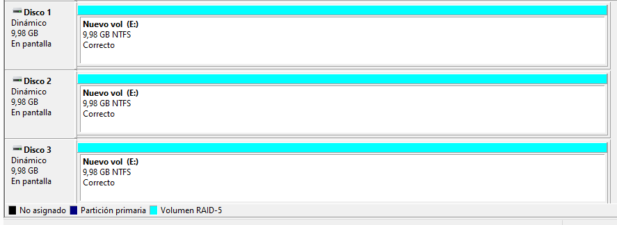

---

### Pas 14: Verificar el RAID a l'Explorador de fitxers

Obre l'Explorador de fitxers i comprova que apareix el nou volum `E:` amb aproximadament 20 GB disponibles.

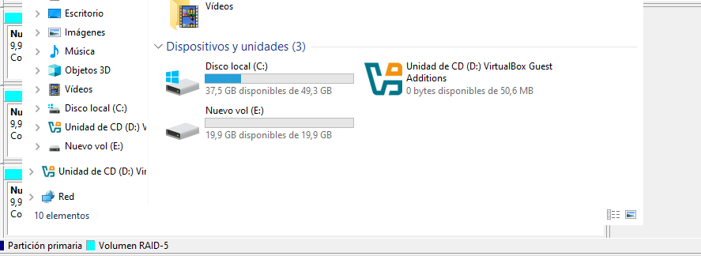
---

## Fase 3: Proves d'escriptura al RAID

### Pas 15: Crear una carpeta de prova

Entra a la unitat `E:\` i crea una carpeta de prova, per exemple:

```text
Prova-RAID5
```

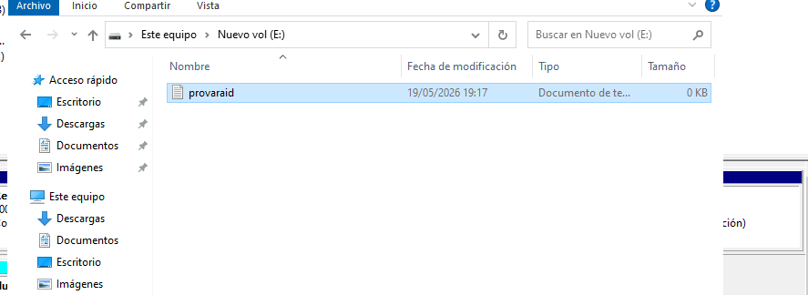
---

### Pas 16: Copiar fitxers al RAID

Copia alguns fitxers dins de la carpeta de prova. Poden ser arxius qualsevol (documents, programes, carpetes del sistema…). Comprova que tots els fitxers s'han copiat correctament i es poden obrir.

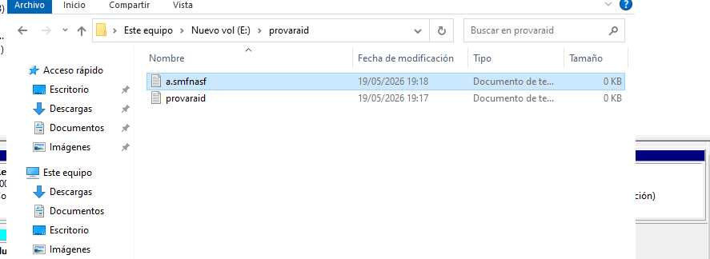
---

## Fase 4: Simulació de fallades

### Pas 17: Simular la fallada d'un disc (Disco 1)

Torna al Gestor de discos, fes clic dret sobre el **Disco 1** i selecciona:

```text
Sin conexión
```

Això simula la fallada física d'un dels discos del RAID.

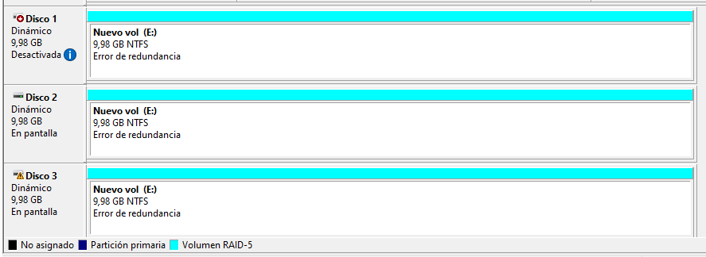
---

### Pas 18: Comprovar l'estat degradat del RAID

Amb el Disco 1 desactivat, el Gestor de discos hauria de mostrar el RAID amb l'estat:

```text
Error de redundancia
```

Això indica que el sistema ha detectat la pèrdua d'un disc i opera en **mode degradat**. Tot i així, el RAID 5 segueix funcionant gràcies a la paritat distribuïda.

---

### Pas 19: Verificar que els fitxers segueixen accessibles

Amb un disc fora de línia, comprova que pots accedir a `R:\Prova-RAID5` i obrir els fitxers sense cap problema.

Això demostra la **tolerància a fallades** del RAID 5: pot continuar funcionant amb un disc menys.

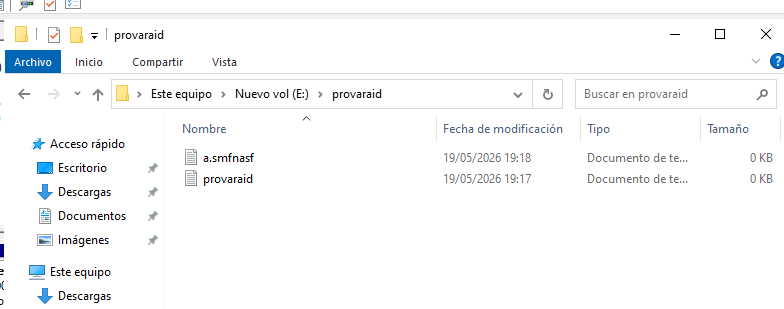

---

### Pas 20: Simular la fallada d'un segon disc (Disco 2)

Ara simula una segona fallada posant el **Disco 2** també fora de línia:

```text
Sin conexión
```

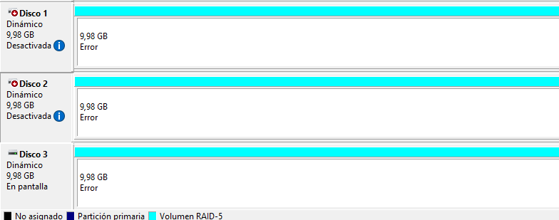

---

### Pas 21: Comprovar el col·lapse del RAID

Amb dos discos fora de línia, el Gestor de discos hauria de mostrar tots els membres amb estat **Error**. El RAID 5 ja **no és capaç** de reconstruir les dades i el volum `R:\` ha deixat de ser accessible.

Explica breument per què passa això: el RAID 5 només tolera la fallada d'**UN** disc. Amb dos discos fallats, la paritat no és suficient per reconstruir tota la informació.

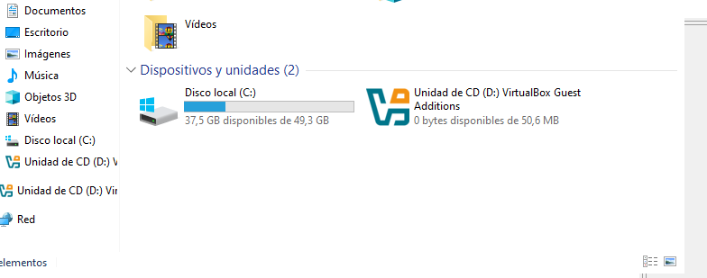

---

## Fase 5: Recuperació del RAID

### Pas 22: Tornar a posar el Disco 1 en línia

Per començar la recuperació, fes clic dret sobre el Disco 1 (en estat "Desactivada") i selecciona:

```text
En línea
```

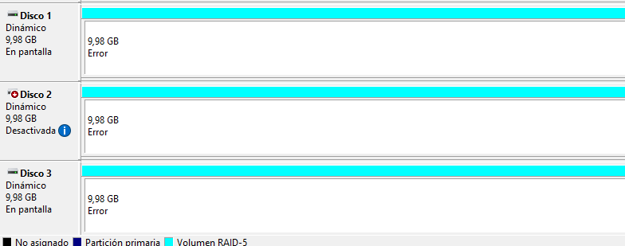
---

### Pas 23: Reactivar el Disco 2

Fes clic dret sobre el Disco 2 i selecciona:

```text
Reactivar disco
```

Això ordena a Windows que torni a sincronitzar la paritat i les dades del disc recuperat amb la resta del RAID.


---

### Pas 24: Esperar la resincronització

El Gestor de discos mostrarà els tres discos amb l'estat:

```text
Volviendo a sincronizar
```

Windows Server està recalculant la paritat i verificant la coherència de les dades entre els tres discos. Aquest procés pot trigar uns minuts depenent de la mida del RAID.

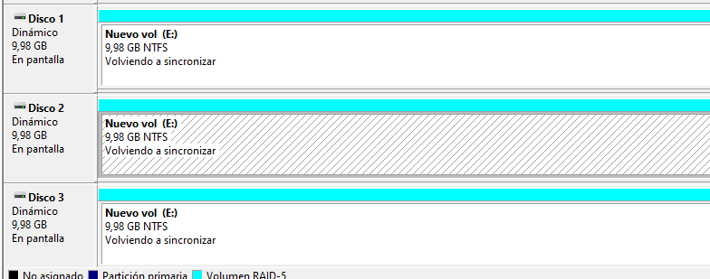
---

### Pas 25: Verificar la recuperació completa del RAID

Un cop finalitzada la resincronització, els tres discos haurien de tornar a mostrar l'estat **Correcto**. El RAID ha recuperat tota la seva redundància.

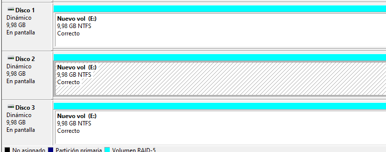
---

### Pas 26: Verificar que els fitxers estan intactes

Finalment, comprova que tots els fitxers de `R:\Prova-RAID5` segueixen intactes i accessibles. Obre algun fitxer per confirmar que no s'ha corromput.

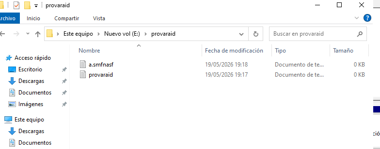intactes.

---

## Observacions tècniques

Per completar el document, pots incloure algunes observacions tècniques sobre el que has après:

- **Paritat distribuïda**: El RAID 5 no dedica un disc exclusivament a paritat (com RAID 3/4), sinó que la reparteix cíclicament entre tots els discos, equilibrant la càrrega d'escriptura.

- **Tolerància a una sola fallada**: Com has comprovat, el RAID 5 pot continuar funcionant amb un disc menys gràcies al càlcul de paritat. Amb dos discos fallats, la paritat ja no és suficient.

- **Capacitat útil N-1**: Amb 3 discos de ~10 GB, la capacitat útil ha estat d'aproximadament 20 GB.

- **Resincronització**: En un entorn real amb discos de grans capacitats (TB), la reconstrucció pot durar hores i suposa una càrrega addicional sobre els discos restants.

- **RAID ≠ Backup**: El RAID protegeix contra la fallada física d'un disc, però **no** contra errors humans, corrupció lògica, ransomware o desastres físics.

- **RAID per programari vs maquinari**: Windows Server implementa RAID per programari. En entorns professionals és preferible utilitzar controladores RAID per maquinari per aconseguir millor rendiment.

### Quan és adequat el RAID 5?

**Sí** per a:
- Servidors de fitxers que requereixen accés continu amb seguretat.
- Entorns amb pressupost limitat que necessiten redundància.
- Sistemes on les lectures són més freqüents que les escriptures.

**No** per a:
- Entorns que requereixen la màxima disponibilitat (preferir RAID 6 o RAID 10).
- Sistemes amb moltes operacions d'escriptura intensiva.
- Com a única mesura de protecció de dades.

---

## Conclusió

Amb aquest sprint has practicat la configuració d'un RAID 5 per programari a Windows Server. Has vist com afegir discos, convertir-los a dinàmics, crear el volum RAID, i sobretot has comprovat experimentalment la tolerància a fallades del sistema: amb un disc fora de línia les dades continuen accessibles, però amb dos discos fallats el RAID col·lapsa. Finalment, has recuperat el RAID reactivant els discos i esperant la resincronització.
